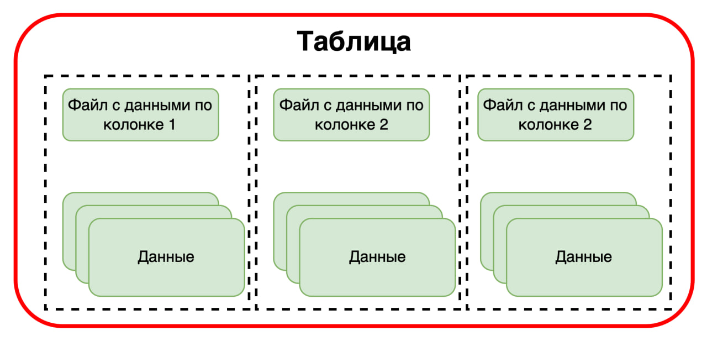
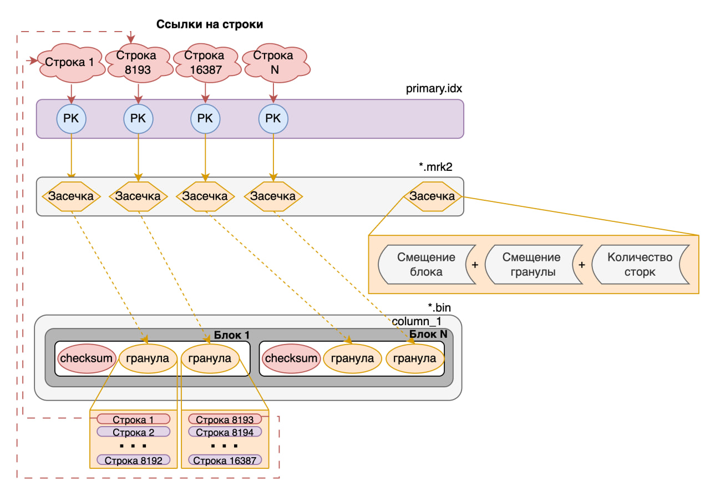
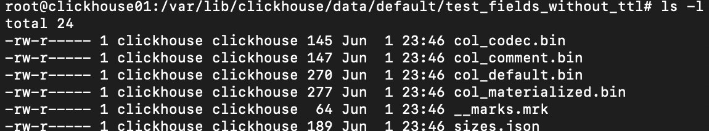
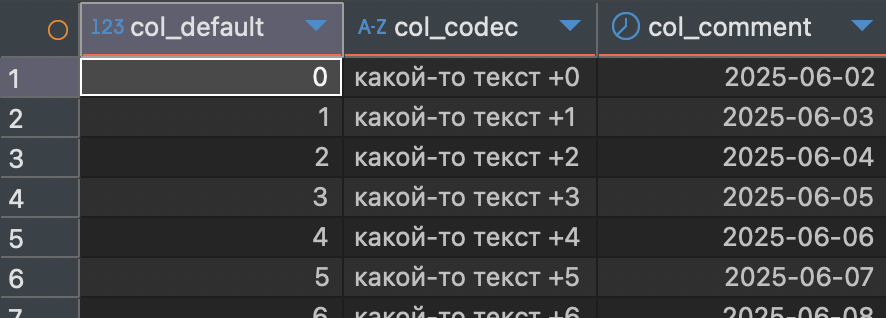
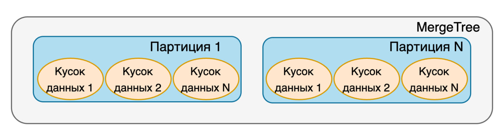
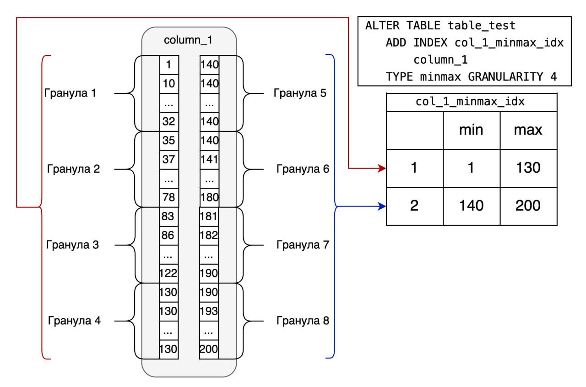
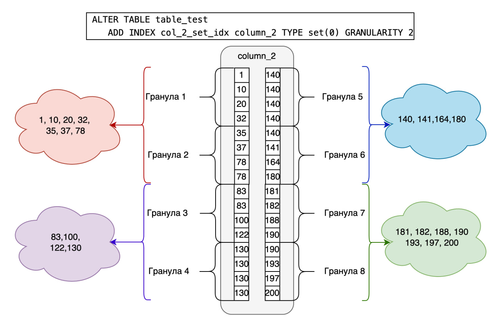

## Куратор раздела


**Шустиков Владимир**, оставивший военную жизнь позади и ушедший в данные с головой. Работаю с данными более 3х лет и останавливаться не собираюсь! Веду:

   [Telegram канал](https://t.me/Shust_DE)
   
   [Youtube канал](https://www.youtube.com/@shust_de)

Если хочешь сменить текущую профессию на Дата Инженера — пиши не стесняйся, я сам проходил этот не легкий путь и тебе помогу https://t.me/ShustDE.

Хочешь улучшить текущий раздел, внести недостающее или поправить формулировку? Предлагай PR и тегай [@ShustGF](https://github.com/ShustGF).

## Напутственные слова перед изучением материала

"Хера куда ты уже забрался. Может всё стоит бросить, да и ну его этот RoadMap, эту дата инженерию, ааа...? Нет, а че так! Готов идти до конца ради своего будущего! Красавчик! Уважения тебе! Никого не слушай и продолжай в том же духе и ты обязательно добьёшься своей цели!".

Изучение на практике такого инструмента, как ClickHouse, достаточно интересное занятие. Это OpenSource, с которым мне приходится достаточно часто мучиться, из-за постоянных проблем с нехваткой, каких либо возможностей, находить обходные пути и о них можно почитать у меня на [канале](https://t.me/Shust_DE) под хештогом **#ClickHouse_ну_ёпт_опять**

В общем и целом мне очень нравится,  как написана [документация](https://clickhouse.com/docs/ru) по ClickHouse, поэтому здесь безумно сжатый материал, который ссылается на другие источники информации. В общем и целом могу сказать по своему опыту, ClickHouse стоит изучать на практике и только на ней, поэтому к материалу я добавил 2 docker-compose файла, которые помогу тебе в обучении по работе с Clickhouse как с однонодовой, так и с кластерной сборкой. 

Запомнить всё без проб и ошибок просто напросто не получится! Так что вперед херачить практику! 

Установить ClickHouse можно по данным docker compose файлам:
1) [однонодовый](./Dop_mat/clickhouse-cone_node/) 
2) [расрпределённый](./Dop_mat/clickhouse-cluster/)

Приятного изучения.

-----------------
<h1 style="text-align: center;">CLICKHOUSE</h1>

Первое что нужно запомнить **ClickHouse** — это колоночно-ориентированная БД, т.е. данные считываются по необходимым нам колонкам. В свою очередь это позволяет считывать и агрегировать большой объем данных за коротких промежуток времени.

<p align="center">
    
</p>

## Колоночная ориентируемость

Перед тем как приступить к изучениию самой БД то необходимо понять, что же такое БД с колоночной ориентацией.

Физически колоночная ориентированность, представляет каждую колонку ввиде отдельного файла, из-за чего считывать данные через команду `SELECT *` значит считывать каждый файл таблицы. Сами понимаете, это правило плохого тона.

<p align="center">
    
</p>

Колоночная ориентируемость имеет ряд преимуществ:

* Оптимизация хранения данных.
* Быстрое чтение данных большого количества данных
* Бытрое выполнение аграгационнных задач(OLAP-нагрузка)

Но есть и ряд недостатков:
* Вообще не подходят под OLTP нагрузку, т.е. изменять, удалять или считывать единичные строки, прям больно
* Ограниченная поддержка ACID
* Сложность управления

## Как работает ClickHouse

Главной особенностью быстрой работы ClickHouse является использовония **разряженного индекса**. Различие данного индекса от обычного B-tree индекса состоит в том, что помечается не каждое значение колонки, а с каким либо промежутком(по умолчанию оно равно 8192, но можно изменить с помощью параметра `index_granularity`), в ClickHouse данный промежуток с значениями называется **гранулой**. Если говорить более научно то **гранула** - это логическое разделение строк внутри блока.  Такой индекс по умолчанию создается при создании таблиц семейста MergeTree(по умолчанию если мы не говорим об определенном движке будет подразумеваться именно он). Разряженный индекс, является отдельным объектом, значения которого являются первым значением каждой гранулы и ссылается на файл с засечками.

<p align="center">
    
</p>

Важно помнить, что при поднятии кластера файл с индексами всегда считывается в оперативную память и храниться именно там (соответственно если вам не хватит места в оперативной памяти то кластер даже не поднимится).

## Типы данных,  создание и движки таблиц, создание полей

### Типы данных

ClickHouse поддерживает достаточно большое количество типов данных. Мы рассмотрим только часть из них:

#### Числовые типы

* **Int8**, **Int16** ... **Int256** — целые числа фиксированной длины со знаком от 8 до 256 разрядов.

* **UInt8**, **UInt16** ... **UInt256** — целые числа фиксированной длины без знака от 8 до 256 разрядов.

В ClickHouse рекомендуется за частую использовать челые числа, так как они занимают значительно меньше места, чем например строки и за счет это ускоряется работа. Например намного эфективнее хранить **1234** метра, чем **1,234** километра.

* **Float32**, **Float64** — числа с плавающей запятой. Эти типы прекрасно подходят для различных статистических математических расчётов. Из-за особенностей данных типов не рекомендуется использовать в точных вычислениях, например финанасах.

Пример особенности, если выполнить следующий запрос в клике:

```
SELECT 1 - 0.9::float 
```

то в итоге мы получим ошибку округления, а именно **0.10000002384185791**

* **Decimal32(S)** ... **Decimal256(S)** — дробные числа с сохранением точности операций, где S — это количество знаков после запятой. Данный тип уже подойдет для точных вычислений 100%

#### Строкове типы

* **String** - набор байт произвольной длины. 

* **FixedString** - строка фиксированной длины N байт.

#### Типы для работы с датой

* **Date** и **Date32** - предназначен для хранения дат. Различие заключается в поддерживаемом диапазоне дат.

* **DateTime** и **DateTime64** - позволяет хранить даты и время с заданной точностью до секунд, в случае DateTime64 точность до наносекунд. 

#### Дополнительные типы данных

*  **UUID** (универсальный уникальный идентификатор) — это 16-байтовое число, используемое для идентификации записей.

* **IPv4**, **IPv6** — типы, предназначенные для хранения IP-адресов.

На самом деле в докемунтации таких типо данных на много больше, но эти я выбрал в качетве примера.

#### Композитные типы данных

Композитные типы данных хранят в себе более сложные структуры, такие как массивы, кортежи и т.д.

* **Array(Массив)** - хранит в себе N-ое кол-во элеметов любого типа данных. Надо запомнить, что массивы не могут иметь разные типы данных. Первый элемет начинается свою индексацию начитает с 1, а не как в програмировании с нуля.

* **Tuple(Кортеж)** - этот тип данных используется для хранения связанных между собой данных. Например информация о клиетах.

* **Вложенная структура**(Nested Structure) - по сути это таблица в таблице.

* **Map** - данный тип похож на словарь в питоне, хранит пары ключ-значения

* **Enum** - позволяет определить ограниченное количество возможных значений, присваиваемых столбцу, и хранить данные компактнее, чем при использовании строк.

<details>
    <summary>Пример с типами данных, который ты можешь потыкать сам</summary>
    <pre>
        <code class="sql">
drop table if exists type_data;
CREATE TABLE type_data
(
--------------------------
-- основные типы данных --
--------------------------
    i Int8,          -- Int8-256 (со знаком)
    ui UInt8,        -- UInt8-256 (без знака)
    fl Float32,      -- Float32-64 (для мат.расчетов, но не для финансов)  
    dc Decimal32(5), -- Decimal32-256 (точность после запятой)
    st String,       -- имеет произвольную длинну
    fst FixedString(5), -- имеет фиксированную длинну
--------------------------------
-- дополнитеьлные типы данных --
--------------------------------
    UID UUID, -- уникальный идентификатор
    ip4 IPv4, -- 127.0.0.1
    ip6 IPv6, -- f2c6:e19b:da60:52ad:2cef:62fe:0279
--------------------------------
--    типы даты и времени     --
--------------------------------
    dt Date,          -- Date32 (различаются диапозном дат)
    dtm DateTime,     -- Сохрняет время с точностью то секунд
    dtm64 DateTime64, -- Сохрняет время с точностью то наносекунд
------------------------------------
--    композитные типы данных     -- - позволяют хранить более сложные структуры данных
------------------------------------
    ar Array(UInt8),                      -- массив данных
    tu Tuple(Date, UInt16, Decimal32(2)), -- кортеж
    ns Nested(                            -- Вложенные структуры
            col1 String,
            col2 UInt64,
            col3 String
            ),
    mp Map(String, Int16), -- хранит в данные в виде ключ -> значение
    en Enum('bad' = 2,     -- хранит данные определенного значения
            'udovlet' = 3, 
            'good' = 4 )      
)
ENGINE = Log;
INSERT INTO type_data
(
    i, ui, fl, dc, st, fst,
    UID, ip4, ip6,
    dt, dtm, dtm64,
    ar, tu, 
    ns.col1, ns.col2, ns.col3,
    mp, en
)
VALUES 
(
    -100,                							-- i Int8
    200,                						    -- ui UInt8
    3.14,                							-- fl Float32
    123.45,             							-- dc Decimal32(5)
    'Пример строки',     							-- st String
    'ABCDE',             							-- fst FixedString(5)
    generateUUIDv4(),    							-- UID UUID
    '192.168.1.1',      						    -- ip4 IPv4
    '2001:db8::1',       							-- ip6 IPv6
    toDate('2025-04-30'),                      		-- dt Date
    toDateTime('2025-04-30 14:30:00'),         		-- dtm DateTime
    toDateTime64('2025-04-30 14:30:00.123456', 6), 	-- dtm64 DateTime64
    [10, 20, 30],        							-- ar Array(UInt8)
    (toDate('2025-04-30'), 150, 99.99), 			-- tu Tuple(Date, UInt16, Decimal32(2))
    ['one'],             							-- ns.col1 Array(String)
    [123456],            							-- ns.col2 Array(UInt64)
    ['value1'],          							-- ns.col3 Array(String)
    {'key1': 10, 'key2': -20}, 						-- mp Map(String, Int16)
    'udovlet'              							-- en Enum
);
select 
    ar[1],      -- обращение к эл-там массива
    ar.size0,   -- получение размера массива
    tu,         -- чтение кортежа
    ns.col1,    -- обращение к вложенной структуре
    mp['key1'], -- получение данных из Map
    en          -- Чтение Enum
from type_data
        </code>
    </pre>
</details>  

#### Агригаторные типы данных

В ClickHouse существуют, так называемые агригаторные типы данных SimpleAggregateFunction и AggregateFunction. Сейчас говорить о них смысла нет, мы затронем данную тему, когда будет расписывать работу джижка AggregatingMergeTree в отдельной статье, для более продвинутого уровня.

### Приведение к типам данных

В ClickHouse можно приводить к типам данных разными способами, я покажу 3:

1. С помощью символов `"::"`. Очень знакомое приведение для тех, кто работал с PostgreSQL.
2. С помощью функции `CAST`. Ну в общем и целом это стандарт языка SQL
3. С промощью функций разработанных для ClickHouse.

Не буду тянуть кота за яйца, поэтому к делу, я уже говорил что клик не похож на другие БД, поэтому при работе с кликом забудьте сразу про первые 2 метода, как минимум потому что они не обрабатывают пустые значения **NULL** в колонке. А это иногда критично. 

Возьмите за практику всегда использовать 3й вариант, как минимум потому что он имеет свои приятные фишечки.

Данные функции очень легко запомнить так как имеют единый шаблон:

```
to<тип данных><разрядноть если такая имеется><модификатор если ннн-ннн-нада>
```

Модификатор позволяет вернуть какое-то значение, даже если не удалось выполнить преобразование к нужному типу.

Существует 3 модификатора:

* **OrNull** — если не удалось преобразовать в требуемый тип, возвращает NULL.
* **OrZero** — если не удалось преобразовать, возвращает 0.
* **OrDefault** — если не удалось преобразовать, возвращает значение по умолчанию.

<details>
    <summary>Пример который ты можешь потыкать сам</summary>
    <pre>
        <code class="sql">
DROP TABLE IF EXISTS cast_type_data;
CREATE TABLE cast_type_data (
    col String
)
ENGINE = Log;
INSERT INTO cast_type_data values ('1'),('2'),('1a'),('-1');
select CAST(NULL as Int64); -- не кастонётся
select
    col,
    toInt64OrNull(col),
    toInt8OrZero(col),
    toInt8OrDefault(col, -100),
    toUInt8(-1), toUInt8(-1.1), toUInt8(256) -- выход за пределы преобразует в значение по модулю диапозона
from cast_type_data;
        </code>
    </pre>
</details>

В примере особое внимание уделите данной строке.

```
toUInt8(-1), toUInt8(-1.1), toUInt8(256)
```

Заметь, что выход за пределы диапозона **не выдаст ошибку** а преобразует данные по модулю диапозона.

### Создание таблиц

#### ЭТО ПРЯМ БАЗИЩА

Создание таблиц в Clickhouse делается абсолютно также как и в других БД за исключением того, что в ClickHouse необходимо указывать **движок** таблицы, например:

```sql
CREATE TABLE <имя таблицы> (
    Id String
    ...
)
engine=MergeTree
PRIMARY KEY (Id, ...)
OREDR BY (Id, ...)
```

 О движках таблиц можно узнать либо из [официльной документации](https://clickhouse.com/docs/ru/engines/table-engines) ClickHouse, либо из следующей статьи про движки, где мы их рассматриваем на примерах и под разными углами. Здесь мы поверхностно рассмотрим синтаксис самого ходового движка MergeTree.

Основная идея MergeTree состоит в том, что данные записываются по частям, небольшими кусками, а потом объединяются в фоновом режиме. Физически это выглядит следующим образом:

<p align="center">
    
</p>

Имя файла у таких таблиц состоит из следующих частей:

<p align="center">
    
</p>

Обязательно при создании таблицы семейства MergeTree требует указать ключ сортировки через модификатор `ORDER BY`. По умолчанию он будет являться первичным ключом, однако можно указать другой первичный ключ через `PRIMARY KEY`. Также нужно запомнить, что если мы указываем `PRIMARY KEY`, то он должен начинаться абсолютно так же как и ORDER BY иначе будет ошибка.

Чуть позже мы поговорим об еще одном параметре `PARTITION BY` который позволяет разбить таблицу на партиции.

#### Атрибуты типов даннных при создании таблиц

Существует 2 ключевых атрибута: **LowСardinality** и **Nullable**.

* **LowCardinality** - меняет способ хранения низкокоординальных полей. Данный атрибут стоит использовать, когда в колонке содержится менее ста тысяч уникальных значений.

* **Nullable** - разрешает вставку со значением NULL. По умолчанию в поле с таким атрибутом вместо NULL будут вставляться значения по умолчанию, для строк это пустое значение, для чисел это 0.

<details>
    <summary>Пример который ты можешь потыкать сам</summary>
    <pre>
        <code class="sql">
drop table nl_lc_tabl;
CREATE TABLE nl_lc_tabl (
    a Nullable(UInt32),         -- разрешает вставку с пропуском значения.
    b LowCardinality(String),   -- ускоряет работу малокоординальных данных(часто повторяющихся)
    c UInt32
) ENGINE = MergeTree 
ORDER BY tuple(); -- определяет порядок сток по порядку вставки данных
INSERT INTO nl_lc_tabl VALUES (NULL,'test' ,1);
INSERT INTO nl_lc_tabl VALUES (1,'test2',NULL); -- null вставится как 0. Если тип данны строка вставляется как пустое значение
INSERT INTO nl_lc_tabl VALUES (1, NULL, 3); 
INSERT INTO nl_lc_tabl VALUES (1, 'test2', 4); 
SET input_format_null_as_default = 0; -- параметр отвечающий за вставку пустых значений. Выполняется совместно с командой на вставку
INSERT INTO nl_lc_tabl VALUES (1, 'sdasda', NULL)
SELECT 
	a, 
	b, 
	c 
from nl_lc_tabl;
SELECT 
	toTypeName(a), 
	toTypeName(b), 
	toTypeName(c) 
from nl_lc_tabl;
        </code>
    </pre>
</details>

#### Модификаторы колонок

Давай рассмотрим пример создания таблицы:

```sql
CREATE TABLE test_fields
(
      col_default UInt64 DEFAULT 42
    , col_materialized UInt64 MATERIALIZED col_default * 33
    , col_alias UInt64 ALIAS col_default + 1
    , col_codec String CODEC(ZSTD(10))
    , col_comment Date COMMENT 'Some comment'
    , col_ttl UInt64 DEFAULT 10  TTL col_comment + INTERVAL 5 DAY
)
...
```

Здесь мы наблюдаем, что после типов данных стоят дополнительные конструкции - модификаторы, разберем их более подробнее.

* `DEFAULT` - если не передается значение, то будет вставлено значение по умолчанию.
* `MATERIALIZED` - Данное поле будет материализовано и физически вычисляться при добавлении данных
* `ALIAS` - все тоже самое, только вычисляется по факту вызова в запросе
* `CODEC` - предназначено для сжатия файлов
* `COMMENT` - можно оставить комментарий для будущих поколений💬
* `TTL` - time to live, время жизни значения. В случе истечения времени, значение либо удалится, либо можно преобразовать в дефолное значение. TTL нельзя примень к полям входящие в ключ сортировки! Можно использовать только в движках MergeTree.

<details>
    <summary>Пример который ты можешь потыкать сам</summary>
    <pre>
        <code class="sql">
drop table if exists test_fields_without_ttl;
CREATE TABLE test_fields_without_ttl
(
     col_default UInt64 DEFAULT 42
    ,col_materialized UInt64 MATERIALIZED col_default * 33 -- к данной колонке можно обратиться только по имени
    ,col_alias UInt64 ALIAS col_default + 1                -- к данной колонке можно обратиться только по имени
    ,col_codec String CODEC(ZSTD(10))
    ,col_comment Date COMMENT 'Some comment'
)
ENGINE = Log;
INSERT INTO test_fields_without_ttl (
    col_default,
    col_codec,
    col_comment,
)
SELECT
    number,
    'какой-то текст +' || toString(number),
    toDate(now()) + number
FROM numbers(60);
select * from test_fields_without_ttl;
drop table if exists test_fields_with_ttl;
CREATE TABLE test_fields_with_ttl
(
      col_default UInt64 DEFAULT 42
    , col_materialized UInt64 MATERIALIZED col_default * 33
    , col_alias UInt64 ALIAS col_default + 1
    , col_codec String CODEC(ZSTD(10))
    , col_comment Date COMMENT 'Some comment'
    , col_ttl UInt64 DEFAULT 10  TTL col_comment + INTERVAL 5 DAY
)
ENGINE = MergeTree()
ORDER BY (col_default);
INSERT INTO test_fields_with_ttl (
    col_default,
    col_codec,
    col_comment,
    col_ttl
)
    SELECT
        number,
        'какой-то текст +' || toString(number),
        toDate(now()) - number,
        rand(1) % 100000000
    FROM numbers(20);
select 
      col_default
    , col_materialized 
    , col_alias 
    , col_codec 
    , col_comment
    , col_ttl
from test_fields_with_ttl;
SHOW FULL COLUMNS FROM test_fields_with_ttl;  -- тут можно увидеть комментарий к столбцу
        </code>
    </pre>
</details>

Теперь я вместе с тобой выполню скипт описанный выше (хотя я знаю, что ты ленивый и просто пробегаешься по теории. Не ленись подними клик и протесть, через руки лучше дойдёт). И давай на все это деяние с тобой посмотрим.

 Я выполню только первую чать скипра, где создается таблица **test_fields_without_ttl** создам таблицу в движком `Log`. Не обращай на это внимание, просто знай, что в данном движке каждая колонка лежит в отдельном файле. 
 
 И какую же картину мы с тобой увидим, когда загляем под капот.(я просто зашел на тачку в докере)

<p align="center">
    
</p>

Мы видем что создалось 4 колонки, что в целом и логично, колонка с модификаторм ALIAS должна будет вычисляться налету.

Теперь выполним запрос:

```sql
SELECT * FROM test_fields_without_ttl;
```

А увидим мы следующую, ужасную историю:

<p align="center">
    
</p>

```
- ГДЕ ЕЩЕ 2 КОЛОНКИ КАРЛЛЛЛЛ!!!!!
- А их нет! Тю-Тю!
```

Да к сожалению ни материализованную (хоть она физически существует), ни алис мы вызвать через `SELECT *` не можем, чтобы их вызнать, необходимо в SELECT обращаться к их именам, попробуйте это сделать самостоятельно на основе примера описанного выше.

## Партицирование таблиц

Хотел бы я сказать, что вы тут узнаете что-то новое о партиция, но нет.

Партиция - это набор данных объединённые единым критерием, например по месяцу. Это позволяет ускорить процес считывания данных по выбранному критерию при фильтрации.

<p align="center">
    
</p>

В ClickHouse создавать партиции можно только на таблицах семейста MergeTree. Партиция указывается при создании таблицы с помощью ключевой конструкции `PARTITION BY`. Например:

```sql
CREATE TABLE partition_table
(
    ...
)
ENGINE MergeTree
ORDER BY (dt)
PARTITION BY toYYYYMM(dt)
PRIMARY KEY (dt);
```

Существует несколько типов партицирования:

* **range** - по диапозонам значений

<details>
    <summary>Пример</summary>
    <pre>
        <code class="sql">
CREATE TABLE table_range
(
    id UInt32,
    name String,
    created_at Date
)
ENGINE = MergeTree
PARTITION BY
    CASE
        WHEN id < 10000 THEN 'range_1'
        WHEN id < 20000 THEN 'range_2'
        ELSE 'range_3'
    END
ORDER BY id;
        </code>
    </pre>
</details>

* **interval** - по интервалу значений

<details>
    <summary>Пример</summary>
    <pre>
        <code class="sql">
CREATE TABLE table_interval
(
    id UInt32,
    amount Float32,
    sale_date Date
)
ENGINE = MergeTree
PARTITION BY toYYYYMM(sale_date)
ORDER BY id;
        </code>
    </pre>
</details>

* **Хеш-партицирование** - на основе хеш-функции

<details>
    <summary>Пример</summary>
    <pre>
        <code class="sql">
CREATE TABLE table_hash
(
    user_id UInt64,
    event String
)
ENGINE = MergeTree
PARTITION BY cityHash64(user_id) % 10
ORDER BY user_id;
        </code>
    </pre>
</details>

* **Cостаное партицирование** - может включать несколько полей

<details>
    <summary>Пример</summary>
    <pre>
        <code class="sql">
CREATE TABLE table_composiste
(
    order_id UInt64,
    customer_id UInt64,
    order_date Date
)
ENGINE = MergeTree
PARTITION BY (toYYYYMM(order_date), customer_id % 10)
ORDER BY order_id;
        </code>
    </pre>
</details>

Важно понимать что при разделении таблиц по патициям, данные сливаются в рамках своих партиций. Из-за этого случаются небольшие коолизии в данных на опредленённых движках.(Об этом мы поговорим в стать о движках)

## Индексы

### Индекс основного назначения

С данными видами индексов мы уже познакомились. Это первичный ключ или ключ сортировки, который создается с таблицей и хранился в файле `primary.idx`.(разряженный индекс)

Напоминаю, что данный ключ создается с помощью ключевых конструкций `ORDER BY (...)` или `PRIMARY KEY (...)`(набор полей должен повторять ключ сортировки и не может быть больше него). 

!!!ИНДЕКС ВСЕГДА ХРАНИТСЯ В ОПЕРАТИВНОЙ ПАМЯТИ!!!

### Индексы пропуска данных

С данными видами мы поработаем чуть поплотнее, но глубоко закапываться не будем. А то утоним, зуб даю😄 (Если ты конечно еще не утонул)

Сущесвует несколько типов индексов пропуска данных:

* **minmax** - индекс хранит мин-ое и макс-ое значение для указанного поля. Подходит для дат и чисел.
* **set** - Индекс хранит уникальные значения столбца в рамках блока. Имеет параметр `max_rows` который задает блок, если значение равно **0**, то берется весь кусок данных. 
* **bloom_filter** - реализован на основе фильтра Блума для поиска по точному совподению. 
* **ngrambf_v1** - реализован на основе фильтра Блума для полнотекствого поиска по n-граммам
* **tokenbf_v1** - реализован на основе фильтра Блума для полнотекствого поиска по фразам

<details>
    <summary>Синтаксис создания</summary>
    <pre>
        <code class="sql">
ALTER TABLE <имя таблицы>
    ADD INDEX <имя индекса> <имя колонки> TYPE <тип индекса> GRANULARITY <число>
        </code>
    </pre>
</details>

Далее мы разберем только первые 2 индекса. Блум фильтрация я оставлю исключительно для самостоятельно изучения, чтобы было интереснее😄

#### Индекс minmax 

Индекс **minmax** требует кореляции с первичным ключом, т.е. по мере возрастания первичного ключа должна быть кореляция с колонкой, на которую мы хотим повесить индекс.

Данный индекс работает достаточно просто, берутся определенные гарнулы, заданные с помощью параметра `GRANULARITY` и в данном куске ищется минимальное и маскимальное значение.

<p align="center">
    
</p>

#### Индекс set

Здесть тоже все просто. 

Вот вам небольшая ассациация, помните Python, что будет если список [1,2,2,3,3,3] преобразовать в множество set(), правильно остануться только уникальные значения (1,2,3). 

И здесь все тоже самое, берутся гранулы и удаляются дубликаты:

<p align="center">
    
</p>

## Итог

Для начала этого хватит, впереди еще куча информации Движки, Оптимизация запросов(Матвьюхи, проекции,словари), распределённый Клик. Короче, то ли еще будет!