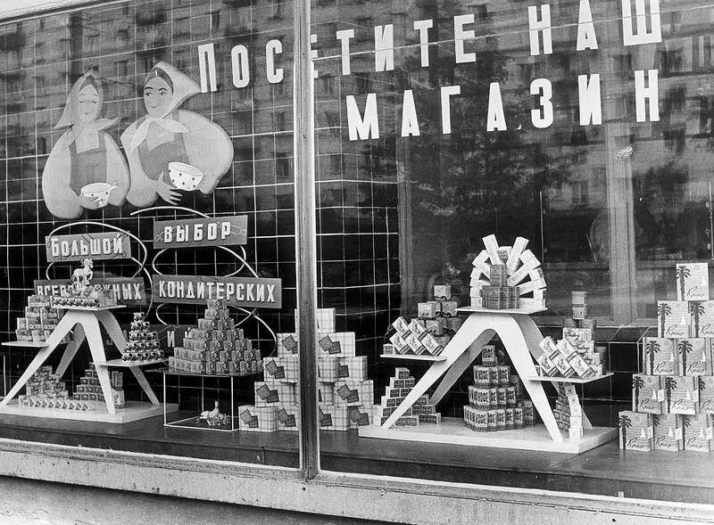
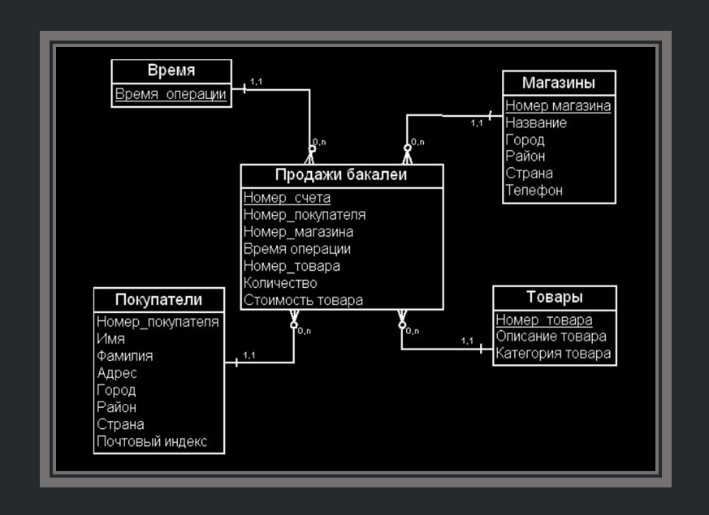
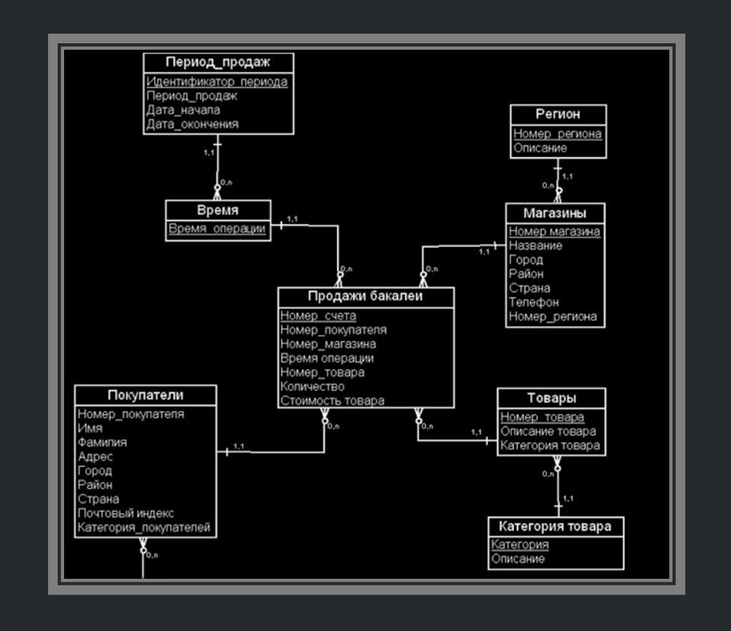

# Витрина Данных

    

**Ничего общего с магазином, конечно же, нет!**

Витрина данных (Data Mart) — это просто таблица или таблицы. Чаще всего DE используют это слово, когда говорят про таблицу для дата аналитиков. Грубо говоря, дата инженеры загрузили данные в хранилище, очистили их от ненужной инфы, обогатили таблицу еще другими таблицами и получили какую-то общую. В ней может быть например собраны все заявки по кредитам, все заявки по ипотекам и кредитным картам в банке за вчерашний день. Хотя на входе там были данные просто с действиями пользователей на сайте. 

Дата инженер раскопал все источники, понял, как с ними работать и сделал для дата аналитика некий готовый срез.

Витрина данных, аналогично дашборду, позволяет аналитику увидеть агрегированную
информацию в определенном временном или тематическом разрезе, а также
сформировать отчетные данные в виде шаблонизированного документа. Витрина
данных часто представлена в виде денормализованой таблицы, однако это не всегда
удобно и не позволяет решать все задачи, поэтому чаще встречается таблица фактов
и таблица измерений.

***
**Таблица фактов** — главная таблица, в которой пишутся события, например, текущие заказы или действия пользователей на сайте. Т.е. некие события, которые скорее всего имеют уникальный характер.

**Таблица измерений** (англ. dimension table) — таблица, в которой хранятся описания объектов. Например id, ФИО курьера, который доставил заказ. Или данные каждого клиента. Таблицы измерений удобны тем, что там можно хранить те данные, которые не часто меняются. Очевидно, что писать в таблице фактов номер телефона клиента будет избыточно. Нам достаточно один раз его записать в таблицу измерений и дать ссылку на это в таблице фактов. И при любом запросе к определенному заказу, мы всегда получим актуальный номер телефона клиента, потому что мы изменили его в таблице измерений.
***

# Модели "Звезда" и "Снежинка"
## Модель "Звезда"

Схемы «звезда» и «снежинка» — это два способа структурировать хранилище данных.

Схема типа «звезда» (пространственная модель, модель измерений и фактов, модель «сущность-связь», dimensional model, star schema) представляется двумя видами таблиц: таблицами фактов и таблицами измерений, которые описывают факты. Схема разбивает таблицу фактов на ряд денормализованных таблиц измерений. Таблица фактов содержит агрегированные данные, которые будут использоваться для составления отчетов, а таблица измерений описывает хранимые данные. Денормализованные проекты менее сложны, потому что данные сгруппированы. Таблица фактов использует только одну ссылку для присоединения к каждой таблице измерений. Более простая конструкция звездообразной схемы значительно упрощает написание сложных запросов.

    

## Модель "Снежинка"

Схема типа «снежинка» отличается тем, что использует нормализованные данные. Нормализация означает эффективную организацию данных так, чтобы все зависимости данных были определены, и каждая таблица содержала минимум избыточности. Таким образом, отдельные таблицы измерений разветвляются на отдельные таблицы измерений. Схема «снежинки» использует меньше дискового пространства и лучше сохраняет целостность данных. Основным недостатком является сложность запросов, необходимых для доступа к данным — каждый запрос должен пройти несколько соединений таблиц, чтобы получить соответствующие данные.

    

***
## SCD [Slowly Changing Dimensions]

> Эта штука очень важна. Обязательно изучите это.

### SCD 0
SCD 0 — заключается в том, что данные после первого попадания в таблицу далее никогда не изменяются. Этот метод практически никем не используется, т.к. он не поддерживает версионности. Он нужен лишь как нулевая точка отсчета для методологии SCD. По сути, вообще не SCD.
Таблица, которая хранит пол родственников Дональда Дака - женский, мужской, не определено. Она также не требует ведения истории.

### SCD 1
SCD 1 — это обычная перезапись старых данных новыми. В чистом виде этот метод тоже не содержит версионности и используется лишь там, где история фактически не нужна.

**Пример:** паспортные данные изменились и были перезаписаны

### SCD 2
SCD 2 - есть два столбца. Первый столбец с датой, когда запись начала действовать. Вторая дата ставится 9999-01-01. Значит, что строка имеет актуальные данные. При обновлении данных, 9999-01-01 меняется на текущую дату и строка становится уже исторической. При этом новые данные появляются на следующей строке. Смотри пример

**Пример:**

| ID | Name          | Number | Team   | Date_start   | Date_end     |
|----|---------------|--------|--------|--------------|--------------|
| 1  | Marc Marquez  | 93     | Honda  | 2013-11-08   | 9999-01-01   |
| 2  | Valentino Rossi | 46    | Yamaha | 2010-11-07   | 9999-01-01   |
| 3  | Dani Pedrosa  | 26     | Honda  | 2014-11-08   | 2018-01-11   |
| 4  | Jorge Lorenzo | 99     | Ducati | 2017-01-01   | 2019-01-01   |
| 5  | Jorge Lorenzo | 99     | Honda  | 2019-01-02   | 9999-01-01   |

### SCD 3
SCD 3 — В самой записи содержатся дополнительные поля для предыдущих значений атрибута. При получении новых данных, старые данные перезаписываются текущими значениями.

**Пример:**

| ID | Name          | Num | Previous_team | Current_team | Date_start   |
|----|---------------|-----|---------------|--------------|--------------|
| 1  | Marc Marquez  | 93  | NULL          | Honda        | 2013-11-08   |
| 2  | Valentino Rossi | 46 | NULL          | Yamaha       | 2010-11-07   |
| 3  | Dani Pedrosa  | 26  | NULL          | Honda        | 2014-11-08   |
| 4  | Jorge Lorenzo | 99  | Ducati        | Honda        | 2019-01-02   |

### SCD 4
История изменений содержится в отдельной таблице: основная таблица всегда перезаписывается текущими данными с перенесением старых данных в другую таблицу. Обычно этот тип используют для аудита изменений или создания архивных таблиц.

***

> Дальше есть еще 5 и 6 версии, но они являются уже просто комбинациями из выше перечисленных. Шарить за них не нужно. Да и о них мало кто знает вообще.
