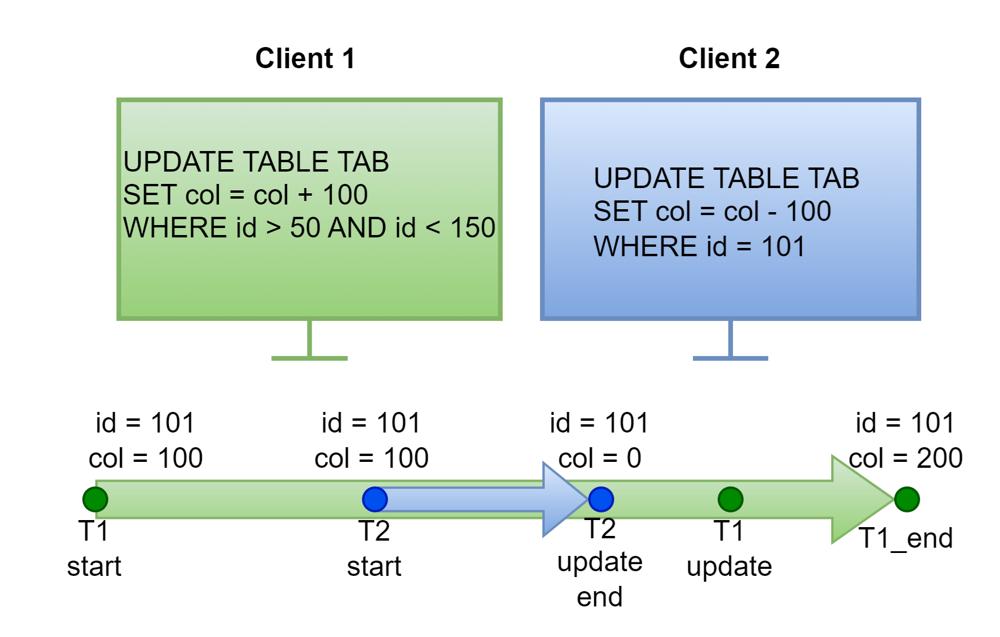
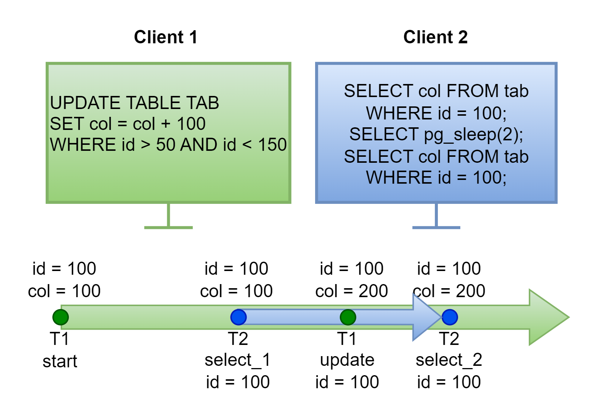
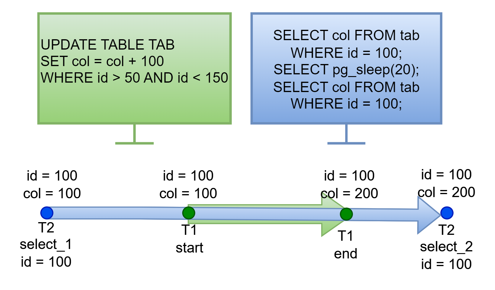
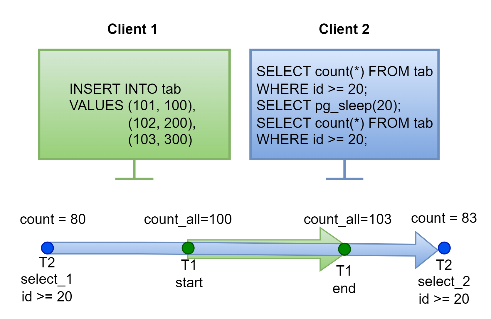

## Куратор раздела

**Шустиков Владимир**, оставивший военную жизнь позади и ушедший в данные с головой. Работаю с данными более 2х лет и останавливаться не собираюсь! Веду:

   [Telegram канал](https://t.me/Shust_DE)
   
   [Youtube канал](https://www.youtube.com/@shust_de)

Если хочешь сменить текущую профессию на Дата Инженера — пиши не стесняйся, я сам проходил этот не легкий путь и тебе помогу https://t.me/ShustDE.

Хочешь улучшить текущий раздел, внести недостающее или поправить формулировку? Предлагай PR и тегай [@ShustGF](https://github.com/ShustGF).

# ACID

Простое опрепределение:

**Транзакция** — последовательность команд, которая удовлетворяет требованием ACID.

Развёрнутое определение:

**Транзакция** — последовательность команд, которая сохраняет согласованность базы данных при условии, что транзакция выполняется полностью и без помех со стороны других транзакций.

**ACID** — это аббревиатура состоящая из 4 компонентов:

* Атомарность
* Согласованность
* Долговечность 
* Изоляция

## Атомарность 

Атомарность — это свойство, которое гарантирует, что каждая транзакция будет выполнена полностью, либо не будет выполнена совсем. 

## Согласованность

Согласованность, подразумевает, что каждая выполненная транзакция переводит БД из одного согласованного состояния к следующему согласованному состоянию

## Долговечность 

Долговечность означает сохранность данных, даже после сбоя системы.

## Изоляция

Изоляция, подразумевает собой, что одновременные транзакции не будут влиять друг на друга. 

# Виды изоляции

Согласно стандарта SQL, транзакции имеют 4 уровня изоляции и каждая из них блокирует определённые возникающие аномалии. Все виды представлены в таблице. 

| Параметр                          | Предотвращаемые аномалии           |
|-----------------------------------|------------------------------------|
| **READ UNCOMMITTED**              | «потерянных обновлений»             |
| **READ COMMITTED**                | «потерянных обновлений», «грязного чтения» |
| **REPEATABLE READ**               | «потерянных обновлений», «грязного чтения», «не повторяющего чтения», «фантомного чтения»|
| **SERIALIZABLE**                  | предотвращает любые аномалии |

Теперь пройдемся по каждому виду и посмотрим от каких аномалий они предотвращают.

# Аномалиии

## Аномалия "потерянных обновлений"

Аномалия **потерянных обновлений** подразумевает, что первая транзакция может изменить данные, запущенные после неё транзакций.

Пример:

    

Есть 2 клиента, и 1й клиент запускает транзакцию на изменение данных, во время выполнения данной транзакции 2й клиент запускает еще одну транзакцию, которая заканчивает выполнение до окончания транзакции клиента 1, после чего заканчивается транзакция 1го клиента. Как мы видим из рисунка значения изменены на основе транзакции 1, а транзакция 2 полностью перезаписана.

## Аномалия "грязного чтения"

Под **грязным чтением** понимается ситуация, когда запрос видит незафиксированные изменения других транзакций.

Пример:

    

Первый пользователь запускает транзакцию на изменение данных, 2й считывает данные первый раз и видит еще не измененные данные, после этого ждет 2 секунды, во время этих 2х секунд 1й доходит до изменения 100го идентификатора и продолжает выполнение транзакции, после этого 2й еще раз считывает данные и видит, что данные изменились, хотя транзакция 1го еще не завершена. 

## Аномалия "не повторяющего чтения"

Аномалия **не повторяющего чтения**, это когда повторное чтение строки вернет другое значение, если оно было изменено и зафиксировано другой транзакцией.

Пример:

    

Второй пользователь начинает читать данные и получает определённое значение выборки, после у него запускается задержка на 20 секунд, в это время 1 клиент, изменяет значения в таблице, затрагивающее значение 2го клиента, и заканчивает транзакцию, после этого 2й пользователь еще раз считывает этот же запрос и получает совсем другую выборку.

## Аномалия "фантомного чтения"

Аномалия **фантомного чтения**, это когда повторный запрос по одному и тому же условию вернет другую выборку, если другая транзакция добавила и зафиксировала новые строки, удовлетворяющие этому условию.

Пример:

    

Второй клиент начинает считывать данные и ожидает 20 секунд. А это время 1й клиент вносит новые данные в таблицу и заканчивает транзакцию. После ожидания 2й клиент еще раз считывает данные и получает совсем другой ответ, так как в его ответ попали новые строки.
