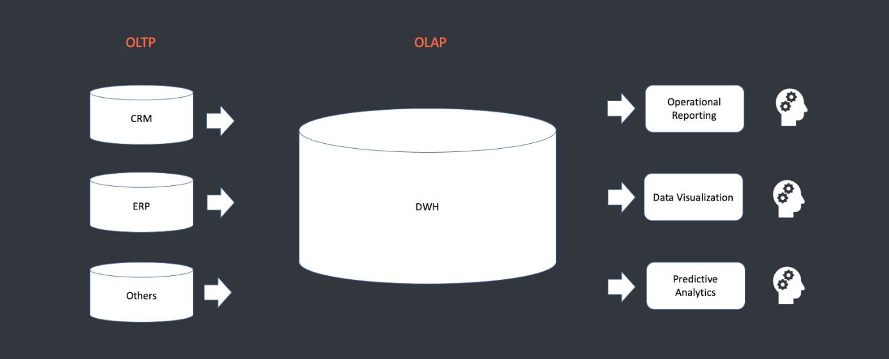
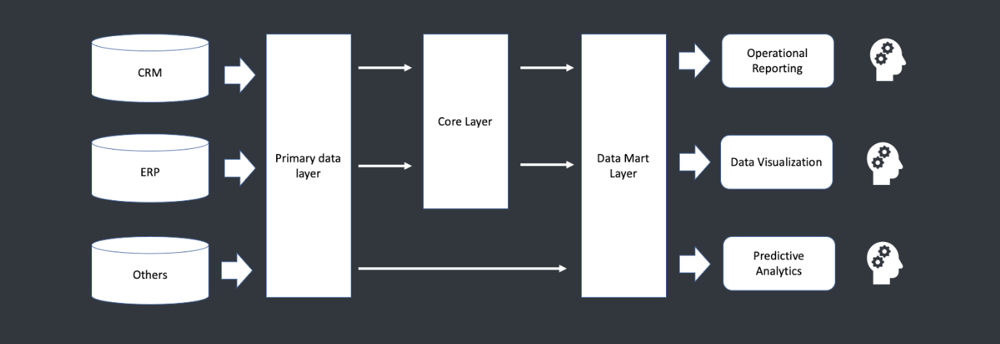
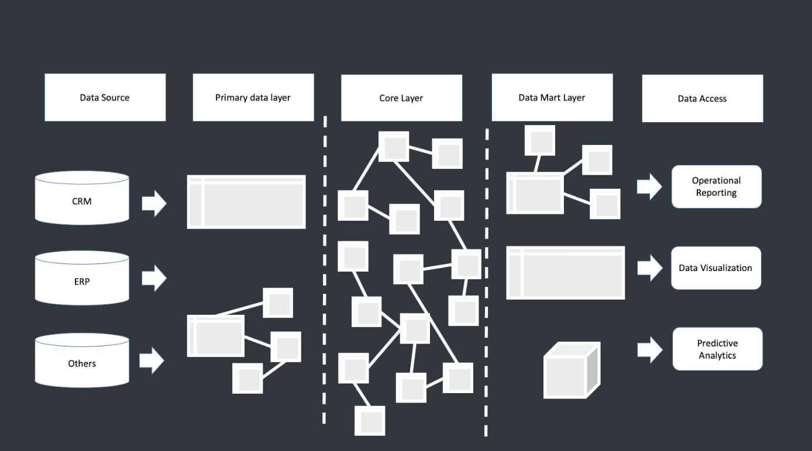
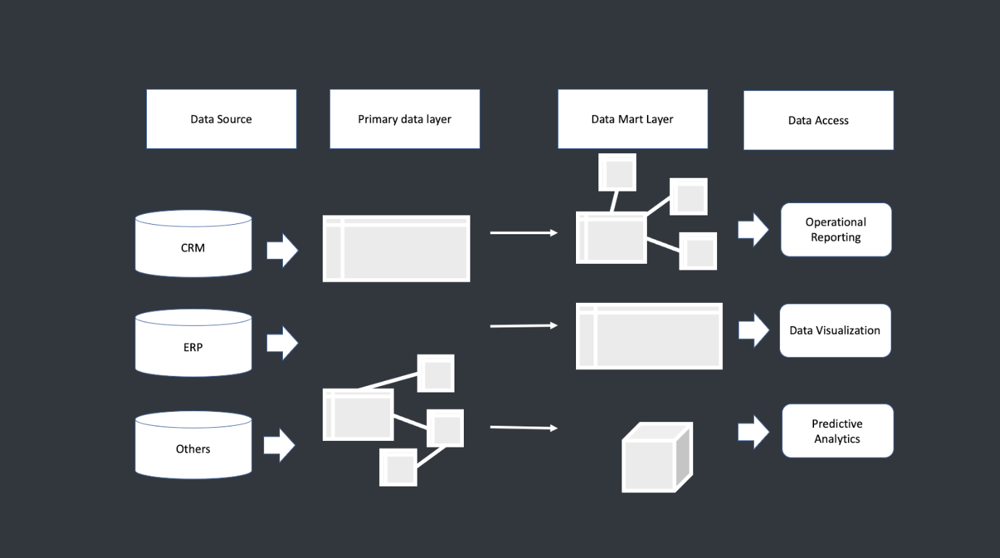
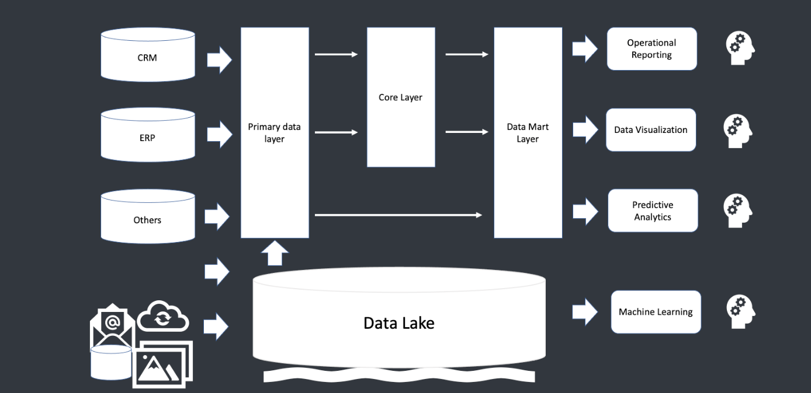
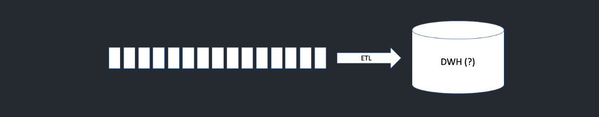
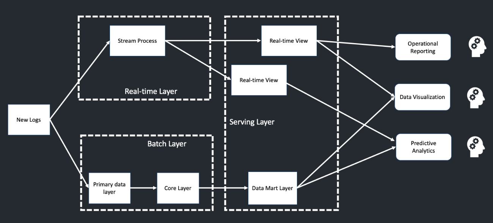
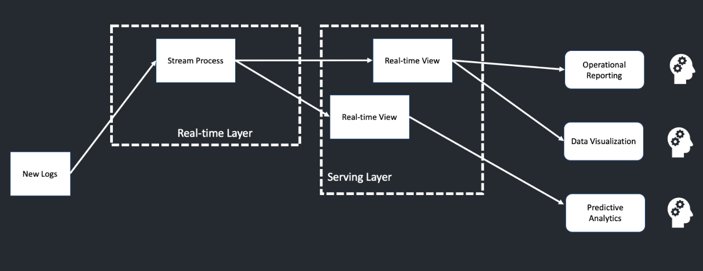

 # HalltapeRoadmapDE
**Теория по DWH:**
- [Data Warehouse](#data-warehouse)
- [OLTP-системы](#oltp-системы)
- [OLAP-системы](#olap-системы)
- [Архитектура DWH](#архитектура-dwh)
- [Подходы к проектированию DWH](#подходы-к-проектированию-dwh)
- [Озеро данных](#озеро-данных)
- [Batch-обработки и Lambda-архитектуры](#batch-обработки-и-lambda-архитектуры)
- [Kappa-архитектура](#kappa-архитектура)
  
# Data Warehouse

# OLTP-системы
**OLTP** (Online Transaction Processing) - система оперативной обработки информации (транзакций).

**Транзакция** - некоторый набор операций над базой данных, который рассматривается как единое целое. Транзакцией может являться несколько операций, но они обязательно выполняются все вместе; часть операций отдельно выполниться не может.

## Главное требование к OLTP-системам
- Быстрое обслуживание относительно простых запросов большого числа пользователей.
- Время выполнения запроса не должно превышать (микро-, милли-)секунд.

# OLAP-системы

При создании систем поддержки принятия решений специалисты столкнулись с проблемами при использовании OLTP-систем. Это привело к появлению **OLAP**-систем.

**OLAP** (Online Analytical Processing) имеет дело с историческими или архивными данными. OLAP характеризуется относительно низким объемом отдельных запросов.

Запросы часто очень сложны и включают много таблиц. В многомерных схемах хранятся агрегированные исторические данные OLAP.

# Сравнение OLAP и OLTP систем

OLAP и OLTP системы имеют ряд принципиальных отличий и разное предназначение в рамках организации хранилища данных. OLAP-системы должны быть организованы иначе, чем OLTP-системы, и для этого существует несколько причин:

1. Для выполнения аналитических запросов необходима обработка информации из разных источников.
2. Для выполнения запросов, связанных с прогнозированием или анализом тенденций, необходимы исторические данные, накопленные за достаточно длительный период, что не всегда обеспечивается OLTP-системами.
3. Данные, используемые для целей анализа данных обслуживания аналитических запросов, отличаются от используемых в OLTP-системах. При аналитической нагрузке можно пользоваться не детальными, а предагрегированными данными.

# Сравнение OLAP и OLTP систем

| Параметр                          | OLAP-системы                       | OLTP-системы                       |
|-----------------------------------|------------------------------------|------------------------------------|
| **Степень детализации**           | Хранение детализированных и обобщенных (агрегированных) данных | Хранение детализированных данных    |
| **Формат хранения**               | Единый согласованный                | Варьируется от задач               |
| **Допущение избыточности**        | Контролируемая избыточность        | Максимальная нормализация, сложные структуры |
| **Управление данными**            | Периодическое добавление данных     | Добавление/удаление/изменение в любое время |
| **Количество хранимых данных**    | Должны быть доступны все данные, включая исторические | Должны быть доступны все оперативные данные |
| **Характер запросов к данным**    | Произвольные запросы (ad-hoc анализ данных) | Заранее составленные запросы       |

***
# Архитектура DWH

## Первичный слой данных

Операционный слой первичных данных (Primary Data Layer, raw или staging) – это уровень, на котором выполняется загрузка информации из систем-источников в исходном качестве с сохранением полной истории изменений. На этом слое происходит абстрагирование следующих слоев хранилища от физического устройства источников данных, способов их сбора и методов выделения изменений.

## Центральный слой данных
**Ядро хранилища (Core Data Layer)** – центральный слой, в котором происходит консолидация данных из разных источников, приводя их к единым структурам и ключам. Здесь осуществляется основная работа с качеством данных и трансформациями, чтобы абстрагировать потребителей от особенностей логического устройства источников данных и необходимости их взаимного сопоставления.

## Слой витрин данных
**Слой аналитических витрин (Data Mart Layer)** – уровень, где данные преобразуются в структуры, удобные для анализа и использования в BI-дэшбордах или других системах-потребителях. Витрина данных (Data Mart) представляет собой срез хранилища данных в виде массива тематической, узконаправленной информации, ориентированной, например, на пользователей одной рабочей группы или департамента.
***

# Подходы к проектированию DWH

В зависимости от наличия центрального слоя существует два основополагающих подхода:

## DWH – это корпоративное централизованное хранилище данных

### DWH по Инмону
1. Проектирование ХД модели “сверху вниз”.
2. Тщательный анализ бизнеса в целом.
3. Выявление бизнес-областей.
4. Определение ключевых бизнес-сущностей.
5. Определение их характеристик (атрибутов) и связей между ними.

В результате анализа появляется понимание, какие сущности участвуют в бизнес-процессах и как они взаимодействуют друг с другом.

#### Пример DWH по Инмону

**Преимущества:**
1. «Единая версия правды».
2. Отсутствие противоречивости в данных.
3. Детальный слой содержит проекцию бизнес-процессов.
4. Легкость поддержки при увеличении количества источников.

**Недостатки:**
1. Сложность в проектировании, требуется высококлассная команда.
2. Долгая реализация на первоначальном этапе анализа бизнеса.

---

### DWH по Кимбаллу
DWH по Кимбаллу – это копия транзакционных данных, специально структурированных для запроса и анализа в виде витрин данных. Хранилище по Кимбаллу можно назвать коллекцией витрин данных (отчетов).

**Проектирование снизу вверх:**
1. Анализ потребностей – определение необходимых отчетов.
2. Анализ источников – идентификация доступных данных.
3. Проектирование витрины под конкретного потребителя.
4. Преобразование первичных данных из источников в витрины.

#### Пример DWH по Кимбаллу

**Преимущества:**
1. Быстрый эффект.
2. Достаточно поэтапного анализа бизнес-областей.
3. Не требуется высококвалифицированных специалистов (на старте).

**Недостатки:**
1. Высокая стоимость поддержки новых источников.
2. Отсутствие стандартизации показателей (в каждой витрине может быть свой алгоритм).
***

# ACID

Часто спрашивают на собесах про ACID! Прочитай, пожалуйста, что это и зачем оно нужно...

[Теория, без которой не получишь оффер](Additional_information/ACID/README.md)

# Озеро данных

Озеро данных (Data Lake) – это хранилище большого объема неструктурированных данных, собранных или генерированных одной компанией. В таком подходе в озеро данных поступают все данные, которые собирает компания, без предварительной очистки и подготовки. 

**Примеры данных:**
- Видеозаписи с беспилотников и камер наружного наблюдения.
- Транспортная телеметрия.
- Фотографии.
- Логи пользовательского поведения.
- Метрики сайтов.
- Показатели нагрузки информационных систем и пр.

Эти данные пока непригодны для типового использования в ежедневной аналитике в рамках BI-систем, но могут быть использованы для быстрой отработки новых бизнес-гипотез с помощью ML-алгоритмов.

## Основные особенности использования подхода:
- Хранятся все данные, включая «бесполезные», которые могут пригодиться в будущем или не понадобиться никогда.
- Структурированные, полуструктурированные и неструктурированные разнородные данные различных форматов: от мультимедийных файлов до текстовых и бинарных из разных источников.
- Высокая гибкость, позволяющая добавлять новые типы и структуры данных в процессе эксплуатации.
- Из-за отсутствия четкой структуры необходима дополнительная обработка данных для их практического использования.
- Озеро данных дешевле DWH с точки зрения проектирования.

## Преимущества озера данных:
- **Масштабируемость**: распределенная файловая система позволяет подключать новые машины или узлы без изменения структуры хранилища.
- **Экономичность**: Data Lake можно построить на базе свободного ПО Apache Hadoop, без дорогих лицензий и серверов.
- **Универсальность**: большие объемы разнородных данных могут использоваться для различных исследовательских задач (например, прогнозирование спроса или выявление пользовательских предпочтений).
- **Быстрота запуска**: накопленные объемы Data Lake позволяют быстро проверять новые модели, не тратя время на сбор информации из различных источников.
  
Ниже можно увидеть архитектуру Data LakeHouse. Она сочетает в себе Data Lake и DWH идеи

---

## Болото данных
У подхода Data Lake есть обратная сторона - болото данных, когда данные собираются, хранятся и не используются.

**Причины этого:**
1. Низкое качество данных из-за отсутствия контроля при загрузке и дешевого хранения информации.
2. Сложность определения ценности данных: философия Big Data предполагает важность любой информации, но если бизнесу нужны данные, эта информация логично загружается сразу в DWH или витрину BI-системы.

# Batch-обработки и Lambda-архитектуры

На всех графиках мы используем стрелочки для описания перехода данных. Каждая отдельная стрелочка - это ETL процесс. ETL - это процесс преобразования данных, который состоит из:

1. **Извлечение данных (Extraction - E)** - из одного или нескольких источников и подготовка их к преобразованию (загрузка в промежуточную область, проверка данных на соответствие спецификациям и возможность последующей загрузки в ХД);
2. **Трансформация данных (Transform - T)** - преобразование форматов и кодировки, агрегация и очистка;
3. **Загрузка данных (Load - L)** - запись преобразованных данных, включая информацию о структуре их представления (метаданные), в необходимую систему хранения (КХД) или витрину данных.

Существует также **ELT** подход. ETL и ELT — два разных способа загрузки данных в хранилище.

### ETL (Extract, Transform, Load)
ETL сначала извлекают данные из пула источников данных. Данные хранятся во временной промежуточной базе данных. Затем выполняются операции преобразования, чтобы структурировать и преобразовать данные в подходящую форму для целевой системы хранилища данных. После этого структурированные данные загружаются в хранилище и готовы к анализу.

### ELT (Extract, Load, Transform)
В случае ELT данные сразу же загружаются после извлечения из исходных пулов данных. Промежуточная база данных отсутствует, что означает, что данные немедленно загружаются в единый централизованный репозиторий. Данные преобразуются в системе хранилища данных для использования с инструментами бизнес-аналитики и аналитики.
***

# Пакетная обработка

ETL процесс может быть разным в зависимости от типа данных, которые в него передаются. В пакетной обработке данных существует разбиение данных по каким-либо диапазонам, обычно по временным диапазонам. В таком подходе данные обычно доставляются с задержкой. Для пакетной обработки характерны простая (относительная) разработка и тестирование, а также высокая эффективность для OLAP-систем и высокая пиковая нагрузка на железо.

Пакетная обработка - классический подход в построении DWH. Обычно хранилище данных строится за `t−1`, то есть данные в хранилище актуальны за вчерашний день. Пакетная обработка может быть и за последний час, и за предыдущие полчаса; это зависит от частоты жизни хранилища данных.

# Потоковая обработка

Потоковая обработка - сервис обрабатывает и загружает весь поток информации, результат получается в режиме реального времени. Потоковая обработка сложнее в разработке и тестировании (относительно) чем пакетная. Для нее характерны низкая эффективность для OLAP-систем и равномерная нагрузка на железо.

***

# Lambda-архитектура

Если мы объединим потоковую и пакетную обработку, то получим Lambda-архитектуру. У Lambda-архитектуры очень простой подход: мы делим общий поток данных на два потока. Первый поток — это пакетная обработка (Batch layer), а второй поток — это потоковая обработка (Real-time layer).

В **Batch layer** представлены Primary data layer и Core layer из классического DWH. Затем данные из Batch layer попадают в **Serving layer**, где находится витрина данных. В **Real-time layer** появляются представления **Real-time View**, которые попадают в Serving layer и к которым могут обращаться аналитики.

У Lambda-архитектуры есть свой минус: нам необходимо дублировать логику в оба потока обработки данных. Если нам не нужна пакетная обработка, мы можем убрать её из архитектуры.

# Kappa-архитектура

Kappa-архитектура — это архитектура только потоковой обработки данных. При этом есть возможность сохранять данные из Serving layer в долговременное хранилище.

