## Куратор раздела


**Шустиков Владимир**, оставивший военную жизнь позади и ушедший в данные с головой. Работаю с данными более 2х лет и останавливаться не собираюсь! Веду:

   [Telegram канал](https://t.me/Shust_DE)
   
   [Youtube канал](https://www.youtube.com/@shust_de)

Если хочешь сменить текущую профессию на Дата Инженера — пиши не стесняйся, я сам проходил этот не легкий путь и тебе помогу https://t.me/ShustDE

Хочешь улучшить текущий раздел, внести недостающее или поправить формулировку? Предлагай PR и тегай [@ShustGF](https://github.com/ShustGF).

## Напутственные слова перед изучением материала

Если тебе не хватает мотивации начать или всё валится из рук, дипрессия, выгорание и тебе нужна батареечка мотивации, заходи на мой телеграмм канал https://t.me/Shust_DE и ты прочтёшь из какой дыры мне приходилось вылазить и сколько сил я убиваю, чтобы идти к своей цели!

Данная статья охватывает достаточно большую теоритическую базу по БД GreenPlum. На собеседовании всего этого спрашивать даже близко не будут. Основная информация заложена в архитектуру, партицирование и дистрибуцию GreenPlum, а всё остальное является дополнительной информацией, которую можно прочитать 1 раз и забыть до лучших времён.

Помните очень важную мудрость: "Хороший инженер не обязан знать ответы на все вопросы - он обязан знать где их найти!". Живите этой мудростью и у вас обязательно всё получится!

Приятного изучения.

-----------------
<h1 style="text-align: center;">GREENPLUM</h1>

**GreenPlum** — это массивно-параллельная, транзакционная аналитическая база данных построенная на основе БД PostgreSQL, поэтому тем кто умеет писать запросы на PostgreSQL можно говорить, что умеете писать запросы на GreenPlum. В основу архитектуры GreenPlum заложена MPP-архитектура. В двух словах, можно сказать что GreenPlum это куча объенинённых PostgreSQL.

<p align="center">
    
</p>

## MPP архитектура

Архитектура **массово-параллельной обработки** (MPP, Massive Parallel Processing) представляет из себя архитектуру, содержащую главный узел, так называемый мастер и несколько вычислительных узлов. Каждый узел имеет свою собственную память, хранилище и CPU. 

<p align="center">
    
</p>

Мастер отвечает за **координацию между вычислительными узлами** и **обмен данными между узлами** с помощью высокопропускной сети. 

Узлы отвечают непосредствено за **обработку** и **хранение** самих данных.  

**Плюсы**:

* поддержка горизонтального(увеличение количества узлов) и вертикального(замена комплектующих) маштабирований;
* скорость обработки из-за параллельности выполнения.

**Минусы**:

* нагрузка на сеть (поэтому нужно ставить высокоскоростной коммутатор).

## Архитектура GreenPlum

Архитектура GreenPlum выглядит следующим образом:

<p align="center">
    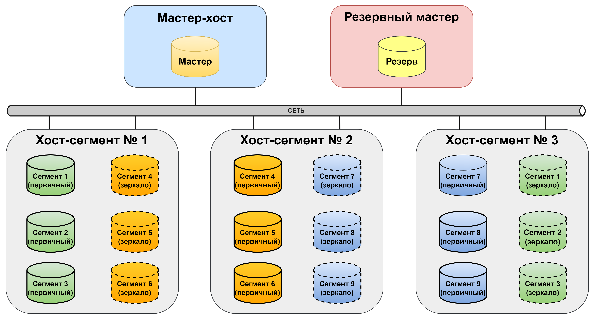
</p>

На каждом хосте GreenPlum запущен(ы) один или несколько **экземпляров PostgreSQL**, в GreenPlum они называются **сегментами**. Чтобы поддерживать отказоустойчивость в кластере дублируются сегменты другого сегмент-хоста. Своего рода получается репликация, хотя в GreenPlum это называется **зеркалированием**.

Существуют несколько типов сегментов GreenPlum.

### Мастер

**Мастер** присутствует в единственном экземпляре и располагается на мастер-хосте. Его задачей является **подключение клиентов к кластеру**, **выдача результатов запросов** и в целом он **обеспечивает координацию работы всего кластера**. Подключающийся пользователь видит только мастер, а весь кластер выглядит как одна большая БД.

### Резерв

Располагается на отдельном мастер-хосте. Он полностью **дублирует данные мастер-сегмента**. Если мастер работает нормально, то к резерву подключиться не получится. В случае отказа мастера, в ручном режиме необходимо активировать резерв и перевести его в режим мастера.

### Первичные сегменты

Этих сегментов в сегмент-хостах может быть несколько, согласно рекомендации лучше использовать от 2 до 8 сегментов. Именно в эти сегменты **хранят в себе пользовательские данные**.

### Сегменты зеркала

Данные сегменты подразумевают собой **зеркало первичного-сегмента**. В случае нормальной работы кластера, зеркала не обрабатывают запросы, а только принимают поток репликаций данных, в связи с этим они не создают нагрузку на процессор и на память. У одного первичного сегмента только одно зеркало, соответственно ***количество зеркал совпадает с количеством первичных сегментов***.

## Типы SQL операций и применение их на сегментах

<p align="center">
    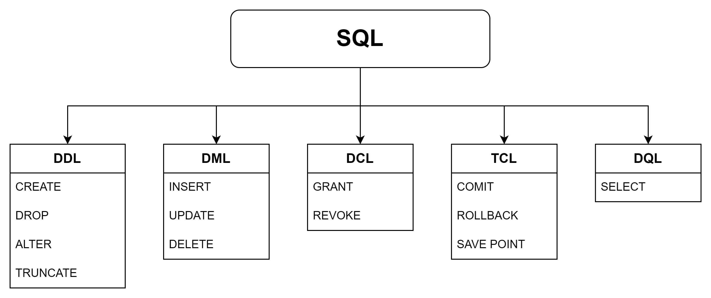
</p>


Стандартом SQL предусмотрены 5 типов SQL-команд:

* **DDL**, это ***язык определения данных***, т.е. операции, которые изменяют саму структуру базы данных. В GreenPlum DDL-команды по своей сути работают только на мастер сегменте, но могут затронуть первичный-сегмент при изменении структуры базы данных.
  
* **DML**, это ***язык манипулирования данными***. На мастер-хосте не выполняются. Обработка таких команд происходит только на уровне первичных-сегментов.
  
* **DCL**, ***язык контроля данных*** или ***язык разграничения данных***, так как с помощью данных команд мы управляем доступом к самим данным. Исполняются исключительно только на мастер-сегменте, что логично, так как именно там находится подсистема подключения клиентов к мастеру.
  
* **TCL**, ***язык управления транзакциями***. Данные операции контролируют транзакции в БД. В GreenPlum мастер-сегмент управляет транзакциями и следит за их состоянием, а первичные-сегменты исполняют операции в контексте транзакции.
  
* **DQL**, ***язык запросов данных***. Это операция извлечения данных из БД. На мастере выполняется оптимизация запроса и генерация его плана,  а на сегментах выполняется основная работа по обработке запросов

Таким образом, ***мастер-сегмент*** отвечает за **управление и контроль**, а ***первичный сегмент*** выполняет **фактическую обработку данных**. 

## Зеркалирование сегментов

### Зеркалирование мастера

Резервная копия или зеркало основного экземпляра разворачивается на **отдельном хосте**. Резервный мастер необходим на случай, если основной мастер-узел выйдет из строя.

<p align="center">
    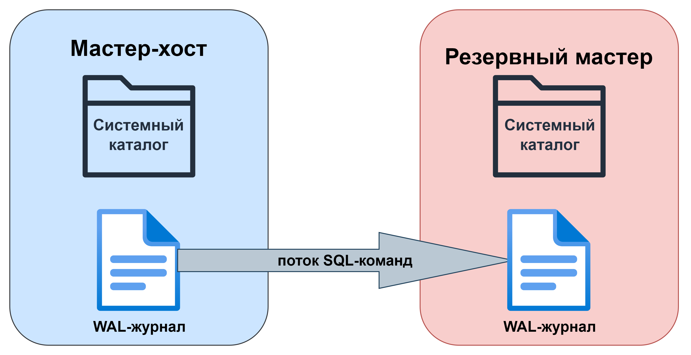
</p>

Резервный мастер поддерживается в актуальном состоянии процессом логической репликации журнала транзакций, его также называют WAL-журнал, который выполняется на резервном мастер-хосте и синхронизирует данные между основным и резервным мастер-хостом.

Если основной мастер выходит из строя, процесс репликации журнала останавливается, и вместо него может быть активизирован резервный мастер. 

<p align="center">
    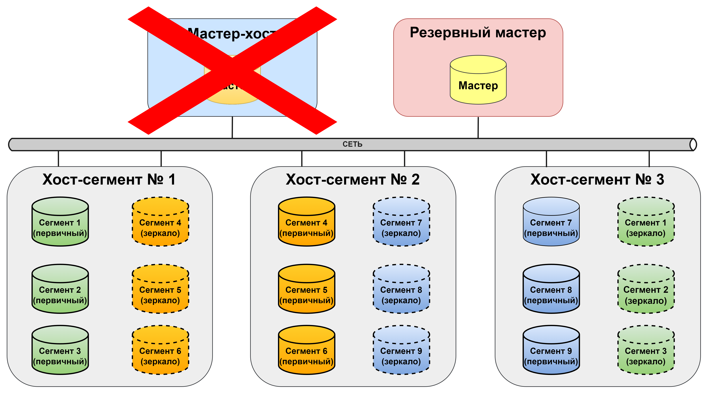
</p>

Переключить мастер можно только **вручную**. При активации резервного мастера реплицированные журналы используются для восстановления состояния основного узла на момент последней успешно зафиксированной транзакции. Активированный резерв фактически становится мастером GreenPlum, принимая клиентские соединения на порт мастера. Поскольку мастер не содержит пользовательских данных, то синхронизации между основной и резервной копиями подлежат только таблицы системного каталога и происходит она достаточно быстро.

### Зеркалирование первичных сегментов

Существуют 2 способа зеркалирования сегментов:

* групповое зеркалирование;
* расширенное зеркалирование.

#### Групповое зеркаливание

Принцип заключается в том, что берутся все первичные сегменты одного хост-сегмента и реплицируются на другом хост-сегменте. На рисунке соединяющими линиями, обозначен поток транзакций WAL-журнала при логической репликации сегментов.

<p align="center">
    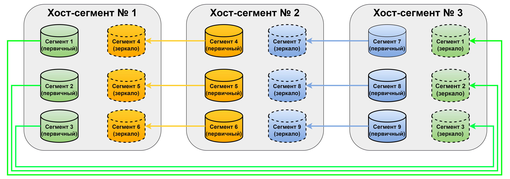
</p>

В случае если хост-сегмент недоступен в **автоматическом** режиме, в работу включаются сегменты-зеркала, которые находятся на другом сервере. Также стоит заметить, что нагрузка на данный сервер значительно увеличивается, а ***работа всего кластера оценивается по работе самого медленного хоста***. 

<p align="center">
    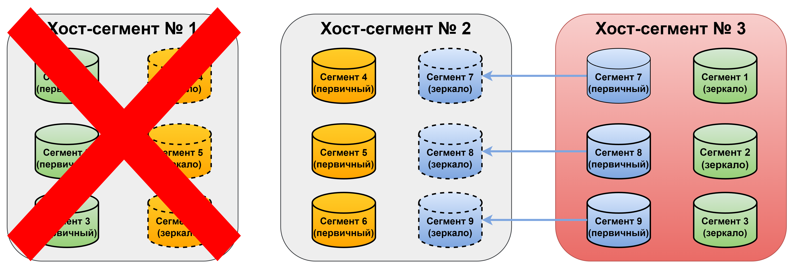
</p>


Как только сломанный хост-сегмент восстановят, сегмент-зеркало синхронизирует WAL-журналы, системные каталоги и первичный сегмент заработает в обычном режиме. 
 

#### Расширенное зеркаливание

Данный способ подразумевает собой, равномерное распределение зеркалируемых сегментов по кластерам. На одном хост сегменте может находиться только одно зеркало другого хост-сегмента из-за этого, накладываются определенные ограничения, количество первичных сегментов на одном хост-сегменте, должно быть **строго меньше**, чем количество хост-сегментов.

<p align="center">
    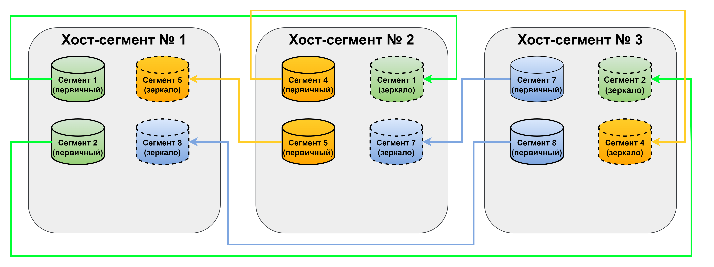
</p>

В случае сбоя одного из хостов, нагрузка  на всех хост-сегментах распределяется **равномерно**, из-за чего не будет сильного замедления всего кластера. 

<p align="center">
    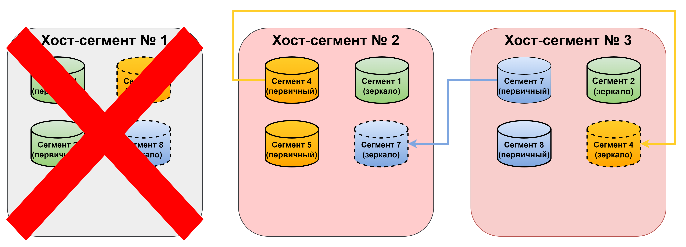
</p>

В общем и целом выйти из строя при зеркалировании сегментов(как при групповом, так и при расширенном) может только 1 хост-сегмент, при выходе работы 2го хост-сегмента, кластер автоматически заканчивает работу с ошибкой.

## Дистрибуция данных

**Дистрибуция** — это принцип проектирования базы данных, при котором данные разбиваются на части и размещаются на разных сегментах.

Для того чтобы применить дистрибуцию к данным, при создании таблицы необходимо прописать ключевое слово **DISTIBUTED**.

В GreenPulm существует 3 вида дистрибуции данных:

* по ключу;
* случайная;
* реплицируемая.

### Дистрибуция по ключу

Ключ дистрибуции может состоять из одной или нескольких полей таблицы. У ключа должна быть ***высокая кардинальность***, т.е. большое количество уникальных значений для более равномерного распределения данных по сегментам. В качестве ключа дистрибуции выгодно выбирать ключ, по которому будут объединяться таблицы по конструкции ```JOIN```.


<p align="center">
    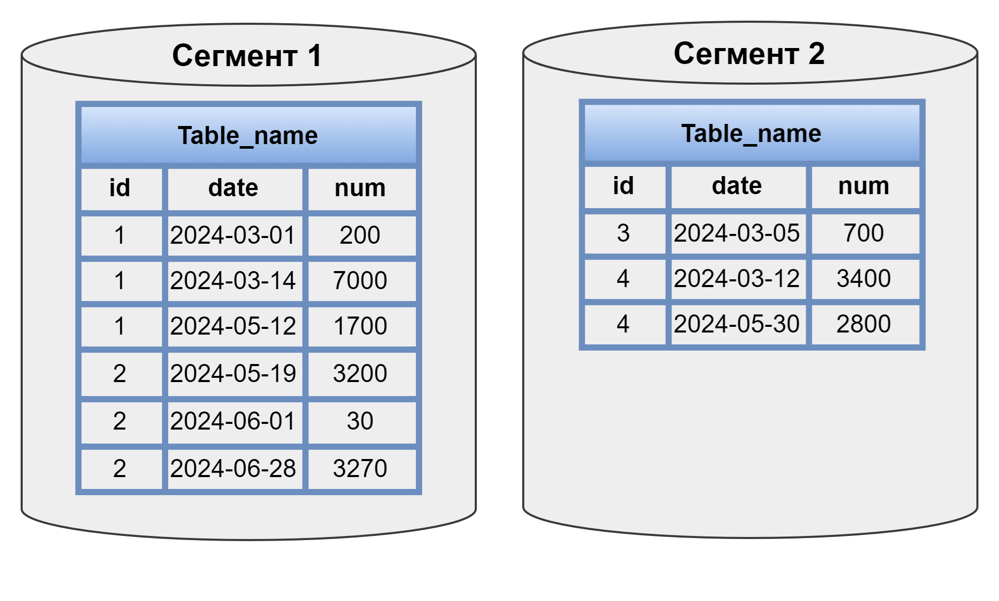
</p>

Принцип заключается в том, что от значения ключа берётся хеш-значение, которое указывает на какой сегмент класть данные.

Согласно рекомендации не рекомендуется делать составной ключ, состоящий из более чем 3х колонок. Код создания такой таблицы выглядит следующим образом:

```
CREATE TABLE ...
DISTRIBUTED BY (id);
```

### Случайная дистрибуция

Если не получается подобрать ключ, то можно использовать дистрибуцию **случайным образом**. В данном случае строки будут просто распределены равномерно по сегментам.

<p align="center">
    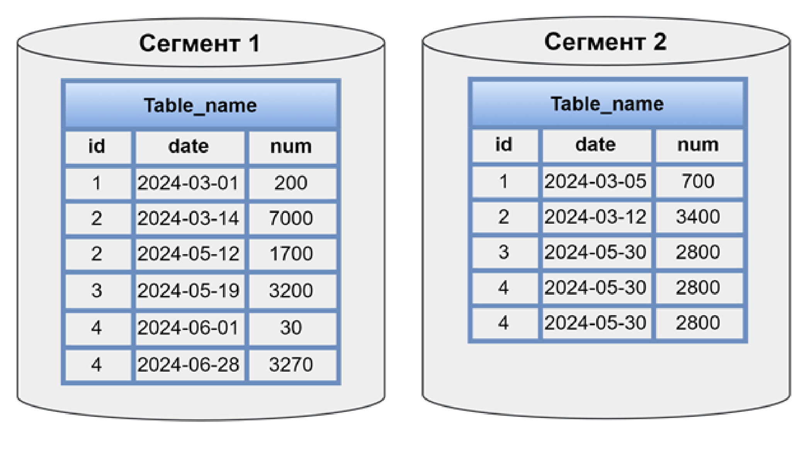
</p>

Код создания такой таблицы выглядит следующим образом:

```
CREATE TABLE ...
DISTRIBUTED RANDOMLY;
```
### Реплицируемая дистрибуция

Если у нас есть небольшая таблица, то лучше использовать **реплицируемое распределение**. В данном случае таблица будет находиться на всех сегментах. Такой тип дистрибуции ускоряет запросы, но занимает больше пространства, поэтому лучше его использовать для таблиц-словарей.

<p align="center">
    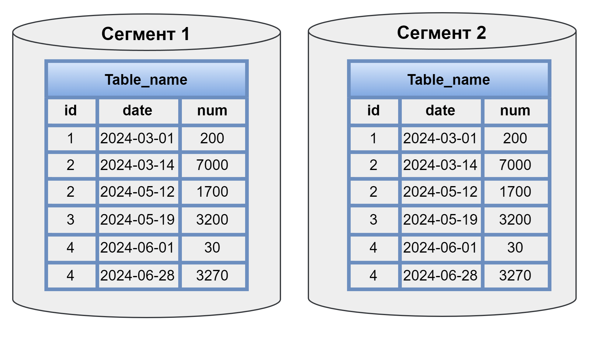
</p>

Код создания такой таблицы выглядит следующим образом:

```
CREATE TABLE ...
DISTRIBUTED REPLICATED;
```

**Важно** всегда явно прописывать какой тип дистрибуции использовать и какие ключи выбираем, от этого зависит распределение данных. Если в запросе при создании таблицы не указать вид дистрибуции, то будет выбрана дистрибуция по ключу и выбрана 1я колонка по типу данных, которой можно хешироваться.

Из-за неправильного распределения страдает оптимизация и, соответственно, время выполнения запроса.

## Виды таблиц

В GreenPlum существует 2 основных вида построения таблиц.


* HEAP-таблица;
* APPEND-OPTIMIZED таблица.

Также присутствуют еще дополнительные виды таблиц, которые за основу построения берут предыдущие виды:

* Временная таблица
* Нежурналируемая таблица
* Внешняя таблица

### HEAP-таблица

В GreenPlum по умолчанию используются **HEAP-таблицы**, которые рекомендуются для OLTP-нагрузок. OLTP подразумевает выполнение коротких транзакций на внесение, удаление и считывание данных, которые должны занимать не более пары секунд. 

<p align="center">
    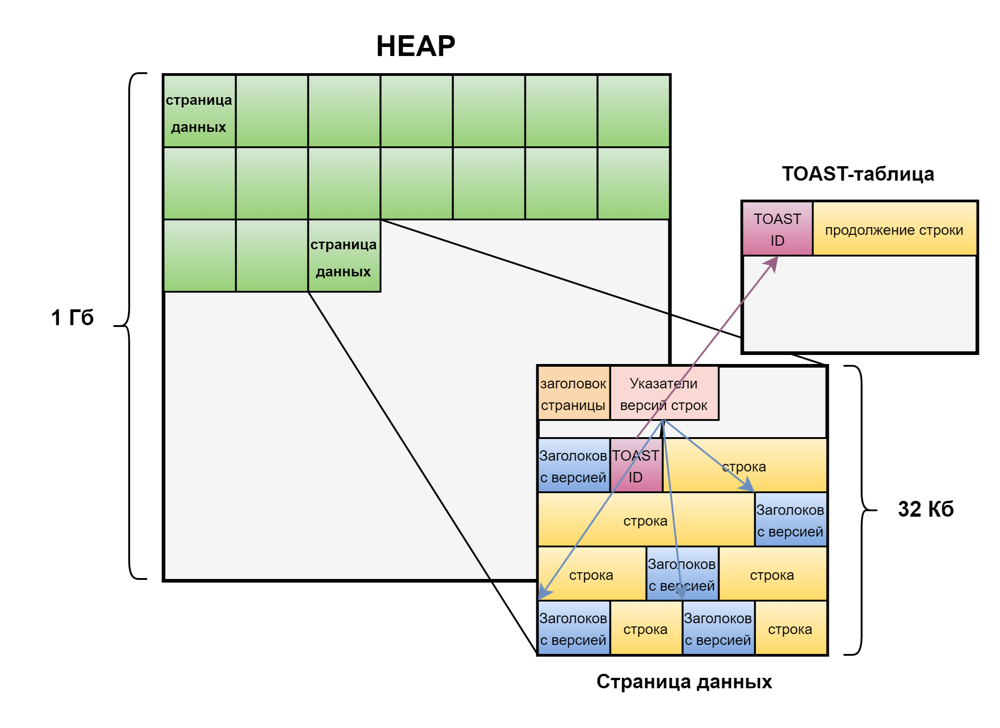
</p>

HEAP-таблица представляет собой файл размером 1 Гб, состоящий из страниц данных по 32 Кб. Каждая страница содержит заголовок, который информирует базу данных о статусе страницы, и указатели на версии строк. Если строка превышает 12 Кб, то  в заголовке строки сохраняется TOAST ID, который в свою очередь ссылается на продолжение строки в TOAST-таблице. 

HEAP-таблицы в GreenPlum позволяют оптимизатору считывать только необходимые данные, что ускоряет выполнение операций ```INSERT```, ```UPDATE``` и ```DELETE```. Однако использование ```SELECT *``` может привести к долгому считыванию данных, из-за того что колонка таблицы находится в TOAST-сегменте.

Таким образом, HEAP-таблицы в GreenPlum могут быть полезны для OLTP-нагрузок, но требуют осторожности при использовании ```SELECT *``` и ```JOIN```.

Чтобы создать такую таблицу используется следующий синтаксис:

```
CREATE TABLE …
WITH (APPENDONLY=false)
DISTRIBUTED BY …
```

### APPEND-OPTIMIZED таблица

**AO-таблицы** предназначены для вставки больших порций данных.  У них более сложная внутренняя структура — транзакционность, модификация данных и индексы реализованы через **вспомогательные heap-таблицы**. Данные хранятся в сегментных файлах, состоящих из блоков произвольной длины, поддерживающих сжатие.

<p align="center">
    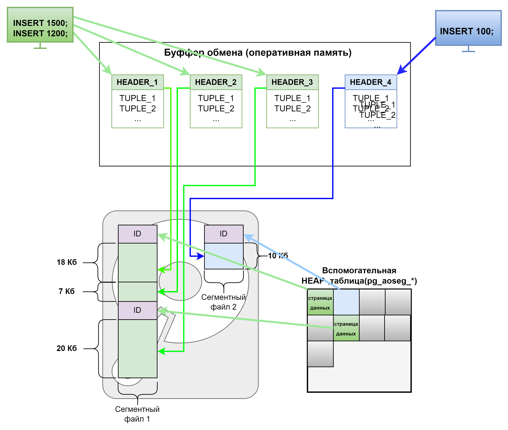
</p>

При вставке данных новые блоки записываются в конец сегментного файла AO-таблицы. Транзакционность вставки обеспечивается за счет вспомогательной heap-таблицы, в которую записывается идентификатор логического смещения конца сегментного файла. 
Каждый процесс при записи данных владеет своим сегментым файлом. Максимально параллельно может удерживаться **127 файлов**, соответственно 127 инструментов могут писать данные в таблицу параллельно. При создании AO-таблицы рядом с ней всегда создается вспомогательная heap-таблица для хранения смещений сегментных файлов.

АО-таблицы необходимо использовать:

* Для средних и больших массивов данных;
* При использовании массовой вставки данных;
* Для аналитической обработки больших объёмов данных.

Более подробно об AO-таблицах написано в [исходниках](https://github.com/greenplum-db/gpdb-archive/blob/main/src/backend/access/appendonly/README.md).

В таблицах оптимизированных на вставку есть 2 ориентации: ***строковая*** и ***колоночная***.

#### Строковая ориентация

При строковой ориентации в сегментных файлах записи хранятся целиком и последовательно, и соответственно, чтобы найти необходимую колонку, необходимо прочитать полностью строку, поэтому данные таблицы хорошо использовать, когда необходимо считать всю таблицу либо её большую часть. 

<p align="center">
    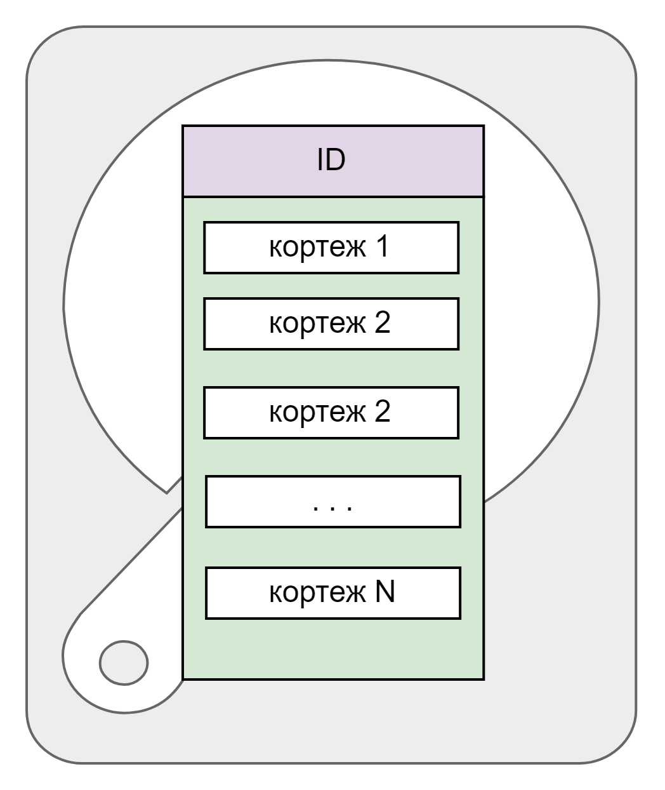
</p>

Данная ориентация используется по умолчанию и является хорошим решением, когда требуется выполение  OLTP и OLAP требований одновременно. Синтаксис создания выглядит следующим образом:

```
CREATE TABLE …
WITH (APPENDONLY=true)
DISTRIBUTED BY …
```

#### Колоночная ориентация

При колоночной ориентации, каждая колонка таблицы хранится в отдельном файле, а в сегментных файлах находятся ссылки на эти файлы. 

<p align="center">
    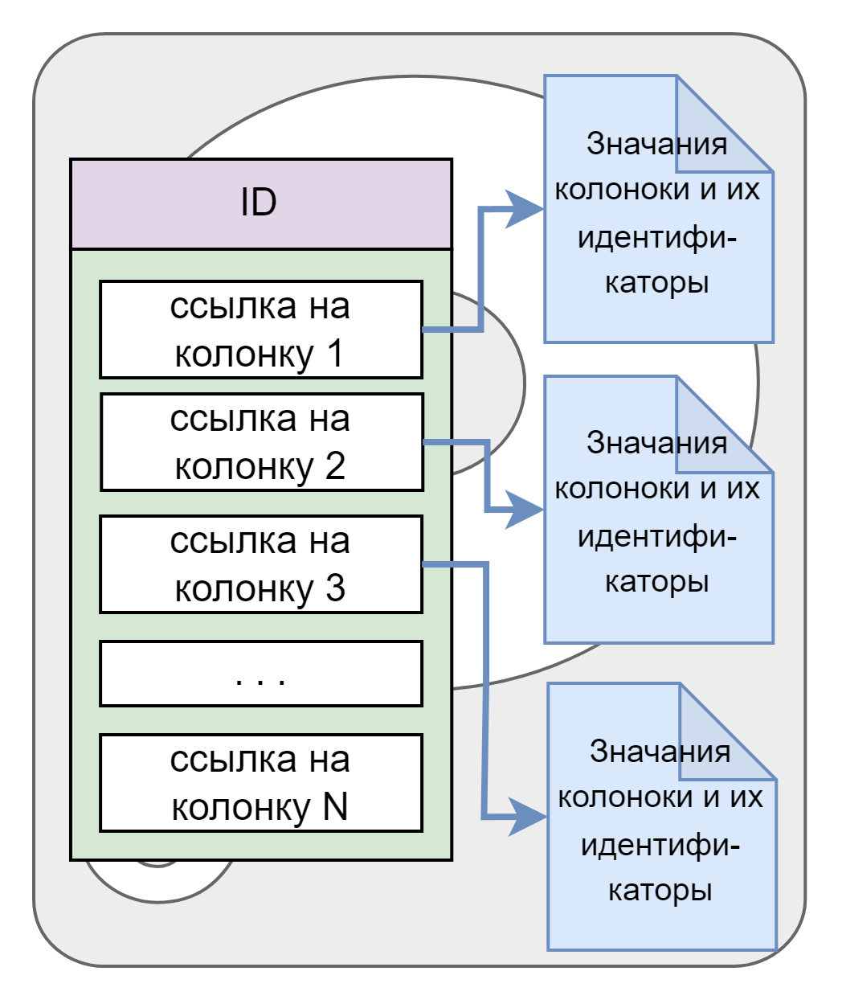
</p>

Это приводит к резкому увеличению количества файлов, в которых хранятся данные, но таблицы с колоночной ориентацией сокращают затраты на чтение, когда запрос обращается к определенным столбцам таблицы. Еще одним плюсом такого метода хранения данных, является то, что такие таблицы лучше сжимаются.

```
CREATE TABLE …
WITH (APPENDONLY=true,
      ORIENTATION = column,
      COMPRESSTYPE=[quicklz|zlib|rle_type|zstd],
      COMPRESSLEVEL=1)
DISTRIBUTED BY …
```

## Партицирование

В GreenPlum, данные в таблицах можно разделять на самих сегментах за счёт партицирования.

<p align="center">
    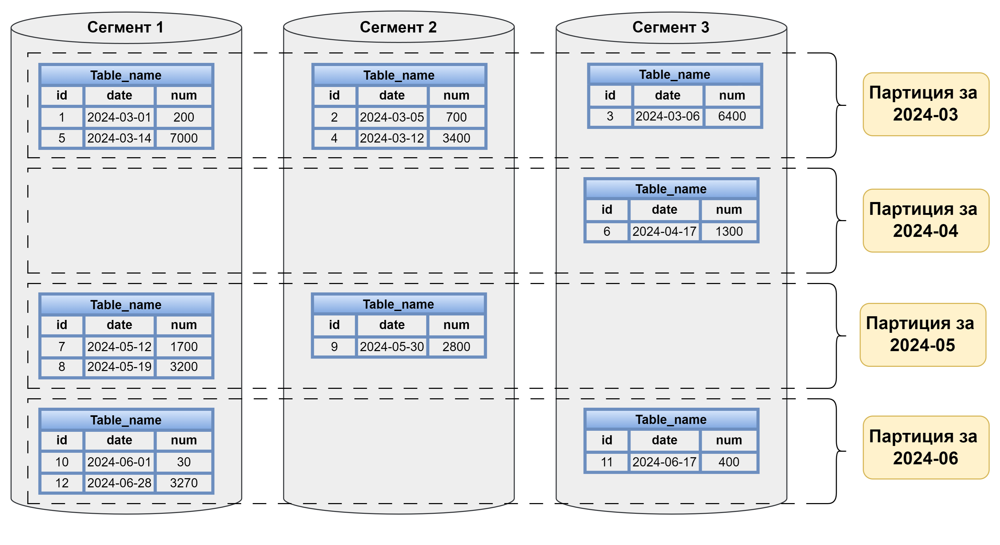
</p>

При партицировании, таблица **физически делится на части** и эти части называются **партициями**. Они позволяют оптимизировать выполнения SQL операций.

Сама партиция представляет собой данные, которые соответствуют определенному диапазону значений ключа партицирования. Сам **ключ партицирования** — это поле значение которого определяет, в какую партицию будет записана строка.

Существует 2 метода партицирования таблиц:

* по диапазону
* по списку

Дополнительно к этим методам можно указать партицию **по умолчанию**, куда будут попадать данные которые не подошли в рамках ключа.

### Партицирование по диапазону

Для объяснения возьмём запрос создания таблицы с партицированием по "дате рождения", где создается 3 партиции, кто родился в 90х, 2000х и 2010х годах. 

```
CREATE TABLE …
WITH …
DISTRIBUTED BY …
PARTITION BY RANGE (date_birth)
(
PARTITION year1990s START ('1990-01-01')
                    END ('2000-01-01')
                    WITH (appendoptimized=TRUE, 
                 compresstype=zstd),
PARTITION year2000s START ('2000-01-01')
                    END ('2010-01-01'),
PARTITION year2010s START ('2010-01-01')
                    END ('2020-00-01'));

```
В конструкции партиции 90х годов можно заметить, конструкцию **WITH**, в которой можно указать все те же самые параметры, что и при создании таблиц, т.е. для партиций можно указывать свою ориентацию, методы сжатия и т.д. По умолчанию берутся параметры ***родительской таблицы***. 

К каждой созданной партиции можно обратиться ```SELECT``` запросом, для этого в конструкции ```FROM``` прописывается имя партиции. Команды DDL и DML для партиций можно выполнить исключительно только через родительскую таблицу.

<p align="center">
    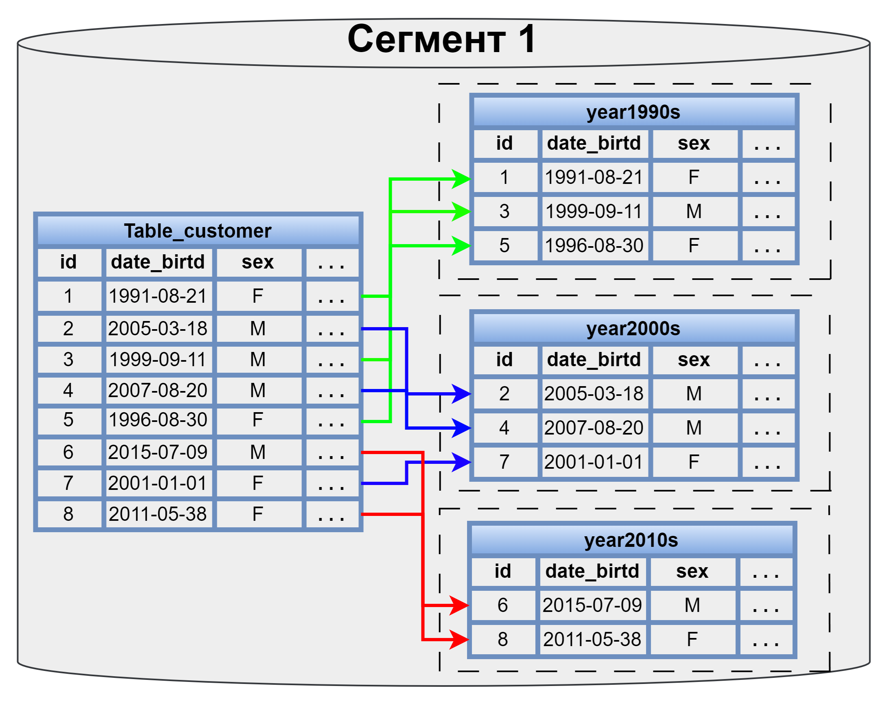
</p>

Чтобы каждый раз не создавать партиции вручную, можно воспользоваться конструкцией представленной ниже. Она включает в себя **границы создания партиции** и **промежуток**, на который будут делиться партиции в рамках границ.

```
(START ('1990-01-01 00:00:00')
    END ('2020-01-01 00:00:00')
    EVERY (INTERVAL '10 YEAR'));
```

### Партицирование по списку

Так же, возьмём пример создания партицированной таблицы по списку, а именно "полу человека".

```
CREATE TABLE ...
WITH…
DISTRIBUTED BY ...
PARTITION BY LIST (sex)
( PARTITION girls VALUES ('F'),
  PARTITION boys VALUES ('M'),
  DEFAULT PARTITION other );

```

Как вы можете заметить таблица разбивается на 3 сегмента, ***мужчин***, ***женщин*** и ***другие***. Партиция "другие" создается за счет конструкции партиции по умолчанию.  

<p align="center">
    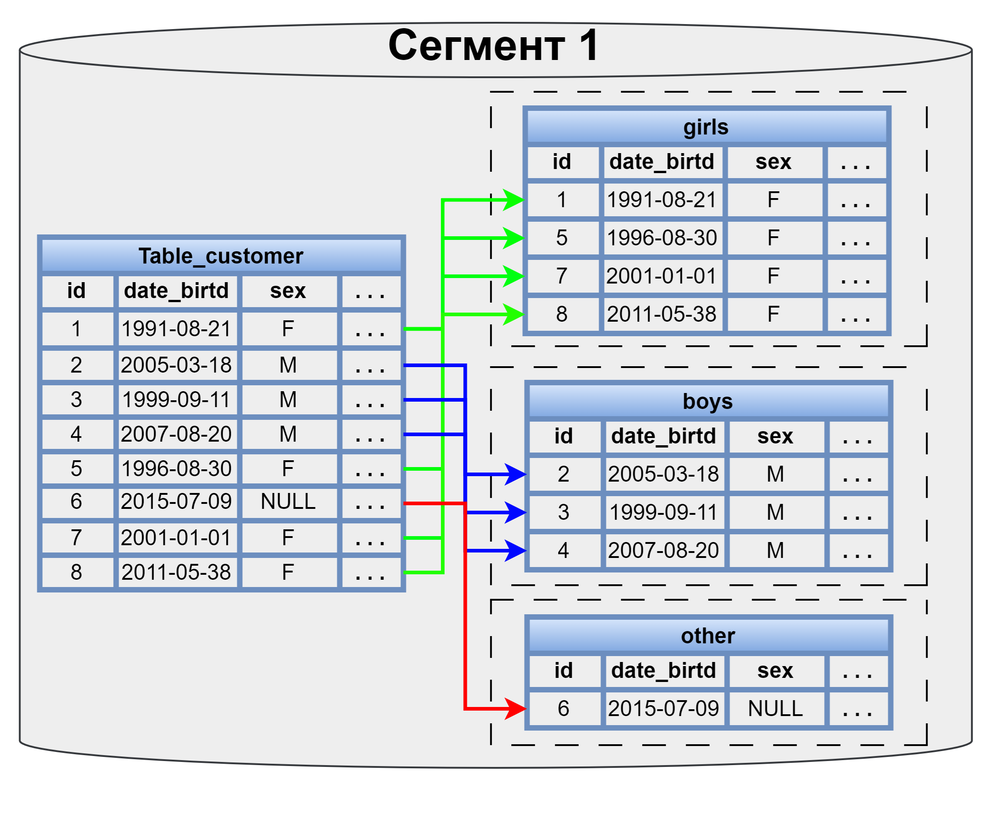
</p>

### Комбинированное партицирование

GreenPlum поддерживает возможность создания **многоуровневого партицирования**, поэтому можно объединить 2 предыдующих случая, следующим образом:

```
CREATE TABLE ...
WITH ...
DISTRIBUTED BY ...
PARTITION BY RANGE (date_birth)
SUBPARTITION BY LIST (sex)
   SUBPARTITION TEMPLATE (
     SUBPARTITION girls VALUES ('F'),
     SUBPARTITION boys VALUES ('M')
        )
(START ('1990-01-01') 
 END ('2025-01-01') 
 EVERY (INTERVAL '10 YEAR'));
```
Но нужно помнить многоуровневое партицирование приводит к **разрастанию количества файлов**.

<p align="center">
    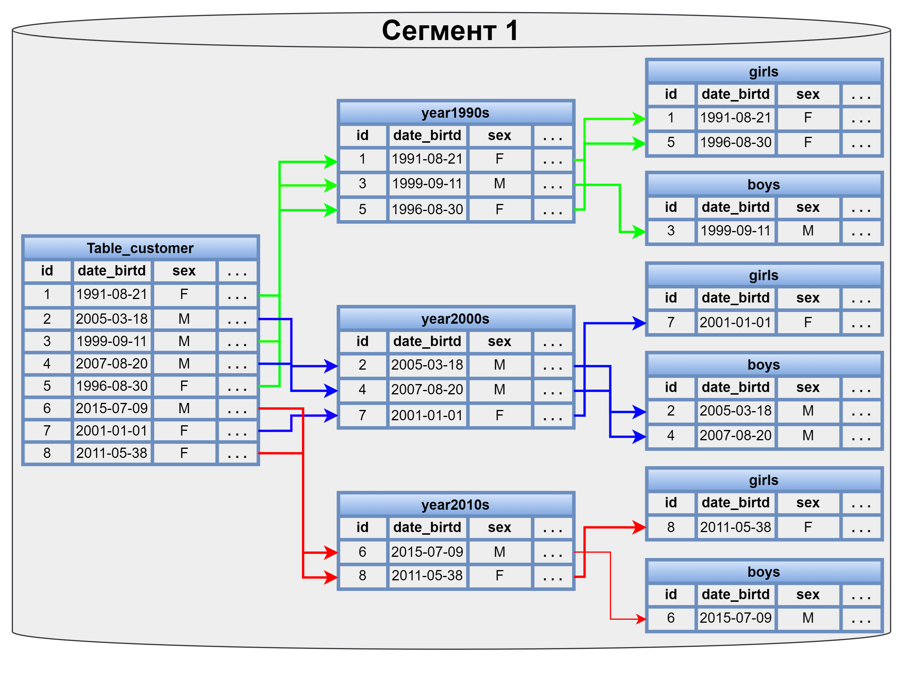
</p>

Согласно документации, рекомендуемое число партиций на одну таблицу должно быть до 1000 файлов, в противном случае необходимо либо увеличить диапазоны, либо продумать другую стратегию хранения данных.

## Индексы

**Индекс** — это специальный объект в БД, который позволяет быстро находить строки по его атрибуту или нескольким атрибутам, чем просто пробегаться по всей таблице. Но как говорилось уже не раз, GreenPlum — это БД построенная на MPP-архитектуре, и может получиться так, что данные уже разделены на части по сегментам, а те в свою очередь могут быть разделены по партициям и в итоге намного выгоднее прочитать всю таблицу, чем лезть в индекс. 

Индексы занимают место на диске и их нельзя сжимать, плюс ко всему замедляется время вставки строк. Поэтому индексы лучше использовать если необходимо из многомиллионной таблицы выводить единичные строки, а во всех остальных случаях лучше остановиться на дистрибуции и партицировании.

<p align="center">
    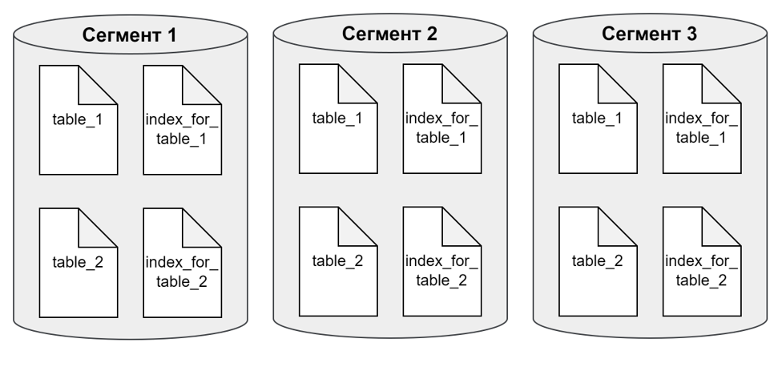
</p>

В GreenPlum существет несколько видов индексов:

* [B-tree](https://habr.com/ru/companies/postgrespro/articles/330544/)
* [Bitmap](https://habr.com/ru/articles/276973/#:~:text=%D1%82%D0%B0%D0%B1%D0%BB%D0%B8%D1%86%D1%8B%20%E2%80%93%20%D1%82%D0%B0%D0%BA%20%D0%BD%D0%B0%D0%B7%D1%8B%D0%B2%D0%B0%D0%B5%D0%BC%D1%8B%D0%B9-,Bitmap%20Index%20Scan,-.%20%D0%9E%D0%BD%20%D0%B2%D1%8B%D0%B3%D0%BB%D1%8F%D0%B4%D0%B8%D1%82%20%D0%B2%D0%BE%D1%82)
* [GIST](https://habr.com/ru/companies/postgrespro/articles/333878/)
* [SP-GIST](https://habr.com/ru/companies/postgrespro/articles/337502/)
* [GIN](https://habr.com/ru/companies/postgrespro/articles/340978/)

## Загрузка и выгрузка данных 

Когда говорится о больших данных, **загрузка** и **выгрузка данных** является одной из важных задач системы. GreenPlum даёт множество различных способов работы как с внутренними данными, так и с внешними.

### Простой способ загрузки и выгрузки данных

Самый простой способ загрузки и выгрузки данных это команды ```INSERT``` и ```SELECT```. 

Этот способ хорошо подойдет если необходимо вставить или вывести несколько сотен строк. Такие команды будут проходить через мастер-хост, так как подключение пользователя происходит на прямую к всему кластеру и именно это место может стать, так называемым "**бутылочным горлышком**".

Такой метод для вставки большого количества данных на практике никогда не используется, но такой функционал есть.

<p align="center">
    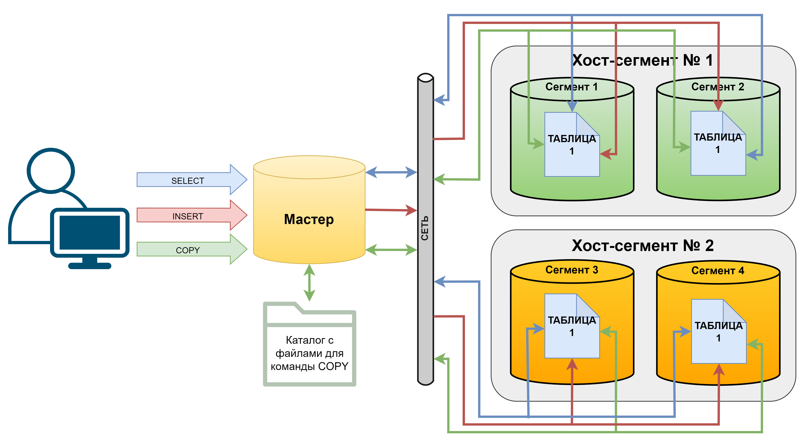
</p>

Еще одной командой является команда ```COPY```, кто знаком с PostrgeSQL уже знает, что она используется для массовой загрузки и выгрузки данных. По своей сути она ничем не отличается от предыдущего решения, за исключением того, что она позволяет загружать данные из файла и соответственно сохранять их в файл. 

Этот способ удобен, если единоразово необходимо загрузить или выгрузить данные из файла, например загрузить данные в словарь-таблицу.

### Загрузки и выгрузка данных с использоваем внешних таблиц

**Внешние таблицы** — это самый эффективный способ занесения данных в хранилище, в связи с тем, что данные не проходят через мастер.

Физически, сама внешняя таблица в БД **не хранится**, а просто база данных **ссылается** на данные в других источниках информации. 

Внешние таблицы хорошо подходят для загрузки и выгрузки данных через команду **INSERT INTO ... SELECT...**

<p align="center">
    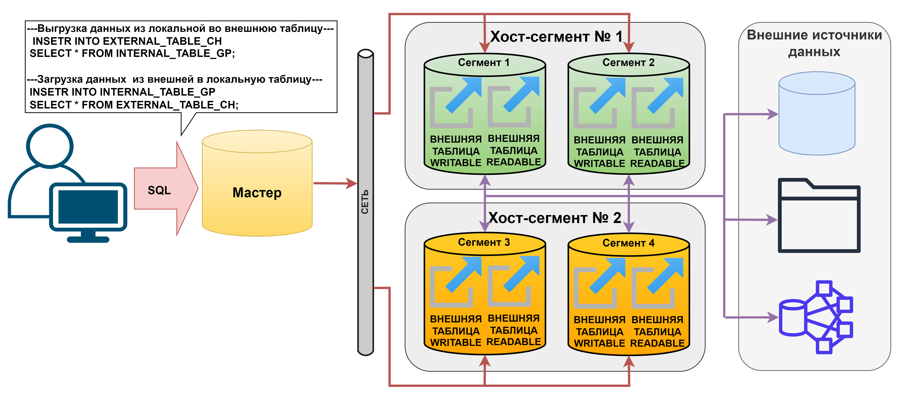
</p>

Существует 2 вида внешних таблиц: **WRITABLE**, **READABLE**. Первая используется для записи, вторая для чтения данных. Одновременно одна внешняя таблица **не может быть** и для чтения и для записи, но можно создать 2 таблицы, которые будут указывать на одни и те же данные. 

Для обмена данными во внешних таблица используются **протоколы**. Их достаточно много, но здесь рассматриваются только 2 самых часто встречаемых: **GPFGIST** и **PXF**.

#### GPFGIST

**GPFGIST**, предназначен для работы только с ***текстовыми данными*** на удалённом сервере. 
 
<p align="center">
    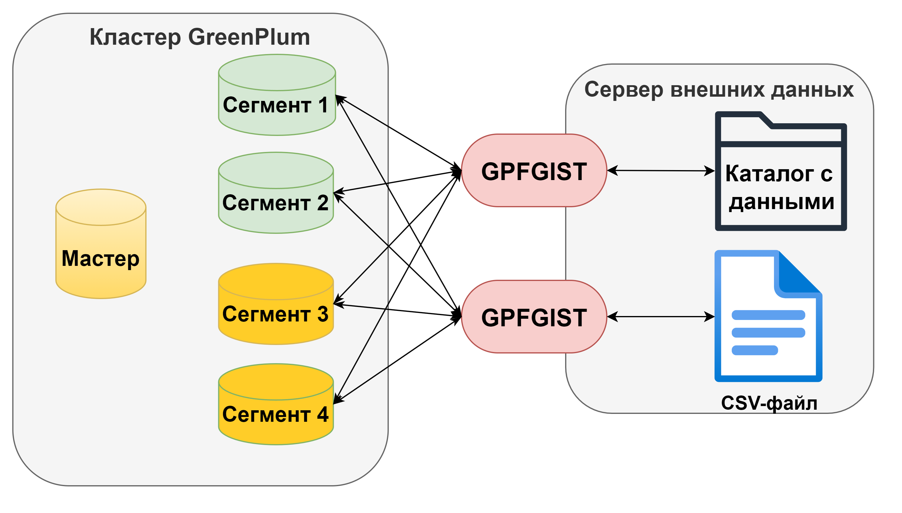
</p>

**GPFGIST**, это не только протокол, но и отдельная **утилита**, которую необходимо запустить на удалённом сервере, где находятся файлы. При создании внешней таблицы мы просто приписываем подключение к данной утилите и каталоги где лежат данные. Она сама управляет распараллеливанием данных по сегментам, после того как с каждого сегмента приходит запрос на считывание данных. Если запросов нет, утилита уходит в спящий режим.

#### PXF

Еще одним протоколом является **PXF**.Он уже более универсальный и является отдельным сервисом для GreenPlum. 

<p align="center">
    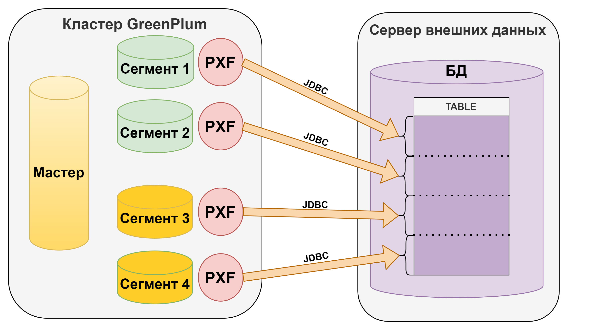
</p>

Он может подключаться, ко многим источникам информации, таким как S3, Hadoop, различные базы данных. Для подключения к базам данных используется обычный **JDBC драйвер**. И тут важно учитывать, что параллелизмом управляет **самостоятельно клиент**. Если мы просто запустим команду **INSERT ... SELECT ...** то PXF запустится на каждом сегменте и загрузить **полную копию данных** на каждый сегмент, чтобы такого не было и каждый сегмент загрузил только определенную часть данных  в PXF задаются определённые параметры **PARTITION BY**, **INTERVAL**, **RANGE**. 

## Оптимизация запросов

В GreenPlum существует 2 оптимизатора, первый от **PostgreSQL** и второй разработанный для GreenPlum — **GROCA**. По умолчанию используется **GROCA** и в целом в 95% запросов, он покажет наилучший результат выполнения запроса, но в 5% возможно нужно будет воспользоваться родным постгресовым.

Чтобы посмотреть план запроса необходимо выполнить 2 команды ``EXPLAIN`` и ``EXPLAIN ANALYZE``. Разница в них в том, что ``EXPLAIN`` выполняет команду на основе **статистических данных** и выдаст вам **предполагаемое дерево выполнения запроса**, которым будет пользоваться отпимизатор. 

<p align="center">
    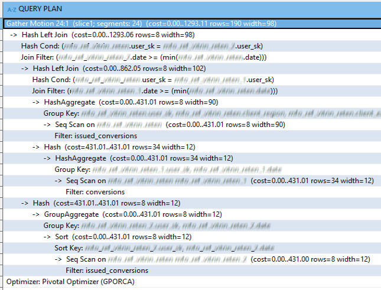
</p>

```EXPLAIN ANALYZE``` в свою очередь выдаст **фактическое выполнение запроса**, т.е. оптимизатор полностью выполняет запрос, а после выдает результат. Эту команду стоит выполнять в тех случаях когда вы уверены, что запрос не положит вашу БД.

<p align="center">
    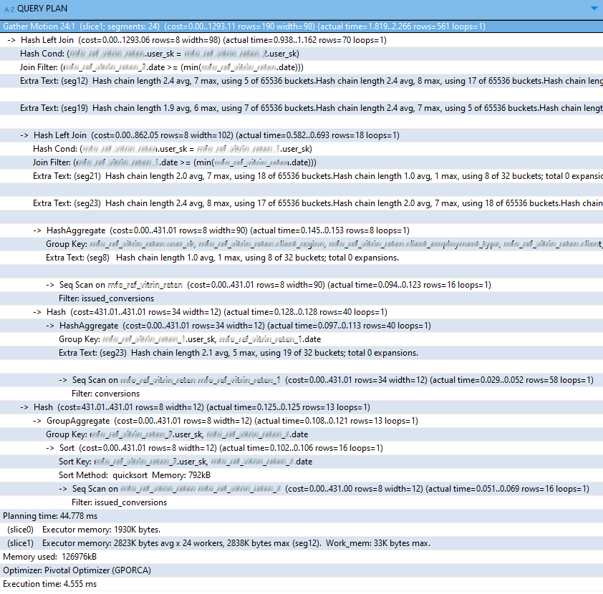
</p>

Планы запросов представляют собой **древовидную структуру**, которую необходимо ***читать с конца***. Каждая строка определяется оператором.

Существует 4 типа операторов:

* операторы доступа;
* операторы преобразований;
* операторы перемещения;
* служебные операторы.

| Операторы доступа | Операторы преобразований| Операторы перемещения| Служебные операторы|
|----------|--------------|--------------|--------|
|Seq Scan|Limit|Redistridute Motion|Result|
|AppendOnly Scan|Sort|Broadcast Motion|Append|
|Column Scan|Hash Join|Gather Motion|Sequence|
|External Scan|Merge Join||Subplan|
|Index Scan|Nested Loop Join||Materialize|
|Bitmap Index Scan|HashAggregate||Partition Selector|
|Bitmap Heap Scan|GroupAggregate||Hash|
|Dynamyc Seq Scan|WindowAgg|||
|Shared Scan||||

### Операторы доступа

- **Seq Scan** - последовательное чтение heap-таблиц.
- **AppendOnly Scan** -  чтение АО-таблицы в строкой ориентации.
- **Column Scan** - чтение АО-таблицы в колоночной ориентации.
- **External Scan** - чтение внешних таблиц.
- **Index Scan** - использование B-tree индекса.
- **Bitmap Index Scan** - использование Bitmap индекса.
- **Bitmap Heap Scan** - использование в фильтрации логических операторов OR или AND.
- **Dynamyc Seq Scan** - используется если таблицу необходимо читать из нескольких партиций.
- **Shared Scan** - используется если в запросе используется CTE-таблица.

### Операторы преобразований

- **Limit** - если встречается оператор limit.
- **Sort** - если необходимо данные отсортировать.
- **Hash, Merge, Nested Loop Join** - это физические методы JOIN.
- **Hash, GroupAggregate** - для оператора GROUP BY
- **WindowAgg** - для оконных функций

### Операторы перемещения

- **Redistribute Motion** - для перемещения данных между сегментами.
- **BroadcastMotion** - когда таблица перемещается на все сегменты.
- **Gather Motion** - когда таблице необходимо соединиться на мастре. Обычно всегда используется в конце, но может произойти так что Gather Motion встретиться посередине запроса, это соответственно достаточно дорогостоящая операция и от нее стоит стараться уходить. 

### Cлужебные операторы

- **Result** - появляется при вычислении функций.
- **Append** - показывает выполнение объединения данных из партиций или оператора UNION.
- **Sequence** - показывает последовательное выполнение операторов.
- **Materialize** - появляется при материализации CTE.
- **Partition Selector** - появляется при выборе партиции, которая есть в конструкции WHERE.
- **Hash** - строится хеш-таблица.
