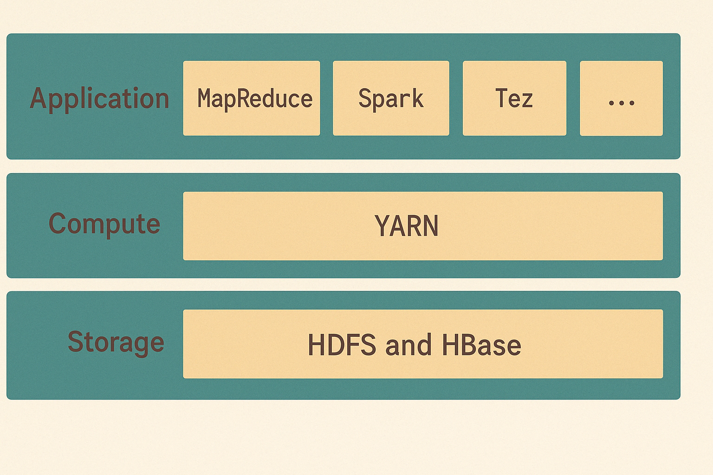
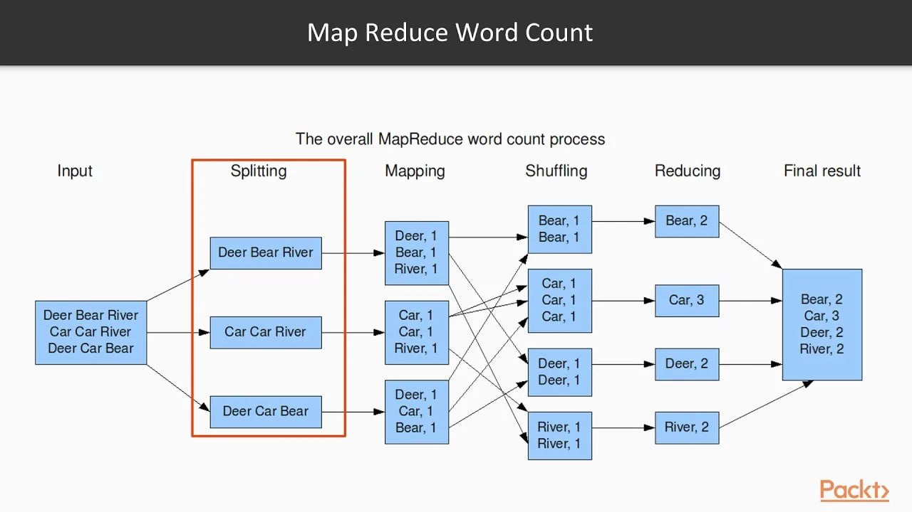
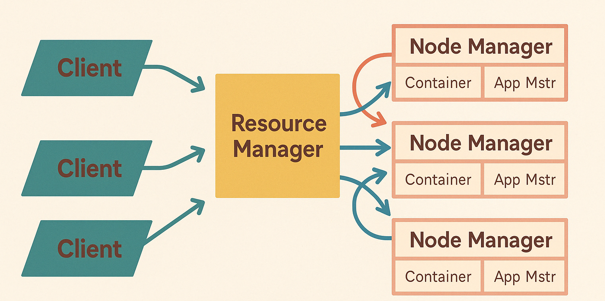

## Куратор раздела

**Подвальный Артем**, 
                                                                                                                      _Data Engineer/Data Scientist_

   [Канал Data Engineer Lab](https://t.me/dataengineerlab)

Хочешь перейти в дата-инженерию, но не знаешь с чего начать? Пиши -  составим резюме, продумаем твое развитие [https://t.me/ampodvalniy](https://t.me/ampodvalniy)

Хочешь улучшить текущий раздел, внести недостающее или поправить формулировку? Предлагай PR и тегай [@Artemlin6231](https://github.com/Artemlin6231)

## Немного об этой главе
Экосистема hadoop разворачивается в большей части компаний при работе с BigData и знание её компонентов также важно как и самого HDFS.

Приятного изучения)

## Компоненты экосистемы Hadoop

    

### HDFS (Hadoop Distributed File System)
Распределённая файловая система, обеспечивающая надёжное и масштабируемое хранение больших объёмов данных на кластере из обычных серверов.

### YARN (Yet Another Resource Negotiator)
Слой управления ресурсами и планирования заданий. Позволяет эффективно распределять ресурсы между различными приложениями, такими как MapReduce, Spark, Tez и другими.

### MapReduce и Spark
Движки для распределённой обработки данных:
- **MapReduce** — классическая модель обработки больших данных.
- **Spark** — более современный, быстрый и гибкий фреймворк для распределённых вычислений в памяти.

### Дополнительные инструменты
- **Hive** — SQL-подобный интерфейс для анализа данных в Hadoop.
- **Pig** — язык потоков данных, простой в использовании для анализа.
- **HBase** — распределённая колонко-ориентированная база данных.
- **Oozie** — планировщик рабочих процессов (workflow scheduler).
- **ZooKeeper** — служба координации и управления распределёнными приложениями.

---

## MapReduce

### Зачем нужен MapReduce?

В условиях стремительного роста объёмов информации традиционные методы обработки данных перестали справляться с поставленными задачами. Компании столкнулись с необходимостью обрабатывать терабайты и даже петабайты данных ежедневно. Именно в ответ на этот вызов и появился MapReduce — революционный подход, ставший фундаментом для распределённых вычислений в рамках экосистемы Hadoop.

### Как работает MapReduce?

    

MapReduce — это способ обработки больших объёмов данных за счёт разбиения задачи на мелкие подзадачи, которые параллельно обрабатываются на разных машинах в кластере.

#### Этапы обработки:

1. **Input**  
   На вход подаётся большой массив данных: текст, логи, последовательности ДНК и т.д.
2. **Splitting**  
   Данные делятся на фрагменты, которые обрабатываются независимо.
3. **Mapping**  
   Каждый фрагмент проходит через функцию `map`, которая превращает данные в пары «ключ — значение».  
4. **Shuffling**  
Все одинаковые ключи группируются:
5. **Reducing**  
К каждой группе применяется функция `reduce`, которая агрегирует значения.
6. **Result**  
Формирование окончательного результата

---

## Что было до YARN?

До появления YARN, архитектура Hadoop в версии **1.x** была построена вокруг модели, в которой система обработки данных была тесно связана с системой управления ресурсами. Центральную роль в этой архитектуре играл компонент под названием **JobTracker**, а на каждом узле кластера работал агент **TaskTracker**.

**JobTracker** размещался на одном выделенном узле и выполнял сразу несколько функций: принимал задания от клиентов (в формате MapReduce), разбивал их на задачи, распределял задачи между узлами, контролировал выполнение и восстанавливал задачи при сбоях. Таким образом, он одновременно был и координатором выполнения, и диспетчером ресурсов, что со временем приводило к чрезмерной нагрузке на него — особенно в крупных кластерах.

**TaskTracker**, в свою очередь, запускался на каждом рабочем узле и исполнял задачи, полученные от JobTracker. Он периодически отправлял отчёты о статусе выполнения задач. При этом каждый TaskTracker имел фиксированное число слотов для `map` и `reduce` задач (например, по два каждого типа). Такая статическая настройка означала, что если задачи одного типа отсутствовали, то ресурсы слота простаивали, что снижало эффективность использования кластера.

К тому же, масштабируемость была сильно ограничена: JobTracker хранил в оперативной памяти всю информацию обо всех заданиях и задачах в кластере. При большом числе заданий он становился узким местом, начинал "захлёбываться" и мог выйти из строя. Поскольку он был **единственной точкой отказа**, его сбой останавливал всю работу кластера.

---

## Что такое YARN?

В ответ на эти архитектурные ограничения в версии **Hadoop 2.x** появилась новая система управления ресурсами — **YARN (Yet Another Resource Negotiator)**. Она стала кардинальной реформой, позволившей отделить управление ресурсами от логики выполнения приложений, что обеспечило гибкость, отказоустойчивость и расширяемость всей экосистемы Hadoop.

Благодаря YARN, Hadoop больше не ограничен только MapReduce-программами — теперь на одном кластере могут параллельно работать Spark, Hive, Tez, Flink и многие другие фреймворки. Это позволило превратить Hadoop из специализированного инструмента в универсальную платформу для обработки больших данных.

    

---

## Архитектура YARN в Hadoop 2.x

Для решения проблем предыдущей версии в **Hadoop 2.x** была представлена новая архитектура — **YARN (Yet Another Resource Negotiator)**. Она стала ключевым компонентом, кардинально изменившим подход к управлению ресурсами в распределённой среде.

Основная идея YARN — **разделить управление ресурсами и выполнение приложений**, тем самым сделав систему более гибкой, масштабируемой и пригодной для работы с разными типами вычислений, а не только с MapReduce.

### Основные компоненты YARN:

- **ResourceManager**  
  Центральный управляющий компонент, выполняющий роль глобального диспетчера ресурсов кластера. Он принимает заявки на ресурсы от приложений, распределяет ресурсы между ними и следит за состоянием узлов. При этом **ResourceManager не управляет задачами напрямую**.

- **ApplicationMaster**  
  Это уникальный процесс, который запускается отдельно для каждого приложения (например, Spark, Hive, MapReduce и др.). Он отвечает за:
  - организацию выполнения приложения,
  - переговоры с ResourceManager по поводу выделения ресурсов,
  - управление задачами внутри приложения.  
  Такой подход позволяет запускать **разные приложения параллельно**, независимо друг от друга.

- **NodeManager**  
  Агент, работающий на каждом узле кластера. Он:
  - отслеживает локальные ресурсы (CPU, память, диск и т.д.),
  - отправляет отчёты ResourceManager'у,
  - запускает **контейнеры (containers)** — изолированные среды выполнения задач.

- **Container**  
  Это изолированная среда, в которой выполняются задачи приложения — будь то MapReduce, Spark, или любой другой фреймворк. Контейнеры запускаются и управляются NodeManager'ом.

---

### Зачем это всё?

Благодаря этой архитектуре, YARN предоставляет **универсальный и расширяемый слой управления ресурсами**, который может обслуживать не только MapReduce-приложения, но и любые другие распределённые фреймворки. Это позволило:

- эффективно использовать ресурсы кластера,
- масштабировать системы до тысяч узлов и миллионов задач,
- запускать разнообразные типы вычислений — от пакетной до потоковой обработки и ML-задач.

---

### Результат

Благодаря YARN, Hadoop превратился из специализированной MapReduce-платформы в **универсальную систему обработки больших данных**, поддерживающую:

- Spark и другие in-memory вычисления,
- потоковую обработку(spark streaming),
- SQL-запросы и интерактивные аналитические задачи (Hive, Presto),
- интеграцию с ML-фреймворками.

## Типичные вопросы на собеседовании
1. Как YARN распределяет ресурсы?
2. Как работает MapReduce — опишите все этапы?
3. Зачем нужен shuffle и почему он дорогой по ресурсам?
4. Чем Spark отличается от MapReduce?
5. Где работает MapReduce? (в памяти или на диске)?
