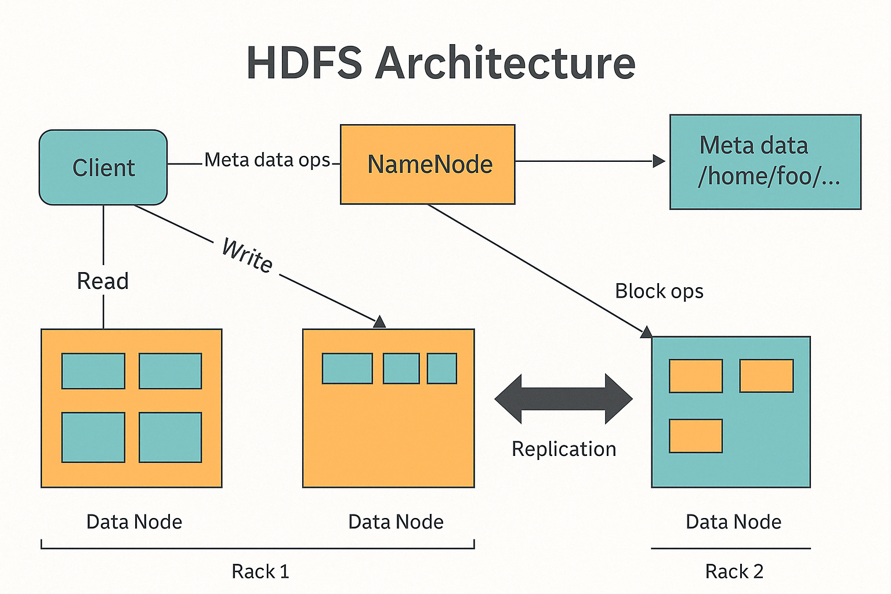
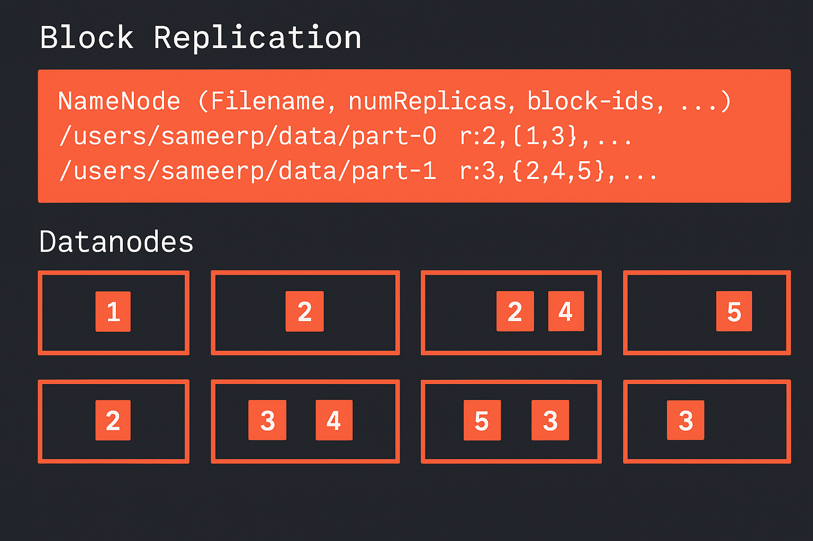
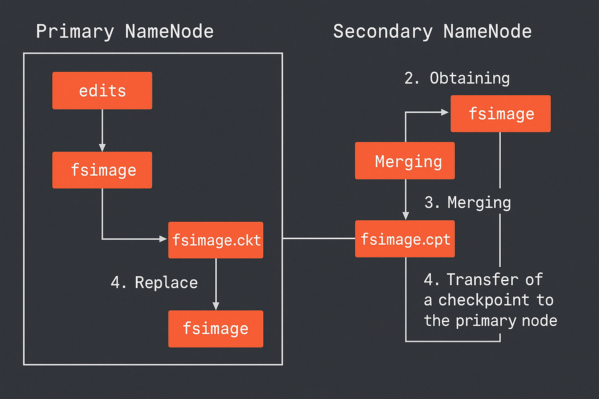

## Куратор раздела

**Подвальный Артем**, 
                                                                                                                      _Data Engineer/Data Scientist_

   [Канал Data Engineer Lab](https://t.me/dataengineerlab)

Хочешь перейти в дата-инженерию, но не знаешь с чего начать? Пиши -  составим резюме, продумаем твое развитие [https://t.me/ampodvalniy](https://t.me/ampodvalniy)
 

Хочешь улучшить текущий раздел, внести недостающее или поправить формулировку? Предлагай PR и тегай [@Artemlin6231](https://github.com/Artemlin6231)

## Немного об этой главе
Понимание Hadoop Distributed File System  - одна из наиболее часто встречающихся тем на собеседованиях, так что разбираться в ней стоит каждому Дата-инженеру.

Приятного изучения)

# Hadoop

**Hadoop Distributed File System** — это один из фундаментальных компонентов в экосистеме обработки больших данных. Он стал краеугольным камнем для дата-инженеров по всему миру и используется в самых разных системах: от банков и телекома до стриминговых платформ и дата-центров.

## Почему HDFS стал таким важным:

- Распределённое хранение данных: большие файлы разбиваются на блоки и автоматически распределяются по множеству узлов.  
- Отказоустойчивость: благодаря репликации блоков (по умолчанию 3 копии), данные не теряются при сбоях узлов.  
- Масштабируемость: можно начинать с нескольких серверов и масштабироваться до тысяч машин без изменения архитектуры.  
- Параллельная обработка: HDFS идеально сочетается с фреймворками типа MapReduce, позволяя выполнять анализ "на месте", рядом с данными.  
- Ориентирован на потоковую запись: файлы в HDFS пишутся один раз и читаются много раз — это идеально для аналитических систем.  

---

## Архитектура HDFS:

    

### Основные компоненты системы

#### Client (Клиент)

Клиент — это пользователь или приложение, взаимодействующее с HDFS. Он не пересылает данные через управляющий узел (NameNode), а напрямую обменивается ими с узлами хранения — DataNode. Однако, перед этим клиент обращается к NameNode для получения информации о размещении данных.

#### NameNode

NameNode — главный управляющий узел системы. Он хранит метаинформацию, такую как структура каталогов, имена файлов, расположение блоков, права доступа и другую служебную информацию. Самих данных на NameNode нет — только информация об их размещении. Все операции по чтению и записи начинаются с запроса клиента к NameNode.

#### DataNode

DataNode — рабочие узлы, на которых физически размещаются блоки данных. Каждый файл в HDFS разбивается на блоки (обычно по 128 или 256 МБ), которые затем распределяются между несколькими DataNode. Эти узлы обрабатывают запросы клиента на чтение и запись блоков, а также участвуют в процессе репликации.

---

## Особенности HDFS

В отличие от традиционных файловых систем, HDFS поддерживает только однократную последовательную запись: файл можно записать только один раз и только одним процессом. Это связано с тем, что система ориентирована на хранение и обработку очень крупных файлов (чаще всего больше 10 ГБ). Каждый файл разбивается на крупные блоки — по умолчанию 128 МБ, но можно увеличить до 256 МБ. Эти блоки представляют собой бинарные объекты (BLOB), физически размещённые на DataNode.

---

## Поддерживаемые операции в HDFS

HDFS поддерживает базовый набор операций для работы с файлами в распределённой среде. Это включает запись новых данных, чтение существующих файлов, удаление ненужной информации, а также автоматическую репликацию данных для обеспечения надёжности и отказоустойчивости системы.

---

## Процесс записи данных

При записи файла клиент сначала обращается к NameNode, запрашивая список подходящих DataNode, куда можно разместить блоки файла. После получения этого списка клиент напрямую отправляет блоки данных на указанные узлы. DataNode сохраняют полученные блоки и автоматически начинают процесс репликации — копируя блоки на другие узлы, согласно заданному фактору. После успешной записи и репликации клиент получает подтверждение об успешном завершении операции.

---

    

## Репликация в HDFS

Для обеспечения надёжности и защиты от потери данных HDFS использует механизм репликации: каждый блок файла сохраняется в нескольких копиях. По умолчанию применяется три реплики (фактор репликации = 3). Система устроена так, что ни один DataNode не хранит более одной копии одного и того же блока. Обычно HDFS размещает две копии в пределах одной стойки, а третью — в другой стойке, чтобы сохранить данные даже при выходе из строя целой стойки.

---

    

## Secondary NameNode

Несмотря на своё название, Secondary NameNode не является резервной копией основного узла. Его задача — периодически создавать контрольные точки (checkpoints), объединяя журнал операций (edits) с текущим образом файловой системы (fsimage) в единый файл. Это помогает снизить нагрузку на NameNode и упрощает его перезапуск. Secondary NameNode работает отдельно и должен быть настроен вручную.

---

## Проблема мелких файлов

Маленькие файлы представляют собой серьёзную проблему для HDFS, так как каждый из них требует хранения отдельной записи в оперативной памяти NameNode. Поскольку NameNode ограничен объёмом доступной памяти, большое количество мелких файлов может привести к её исчерпанию. Это снижает общую производительность системы и ограничивает её масштабируемость. Поэтому HDFS гораздо эффективнее работает с крупными файлами, объединяющими множество мелких данных.

---

## 💻 CLI-команды HDFS

| Категория                | Команда                                                | Описание                                      |
|--------------------------|--------------------------------------------------------|-----------------------------------------------|
| Работа с файлами      | `hdfs dfs -ls /путь`                                  | Просмотр содержимого директории               |
|                          | `hdfs dfs -mkdir /путь`                               | Создание новой директории                     |
|                          | `hdfs dfs -put файл /hdfs/путь`                       | Загрузка файла в HDFS                         |
|                          | `hdfs dfs -get /hdfs/файл путь`                       | Скачивание файла из HDFS                      |
|                          | `hdfs dfs -cat /файл`                                 | Просмотр содержимого файла                    |
|                          | `hdfs dfs -rm /файл`                                  | Удаление файла                                |
|                          | `hdfs dfs -rm -r /каталог`                            | Рекурсивное удаление каталога                 |
|                          | `hdfs dfs -mv /старый /новый`                         | Переименование или перемещение файла          |
| Права и доступ        | `hdfs dfs -chmod 755 /путь`                           | Изменение прав доступа                        |
|                          | `hdfs dfs -chown пользователь:группа /путь`           | Изменение владельца                           |
|                          | `hdfs dfs -chgrp группа /путь`                        | Изменение группы                              |
| Репликация            | `hdfs dfs -setrep -w 2 /файл`                         | Установка фактора репликации                  |
|                          | `hdfs dfs -getrep /файл`                              | Просмотр текущего уровня репликации           |
| Инфо о системе        | `hdfs dfsadmin -report`                               | Информация о состоянии DataNode               |
|                          | `hdfs dfs -du -h /путь`                               | Размер директории/файла                       |
|                          | `hdfs dfs -df -h`                                     | Использование пространства в HDFS             |
|                          | `hdfs dfs -count /путь`                               | Количество файлов, директорий и байт          |

---

## Типичные вопросы на собеседовании
1. Что такое DataNode и NameNode?
2. Что такое Secondary NameNode?
3. Какие операции можно делать с файлами?
4. Можно ли добавить информацию в файл на hdfs?
5. Проблема мелких файлов что это такое?

