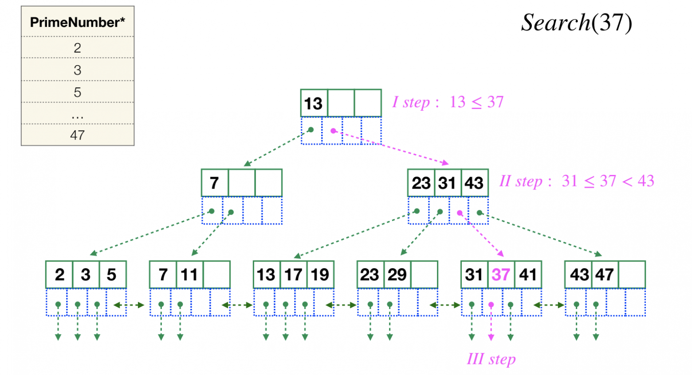
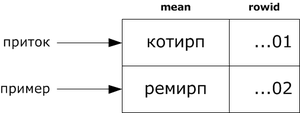
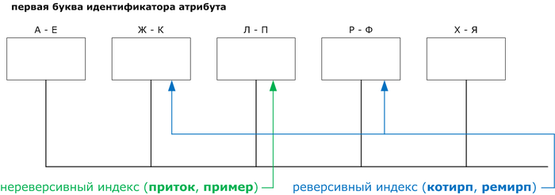
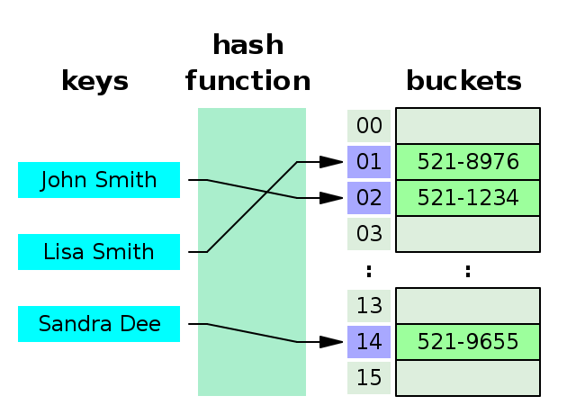
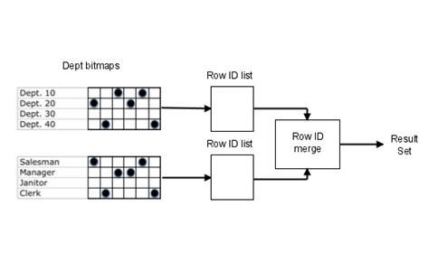
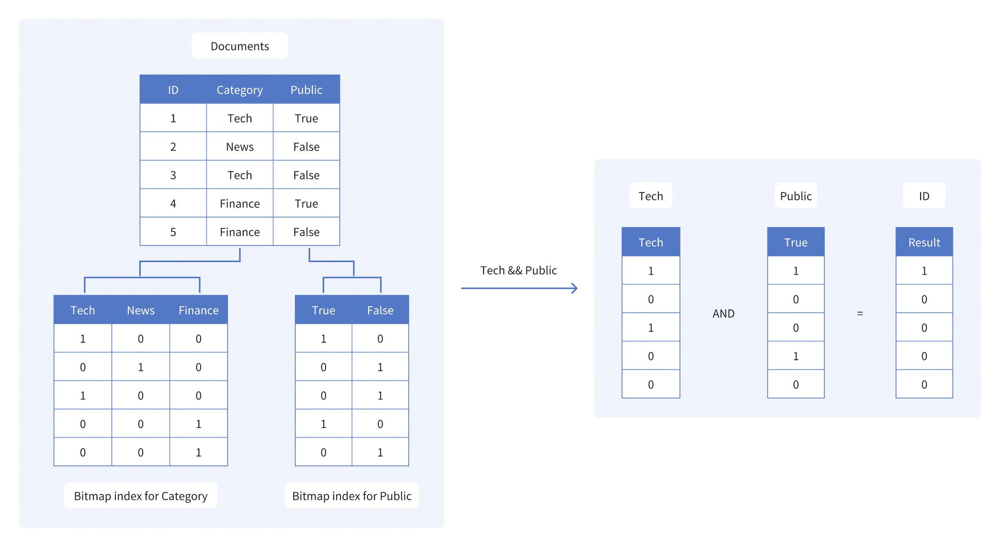

## Куратор раздела


**it пингвин**, 
                                                                                                                      Data Engineer

   

Мне 25 лет, и я - главный разработчик озера данных в одном из топовых банков России. За плечами - опыт работы в крупных IT-компаниях (телеком и банки), а в трудовой книжке есть записи: инженер КХД, ETL-разработчик, Data Engineer

Также я веду [Telegram канал](https://t.me/data_penguin). 

Этот канал - это место, где я делюсь тем, что было бы полезно и интересно мне самому. Здесь много интересной  информации: от базовых основ для новичков до продвинутых лайфхаков и хардкорных инсайдов. 

Также на канале делаю обзоры и разборы своих собеседований, объясняю всякие теоритические штуки и на канале решаем много задачек разного уровня. В планах еще много всего интересного.

Хочешь улучшить текущий раздел, внести недостающее или поправить формулировку? Предлагай PR и тегай [@it-pengwin](https://github.com/it-pengwin)


# Индексы и партиции


## Объяснение на пальцах:


**1. Таблица без индексов и партиций (просто мешок)**

Давайте представим, что у нас есть мешок с кубиками, на которых номерки:


Как выглядит:

<p align="center">
    
</p>


Есть один большой мешок, куда все номерки (данные) бросаются в случайном порядке.

Пример:
```
CREATE TABLE bags (

  number_cube INT  -- цифра на кубике
  
);
```
**Как работает:**

Чтобы найти нужный номерок (number_cube=5) придётся перебрать весь мешок вручную - сканируем всю таблицу (Full Scan).

Плюс: Быстрая запись (просто кидаем в мешок).

Минус: Медленный поиск.

**2. Таблица с партициями (Несколько мешков с разделением)**

**Как работает:**

Теперь у нас есть несколько мешков, разделённых по правилу. Например, можно брать на каждый диапазон номеров новый мешок - 1-10 мешок №1, 11-20 мешок №2, 21-30 мешок №3 и тд.
Когда нам нужно найти кубик с номеров 15, мы сразу идем в мешок №2 и просматриваем только 10 кубиков (11-20).


Или можно представить, что у кубиков еще есть цвета (нейронка не смогла числа  нарисовать, ну ничего страшного):

<p align="center">
    
</p>


Пример:

```
CREATE TABLE partitioned_bags (

    number_cube INT,
    
    color VARCHAR(20)  -- Цвет номерка (ключ партиции)
    
) 
PARTITION BY LIST (color);

-- Создаём отдельные мешки для каждого цвета

CREATE TABLE bags_red PARTITION OF partitioned_bags FOR VALUES IN ('red');

CREATE TABLE bags_blue PARTITION OF partitioned_bags FOR VALUES IN ('blue');
```
**Как работает:**

Если ищем красный номерок (color='red'), СУБД полезет только в мешок bags_red.

Плюс: Ускорение поиска по ключу партиции.

Минус: Если ищем без указания цвета — проверяем все мешки. Чуть сложнее сопровождать, чем таблицу без партиций.

*Если мало данных (<1млн) нет смысла делить таблицу по партициям. Прироста производительности не будет.

**3. Таблица с индексом (Мешок + каталог номерков)**

Если все 1000 лежат в перемешку (мешок), нам нужно просмотреть все кубики, пока не найдем нужный. Можем найти его первым, а можем 1000-ым. А если мы будем знать, что среди кубиком **могут быть повторения** номерков, тогда мы будем **обязаны** всегда смотреть **все 1000** кубиков. 

Индекс может ускорить поиск номерков.

Можно представить, что у нас вообще нет мешка и все кубики лежат **отсортированные** и тогда мы найдем нужный номерок быстрее. 

Допустим, на полу лежат 1000 кубиков отсортированные от 1 до 1000. 

Нужно достать номер 410. Нам не нужно смотреть каждый номерок, мы будем просмотреть сразу большим срезами. Например, находим кубик с номером 500. 410<500, значит правую половину (501-1000) мы сразу отсекаем, она нам не подходит. Далее находим 250. 250<410 - отсекаем левую часть (1-250) и тд. Мы найдем наш номерок за несколько шагов. 

Такой индекс будет называться **кластерным**, когда не создается дополнительная сущность, а сразу вся таблица сортируется.


Минус: мы будем дольше записывать данные. Например, number_cube=5 мы не можем записать в конец, как было раньше (просто кинули в мешок), а должны найти подходящее место в списке и все оставшиеся кубики подвинуть (перестроить индекс). 


Другой вариант **некластерный** индекс.

Как выглядит:

У нас есть как раньше один мешок, но есть еще отдельный список (индекс), где записано:
«Номерок 5 лежит на дне, номерок 12 — у горловины».

Пример:

```
CREATE TABLE indexed_bags (
    number_cube INT
);

-- Создаём "каталог" для быстрого поиска номерков

CREATE INDEX idx_number ON indexed_bags (number_cube);
```

**Как работает:**

При поиске number_cube=5 СУБД сначала смотрит в индекс (каталог). Так как в каталоге все **отсортировано**, СУБД быстро находит нужный номер, где в соседней ячейке будут написаны координаты положения этого кубика в мешке (в таблице это ctid или rowid). Далее СУБД знает координаты местоположения кубика в мешке (всей строки, например с 30 полями) и быстро находит его, не просматривая все кубики из мешка. 

Плюс: Быстрый поиск по number_cube.

Минус: Запись медленнее (нужно обновлять и мешок, и каталог). Необходимо еще место на диске для католога. Неоптимизированный индекс может весить больше, чем сама таблица.


**Когда что использовать?**

- Просто мешок — если данные пишутся часто, а читаются редко (логи).

- Несколько мешков (партиции) — если данные можно чётко разделить (например, по дате, по региону, по бизнес сегменту).

- Отсортированный список/Мешок + каталог (индекс) — если нужен быстрый поиск по ключевому полю (id, email). Если это поле используется в условии соединения таблиц, или в where, group by, order by и тд. Когда данные в таблицах редко меняются (каждый INSERT/UPDATE/DELETE требует обновления индекса). Если выбирается небольшой процент данных, до 5%. Объем данных свыше 5% эффективнее "фулл сканить". 


С детскими аналогиями закончим :)

Теперь попробую рассказть поподробнее про партиции и индексы

# **Индексы**
Это очень популярная тема на собеседованиях. Спрашивают что такое индексы, когда их нужно испольльзовать, когда не нельзя? Какие есть виды индексов?

**Индексы в базах данных** — это специальные структуры, ускоряющие поиск и сортировку данных. Они работают подобно оглавлению в книге, позволяя СУБД быстро находить строки без полного сканирования таблицы.


Если грамотно использовать индекс скорость запроса может увеличиться в тысячи раз. И также наоборот, неправильное использование индекса может положить на лопатки весь запрос и сожрать все ресурсы.

**Рекомендуемые случаи для индексов**

- Первичные и внешние ключи - автоматически индексируются в большинстве СУБД

- Часто используемые в WHERE - столбцы, по которым часто фильтруют данные

- Столбцы в JOIN условиях - для ускорения соединений таблиц

- Столбцы в ORDER BY - особенно если часто требуется сортировка

- Столбцы в GROUP BY - для ускорения агрегации

- Уникальные значения - столбцы с высокой селективностью (много уникальных значений)


**Когда индексы могут быть неэффективны**
- Часто изменяемые таблицы - каждый INSERT/UPDATE/DELETE требует обновления индекса

- Столбцы с малым количеством уникальных значений (низкая селективность)

- Очень большие таблицы с редкими запросами - затраты на поддержку индекса могут превысить выгоду
- Выбор большого количество данных из таблицы(>5%). Быстрее будет прочитать фулл сканом.


## Классификация индексов


Индексы можно делить по группам по многим разным признакам.


### Кластеризованные и некластеризованные индексы


*они же кластерный/некластерный индексы.

**Что такое кластеризованный индекс?**

**Кластеризованный** индекс – это тип индекса, который сортирует строки данных в таблице по их ключевым значениям. В базе данных существует только один кластеризованный индекс на таблицу.
Кластерный индекс определяет порядок, в котором данные хранятся в таблице и могут быть отсортированы только одним способом. Таким образом, для каждой таблицы может быть только один кластеризованный индекс. В СУБД, как правило, первичный ключ позволяет создавать кластерный индекс на основе этого конкретного столбца.

**Что такое некластеризованный индекс?**

**Некластеризованный** индекс хранит данные в одном месте и индексы в другом месте. Индекс содержит указатели на местоположение этих данных. Одна таблица может иметь много некластеризованных индексов, поскольку индекс в некластеризованном индексе хранится в разных местах.
Например, книга может иметь более одного индекса, один в начале, который отображает содержание книги, а второй индекс показывает индекс терминов в алфавитном порядке.
Некластеризованный индекс определяется в неупорядоченном поле таблицы. Этот тип метода индексации помогает повысить производительность запросов, использующих ключи, которые не назначены в качестве первичного ключа. Некластеризованный индекс позволяет добавить уникальный ключ для таблицы.


<p align="center">
    
</p>


||Кластеризованный индекс | Некластеризованный индекс |
| -------------| ------------- | ------------- |
|Использовать для|	Вы можете сортировать записи и физически хранить кластерный индекс в памяти в соответствии с порядком|	Некластеризованный индекс помогает вам создать логический порядок для строк данных и использует указатели для физических файлов данных|
Метод хранения|	Позволяет хранить страницы данных в конечных узлах индекса.|	Этот метод индексации никогда не сохраняет страницы данных в конечных узлах индекса.|
Размер|	Размер кластерного индекса довольно велик.|	Размер некластеризованного индекса невелик по сравнению с кластеризованным индексом.|
Доступ к данным|	Быстрее|	Медленнее по сравнению с кластерным индексом|
Дополнительное дисковое пространство|	Не требуется|	Требуется хранить индекс отдельно|
Тип ключа|	По умолчанию первичные ключи таблицы являются кластерным индексом.|	Его можно использовать с уникальным ограничением на таблицу, которое действует как составной ключ.|
Главная особенность|	Кластерный индекс может повысить производительность поиска данных.|	Он должен быть создан на столбцах, которые используются в соединениях.


### Уникальные и неуникальные индексы

**Уникальный** (Unique index) — все значения встречаются только один раз. Если в столбец с уникальным индексом попробовать добавить неуникальное значение, то возникнет ошибка.

**Неуникальный** (Non-unique index) — индекс, при котором значения могут повторяться.


### Простые и составные  индексы

**Простой** (Simple index) — индекс, состоящий из одного поля.

**Составной** (Composite Index) — индекс, который строится по нескольким столбцам таблицы. В данном типе индекса расположение полей является важным. Здесь поля сортируются как и в order by сначала по 1,потом по 2 и тд. Если в 1 поле одинаковые значения, сортируем по следующим полям.


### Классификация по структуре

**1. B-деревья (B-Tree и B+Tree)**


Самое главное, что нужно запомнить - B-Tree индекс используется в 90% случаях.

**B-Tree** – это самобалансирующаяся древовидная структура данных, которая поддерживает отсортированные данные и позволяет выполнять поиск, последовательный доступ, вставки и удаления за логарифмическое время . B-дерево обобщает двоичное дерево поиска , допуская узлы с более чем двумя потомками. В отличие от других самобалансирующихся двоичных деревьев поиска , B-дерево хорошо подходит для систем хранения, которые считывают и записывают относительно большие блоки данных , таких как базы данных и файловые системы .

Не путать с бинарным деревом. В бинарном дереве делим на 2 и оно получается очень "высоким". Сбалансированное дерево "широкое" и в глубь обычно немного уровней. Для большого количества данных, коненчно, сбалансированное дерево более эффективно.

<p align="center">
    
</p>


balanced tree индекс -  это индекс сгруппированный по листьям сбалансированного дерева. Применяется для больших индексов, **по сути это индекс индексов**. Ну скажем индексы с величиной от 1 до 10 хранятся в одной ветке, от 11 до 20 в другой и т.д., когда приходит запрос на индекс с номером 35, идем к 3-й ветке и находим там 5-й элемент. 


- Данные сортируются по ключу.

- Поиск происходит за O(log n).

Команда для создания обычного B-Tree индекса следующая: 

```
CREATE INDEX idx_user ON test.user (id);
```


**B+Tree** (используется в MySQL, PostgreSQL) - это улучшенная версия, где данные хранятся только в листьях, а внутренние узлы содержат ключи для быстрого поиска. Подходят для диапазонных запросов (WHERE age BETWEEN 18 AND 30).

Подробнее можно почитать здесь: 
- https://en.wikipedia.org/wiki/B-tree
- https://habr.com/ru/companies/quadcode/articles/696498/ 


Здесь еще хочется упоминуть **реверсивные индексы**.

**Реверсивный индекс** — это особый вид B-Tree индекса, где ключи хранятся в обратном порядке (например, значение 1234 становится 4321). Специализированные индексы для оптимизации вставок. 


Оригинальный ключ: 1001, 1002, 1003

В реверсивном индексе: 1001 → 1001, 1002 → 2001, 1003 → 3001

**Зачем они нужны?**
- Основная цель — снижение конкуренции (contention) в высоконагруженных OLTP-системах, особенно при вставке последовательных значений (например, автоинкрементных ID).
Используется в больших кластерных системах и позволяют равномерно распределить индексы по серверам кластера. 

В обычном B-Tree индекс с последовательными ключами (1, 2, 3, ...) все новые записи попадают в один "правый" лист дерева, создавая "горячую точку" (hot spot).

Реверсивный индекс **распределяет вставки равномерно** по всему дереву. 

<p align="left">
    
</p>


Пусть для хранения индекса слов используется кластер, состоящий из 5 серверов:

<p align="center">
    
</p>


Данный пример показывает, что применение реверсивного индекса позволяет снизить нагрузку на сервер вдвое (распределить её между другими).


**2. Хеш-индексы (Hash Indexes)**

Хеш-индексы используют хеш-функцию для быстрого доступа к данным. Хеш-функция — это алгоритм, который преобразует входные данные (или ключ) в число фиксированного размера, называемое хеш-значением. В PostgreSQL хеш-функция всегда возвращает значение типа integer, что составляет примерно 4 миллиарда возможных значений.

Когда новый ключ добавляется в индекс, PostgreSQL применяет к нему хеш-функцию, которая преобразует ключ в хеш-значение. Это значение будет использоваться для быстрого поиска соответствующих записей.

Хеш-значение используется для определения номера бакета (корзины), в который будет помещена запись. В PostgreSQL количество бакетов изначально равно двум и увеличивается динамически по мере роста данных. Номер бакета вычисляется с помощью битовой арифметики на основе хеш-значения.

<p align="center">
    
</p>


Структура хеш-индекса
Хеш-индексы в PostgreSQL имеют сложную внутреннюю структуру, которая состоит из нескольких типов страниц: мета-страницы, страницы бакетов, переполненные страницы и битовые карты.


Хеш-индексы предназначены в первую очередь для нагрузки с большим количеством операций SELECT и UPDATE, которые выполняют сканирование с проверкой равенства для больших таблиц. В индексе-B-дереве поиск должен проходить по дереву до тех пор, пока не будет найдена листовая страница. В таблицах с миллионами строк такой «спуск» может увеличить время доступа к данным. Листовым страницам в хеш-индексе соответствуют страницы ячеек. В отличие от индекса-B-дерева хеш-индекс позволяет напрямую обращаться к страницам ячеек, тем самым потенциально сокращая время доступа к индексу в больших таблицах. Это сокращение «логического ввода-вывода» становится ещё более заметным для индексов/данных, которые не умещаются в общих буферах/ОЗУ.

**Коллизии**

Нетрудно догадаться, что разные данные на входе могут привести к одному и тому же хэш-коду и бакету на выходе. Это называется коллизией. Например, хэш-функция mod(3) возвращает один и тот же код 2 для значений 2, 5, 8.


На деле система поступает хитрее. Сначала используем хэш-функцию для вычисления хэш-кода.
```
db=# SELECT
    hashtext('text'),
    hashchar('c'),
    hash_array(array[1,2,3]),
    jsonb_hash('{"me": "haki"}'::jsonb),
    timestamp_hash(now()::timestamp);
─[ RECORD 1 ]──┬────────────
hashtext       │ -451854347
hashchar       │ 203891234
hash_array     │ -325393530
jsonb_hash     │ -1784498999
timestamp_hash │ 1082344883

```
Затем используем mod(кол-во бакетов) для определения номера бакета. Это все равно может привести к тому, что несколько значений попадут в один и тот же бакет. Поэтому даже после того, как бакет идентифицирован, системе все еще необходимо просеять хэш-коды в корзине и перепроверить условие, чтобы отфильтровать только совпадающие кортежи.

По мере того, как новые ряды добавляются и индекс пересчитывается, первичная страница индекса заполняется. Далее новые ряды пишутся в дополнительные страницы.
Подробнее 


B-Tree индекс дает скорость выборки порядка log(N), hash дает линейную. В реальной жизни hash и B-Tree применяются совместно, то есть для вычисления значений B-Tree индекса все равно применяются хэши.

Подробнее можно почитать здесь: 
- https://postgrespro.ru/docs/postgresql/17/hash-index 
- https://habr.com/ru/companies/otus/articles/814537/  
- https://habr.com/ru/articles/747910/ 


**3. Bitmap-индексы**

Битовая карта (Bitmap) - это эффективная техника индексирования, разработанная для повышения производительности запросов к скалярным полям с низкой кардинальностью. Под кардинальностью понимается количество отдельных значений в поле. Поля с меньшим количеством отдельных элементов считаются низкокардинальными.

Этот тип индекса помогает сократить время поиска скалярных запросов, представляя значения полей в компактном двоичном формате и выполняя над ними эффективные побитовые операции. По сравнению с другими типами индексов, растровые индексы обычно занимают больше места и обеспечивают более высокую скорость выполнения запросов при работе с полями с низкой кардинальностью.

- Быстро выполняет логические операции (AND, OR).
  
Пару картинок-примеров для понимания :)

<p align="center">
    
     
</p>


Рассмотрим еще один пример -  коллекцию документов с полями Category и Public. Мы хотим получить документы, которые относятся к категории Tech и открыты для публики. В этом случае ключами для наших растровых индексов будут Tech и Public.

<p align="center">
    
</p>

Как показано на рисунке, растровые индексы для Category и Public будут следующими.

Tech: [1, 0, 1, 0, 0], что показывает, что только 1-й и 3-й документы попадают в категорию Tech.

Public: [1, 0, 0, 1, 0], что показывает, что только 1-й и 4-й документы открыты для публики.

Чтобы найти документы, соответствующие обоим критериям, мы выполняем побитовую операцию AND на этих двух битовых картах.

Tech AND Public: [1, 0, 0, 0, 0]
Полученное битовое изображение [1, 0, 0, 0, 0] указывает на то, что только первый документ(ID 1) удовлетворяет обоим критериям. Используя растровые индексы и эффективные побитовые операции, мы можем быстро сузить область поиска, избавившись от необходимости сканировать весь набор данных.

  
Подробнее можно почитать здесь:
- https://habr.com/ru/companies/otus/articles/433090/
- https://milvus.io/docs/ru/bitmap.md
- https://www.scaler.com/topics/sql/bitmap-index/


**4. GiST, GIN, SP-GiST (PostgreSQL)**

GiST (Generalized Search Tree) – универсальный индекс для сложных типов данных (геоданные, текстовый поиск).

- Основан на идее сбалансированного дерева, но поддерживает произвольные методы поиска.
- Каждый узел содержит предикаты (условия), по которым можно отфильтровать поддеревья.
- Подходит для данных, где обычные B-деревья неэффективны (например, пересечение геометрических объектов).
- Может использоваться для k-ближайших соседей (KNN) и расстояний.

GIN (Generalized Inverted Index) – для полнотекстового поиска и массивов.

- Похож на инвертированный индекс (хранит пары элемент → список строк).
- Эффективен, когда нужно искать вхождение элементов (например, слова в тексте).
- Поддерживает быстрый поиск по частичным совпадениям.
- Требует больше места, чем GiST, но обычно быстрее для точных запросов.

SP-GiST (Space-Partitioned GiST) – для нерегулярных структур (IP-адреса)

- Разбивает пространство данных на непересекающиеся области (в отличие от GiST, где области могут перекрываться).
- Использует разделение на основе префиксов или пространственных разбиений.
- Хорошо подходит для рекурсивных структур (например, префиксные деревья).

Тема сложная, на собеседованиях принцип работы не спрашивают. Просто нужно знать что такие индексы есть. Если интересно прочитайте статьи:
- https://habr.com/ru/companies/postgrespro/articles/333878/
-  https://habr.com/ru/companies/postgrespro/articles/340978/
  
--------------


* У ораклистов любят спрашивать, что такое локальные и глобальные индексы? Локальные создают на каждую партицию отдельный индекс, глобальный индекс - индекс на всю таблицу. Когда есть большие партиции локальные индексы могут быть суперэффективны. Поле, по которому строятся партциии тоже участвует в индексе. В PostgreSQL нет такого разделения и все индексы по умолчанию можно считать локальными.


Индексы на самом деле очень сложная и глубокая тема. На моей прошлой работе в красном банке был один эксперт, который только и строил индексы, изучал планы и оптимизировал сложные запросы. И этим он занимается больше 10 лет, его очень ценят за глубокие знания. Но горизонтально он не сильно развивается, и многие популярные инструменты он не знает, ему это неинтересно и пока что не нужно (это его слова).

По индексам в интернете есть много статей, документации, видео. От себя могу еще порекомендовать:
- видео от разраба из Озона, как выбрать индекс https://youtu.be/DyqtBiDrz3g?si=xIw5OlHteTI1bfF3
- канал ораклиста, где он на пальцах разбирает разные концепции, пишет запросы и сравнивает планы запросов, можно смотреть в Яндекс браузере с переводчиком https://www.youtube.com/watch?v=DGAisQZxk-s


# **Партиции**
**Партиционирование** таблиц (оно же секционирование) - это метод проектирования базы данных, используемый для разделения большой таблицы на более мелкие, более управляемые фрагменты, называемые разделами. Каждый раздел по сути является отдельной таблицей, которая хранит подмножество исходных данных. Этот метод может значительно улучшить производительность запросов и управление данными для больших наборов данных.

Разделение может быть выполнено на основе одного или нескольких столбцов, таких как столбец даты или диапазон значений. Например, вы можете разбить таблицу на основе даты записей, где каждый раздел представляет данные для определенного диапазона дат. При запросе данных СУБД может быстро исключить разделы, которые не имеют отношения к запросу, что приводит к более быстрому выполнению запроса.

Каждый раздел — это отдельный сегмент таблицы, которым можно управлять независимо. Например, вы можете разделить данные о продажах по годам, при этом каждый год будет находиться в своем собственном разделе.

<p align="center">
    
</p>

Большинство СУБД позволяет дробить партиции еще на секции - субпартиции.

Преимущества партицированных таблиц:
1. Улучшенная производительность запросов: разделение позволяет базе данных быстро сузить данные до определенного раздела, уменьшая объем данных, которые необходимо сканировать во время запросов. Это приводит к более быстрому времени выполнения запросов, особенно для больших наборов данных.

2. Более простое управление данными: с помощью секционирования таблиц вы можете легко управлять большими наборами данных, разделяя их на более мелкие, более управляемые секции. Это может упростить такие задачи, как архивирование данных, очистка данных, а также операции резервного копирования и восстановления.

3. Улучшенная загрузка и индексация данных: при загрузке данных в секционированную таблицу процесс может быть распараллелен, что приводит к более быстрому приему данных. Кроме того, индексы в секционированных таблицах могут быть более эффективными, поскольку им нужно охватывать только меньший подмножество данных.

4. Экономичное хранение: разделение позволяет хранить старые или редко используемые данные на более дешевых носителях, а часто используемые данные — на более быстрых устройствах хранения.


Существует два основных варианта партиционирования в СУБД — горизонтальное и вертикальное.

Горизонтальное партиционирование предполагает разделение таблицы на партиции, основанное на строках. Каждая партиция содержит определенное количество строк. Такой подход используется, когда таблица имеет очень большой объем данных и необходима более эффективная обработка.

Вертикальное партиционирование, в свою очередь, разделяет таблицу на партиции, основываясь на столбцах. Каждая партиция содержит определенный набор столбцов. Такой подход может быть полезным, когда таблица имеет много столбцов и только некоторые из них часто используются.

Комбинация горизонтального и вертикального - Редкое сочетание горизонтального и вертикального разбиения, которое делит таблицу как по строкам, так и по столбцам.


В целом, принцип партиционирования во всех СУБД одинаковый, но как всегда есть нюансы.
Для конкретики, разберем устройство партиционивания в PostgreSQL.

PostgreSQL предлагает различные методы секционирования, в том числе:

- Разделение диапазона

- Разделение списка

- Разделение хэша


### **Разделение диапазона (Range Partitioning)**

Принцип работы: Таблица разделяется на партиции по диапазонам значений ключевого столбца. Каждая партиция содержит данные, попадающие в определенный диапазон.

Когда использовать:
- Для временных данных (по датам, месяцам, годам)
- Для числовых значений с естественными диапазонами (например, суммы, возраст)

Пример:

```
-- Создаем основную партиционированную таблицу
CREATE TABLE sales (
    id SERIAL,
    sale_date DATE NOT NULL,
    product_id INT,
    amount DECIMAL(10, 2)
) PARTITION BY RANGE (sale_date);

-- Создаем партиции для каждого квартала 2023 года
CREATE TABLE sales_q1_2023 PARTITION OF sales
    FOR VALUES FROM ('2023-01-01') TO ('2023-04-01');

CREATE TABLE sales_q2_2023 PARTITION OF sales
    FOR VALUES FROM ('2023-04-01') TO ('2023-07-01');

CREATE TABLE sales_q3_2023 PARTITION OF sales
    FOR VALUES FROM ('2023-07-01') TO ('2023-10-01');

CREATE TABLE sales_q4_2023 PARTITION OF sales
    FOR VALUES FROM ('2023-10-01') TO ('2024-01-01');

-- Создаем дефолтную партицию для данных вне указанных диапазонов
CREATE TABLE sales_default PARTITION OF sales DEFAULT;
```

Особенности:
- Диапазоны не должны пересекаться
- Можно создавать партиции заранее для будущих данных
- Эффективно для запросов с условиями по ключу партиционирования

### **Разделение списка (List Partitioning)**
Принцип работы: Таблица разделяется на партиции по списку значений ключевого столбца. Каждая партиция содержит данные с определенными значениями.

Когда использовать:

- Когда данные естественным образом группируются по дискретным значениям
- Для географических регионов, категорий продуктов и т.д.

Пример:

```
-- Создаем основную партиционированную таблицу
CREATE TABLE employees (
    id SERIAL,
    name TEXT,
    department TEXT,
    salary DECIMAL(10, 2)
) PARTITION BY LIST (department);

-- Создаем партиции для каждого отдела
CREATE TABLE employees_hr PARTITION OF employees
    FOR VALUES IN ('HR', 'Human Resources');

CREATE TABLE employees_it PARTITION OF employees
    FOR VALUES IN ('IT', 'Information Technology');

CREATE TABLE employees_sales PARTITION OF employees
    FOR VALUES IN ('Sales', 'Marketing');

CREATE TABLE employees_finance PARTITION OF employees
    FOR VALUES IN ('Finance', 'Accounting');

-- Партиция для всех остальных отделов
CREATE TABLE employees_default PARTITION OF employees DEFAULT;
```

Особенности:

- Значения в списке не должны пересекаться между партициями
- Хорошо подходит для данных с известным набором категорий
- Эффективно для запросов с фильтрацией по категориям

### **Разделение хэша (Hash Partitioning)**
Принцип работы: Таблица разделяется на партиции с использованием хэш-функции от значения ключевого столбца. Данные распределяются по партициям равномерно.

Когда использовать:

- Когда нет естественного критерия для диапазонного или спискового разделения
- Для равномерного распределения данных и нагрузки
- Для больших таблиц, где важна параллельная обработка

Пример:

```
-- Создаем основную партиционированную таблицу
CREATE TABLE user_sessions (
    session_id UUID,
    user_id BIGINT,
    created_at TIMESTAMP,
    session_data JSONB
) PARTITION BY HASH (user_id);

-- Создаем 4 партиции, используя остаток от деления хэша
CREATE TABLE user_sessions_p0 PARTITION OF user_sessions
    FOR VALUES WITH (MODULUS 4, REMAINDER 0);

CREATE TABLE user_sessions_p1 PARTITION OF user_sessions
    FOR VALUES WITH (MODULUS 4, REMAINDER 1);

CREATE TABLE user_sessions_p2 PARTITION OF user_sessions
    FOR VALUES WITH (MODULUS 4, REMAINDER 2);

CREATE TABLE user_sessions_p3 PARTITION OF user_sessions
    FOR VALUES WITH (MODULUS 4, REMAINDER 3);

 ```

Особенности:

- Обеспечивает равномерное распределение данных

- Количество партиций лучше выбирать степенью двойки

- Не поддерживает исключение партиций при запросах (partition pruning) так же эффективно, как range/list

- Хорошо подходит для распределения нагрузки при параллельных операциях
  


PostgreSQL также поддерживает:

- Композитное партиционирование (сочетание разных методов)
- Присоединение внешних таблиц как партиций (с PostgreSQL 12)
- Автоматическое создание партиций (с помощью расширений)


  
Подробнее можно почитать здесь:
- https://docs.arenadata.io/ru/ADB/current/concept/data-model/tables/partitioning.html
- https://sql-ex.ru/blogs/?/Rukovodstvo_po_sekcionirovaniju_tablic_v_PostgreSQL_.html
- https://habr.com/ru/companies/skyeng/articles/583222/
  