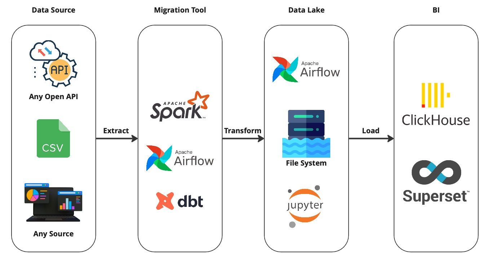

# Pet Project

### Проект №1 - HalltapeETLPipeline

    

>Важно! Этот проект был таким не сразу. Первые его версии содержали только Airflow, Clickhouse и Pandas по капотом. Поэтому не думайте, что я сразу был суперменом. Все добавлялось и допиливалось уже позже. Но база была та же.

Любой пет проект ты можешь собрать, как с нуля, так и взять готовый шаблон по типу моего. В проекте ниже есть минимальный набор необходимых инструментов. Твоя задача – настроить ETL процесс. Данные можно, как сгенерировать свои, так и скачать по API или с любого другого ресурса. Ограничение только твоя фантазия. Этот проект больше, как шаблон. То, как выстроить весь процесс работы с данными – твоя задача.

Вот, что там уже есть:
- Генерация синтетических данных
- Построение простой витрины данных на Spark
- Мониторинг качества данных
- dbt модель для витрины данных в Clickhouse
- dbt модель для качества данных в Clickhouse

Для сборки проекта тебе понадобятся знания [Git](../Git/README.md), Docker

**Собери его у себя** ➜ [Pet Project HalltapeETLPipeline](https://github.com/halltape/HalltapeETL)

---
### Проект №2 - spacex-api-analize

По всем вопросам по данному проекту можно обращаться к Шустикову Владимиру в телеграмм канале  – [Инженерообязанный](https://t.me/Shust_DE)

    

Задачами проекта является настройка ETL-процесса по загрузке данных из API в базу данных, настройка сетей и логической репликации данных, автоматизация создания аналитических запросов поверх сырых данных и визуальное представление результатов на дашборде.

Здесть вы можете получить следующие знания:

- Выгрузка данных из API на AirFlow
- Работа с ООП 
- Настройка сетей, а именно IP-адресации
- Логическая репликация в PostgreSQL
- Работа с внешними источниками в Clickhouse на основе движка PostgreSQL
- Построение моделей, тестов и макросов в DBT

Для сборки проекта тебе понадобятся знания [Git](../Git/README.md), Docker

**Собери его у себя** ➜ [Обработка данных SpaceX AP](https://github.com/ShustGF/spacex-api-analize)

____
### Проект №3 - Create mart in PySpark

По всем вопросам по данному проекту можно обращаться к Шустикову Владимиру в телеграмм канале  – [Инженерообязанный](https://t.me/Shust_DE)

Задачей данного проекта была сгенерирорать сырые данные и на их основе построить несколько витрин даныых. Более подробно с заданием проекта можно ознакомиться [здесь](https://docs.google.com/document/d/1xrlCK8Yw-qbmgmiAlY96x7UOGlu3ug3w/edit?usp=sharing&ouid=112563507644559378212&rtpof=true&sd=true).

    

В этом проекты вы можете получить следующие знания:

- программирования на Python
- работа с Google Disk через код
- написание кода на PySpark

**Собери его у себя**

Проект состоит из двух блокнотов:

1) [генерация файлов в Google Disk](https://colab.research.google.com/drive/1QJhmaAGopzt9t7oh9CV420mWCQAGD63i?usp=sharing)
2) [создание витрин данных](https://colab.research.google.com/drive/1Z5fVuajC1rLZQe_w2rJ2LFEzh1SV6KXq?usp=sharing)

Для сборки проекта тебе понадобятся стабильный интернет и Google аккаунт. Вся инструкция по запуску описана в блокнотах.

____
### Проект №4 - Create mart in PySpark

- [ETL-проект для начинающих Data Engineers: От почтового сервера до Greenplum](https://github.com/dim4eg91/DataEngineering/blob/main/articles/ETL_as_a_pet_project.md)
