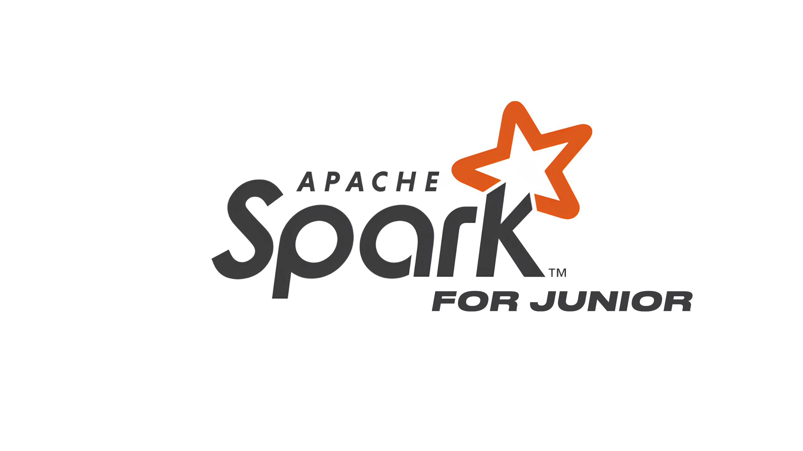

# HalltapeRoadmapDE
<i>Roadmap для Data Engineer | Актуально на 2024-2025г.</i>

Оглавление
- [HalltapeRoadmapDE](#halltaperoadmapde)
  - [Каналы авторов Roadmap | Подпишись!](#каналы-авторов-roadmap--подпишись)
    - [0. Деньги](#0-деньги)
    - [1. Кто такой Дата Инженер?](#1-кто-такой-дата-инженер)
    - [2. Курсы](#2-курсы)
    - [3. Github / Git](#3-github--git)
    - [4. Linux / Terminal](#4-linux--terminal)
    - [4. Data Warehouse](#4-data-warehouse)
    - [5. Нормальные формы](#5-нормальные-формы)
    - [6. Модели данных](#6-модели-данных)
    - [7. Data Vault (Hub - Satellite - Link)](#7-data-vault-hub---satellite---link)
    - [8. Docker](#8-docker)
    - [9. Hadoop](#9-hadoop)
    - [10. Airflow](#10-airflow)
    - [11. Greenplum](#11-greenplum)
    - [12. ClickHouse](#12-clickhouse)
    - [13. Spark](#13-spark)
    - [14. dbt (data build tool)](#14-dbt-data-build-tool)
    - [15. Apache Kafka](#15-apache-kafka)
    - [16. Pet Project](#16-pet-project)
    - [17. Теоретические вопросы c собеседований](#17-теоретические-вопросы-c-собеседований)
    - [18. Резюме и Работа](#18-резюме-и-работа)
    - [19. Рабочие кейсы](#19-рабочие-кейсы)
    - [20. Полезные ссылки](#20-полезные-ссылки)

***
## Каналы авторов Roadmap | Подпишись!

| Канал | Автор |
|------------------|--------|
| [Канал Я – Дата Инженер](https://t.me/halltape_data) | [t.me/halltape](https://t.me/halltape) |
| [Канал Инженерообязанный Из военки в IT](https://t.me/Shust_DE) | [t.me/ShustDE](https://t.me/ShustDE) |
| [Канал rzv Data Engineering](https://t.me/rzv_de) | [t.me/razvodov_de_mentor](https://t.me/razvodov_de_mentor) |
| [Канал Data Engineer Lab](https://t.me/dataengineerlab) | [t.me/ampodvalniy](https://t.me/ampodvalniy) |

**Хочешь стать автором?** [Кликай сюда!](CONTRIBUTING.md)

***

### 0. Деньги
Размер зарплаты зависит от успешности продажи себя на собесе. Если будешь бояться говорить большие суммы, эти суммы будет называть другой более наглый человек. При этом он будет знать меньше тебя, а зарабатывать больше.
С этого момента забудь про справедливость. Её нет.

Зарплатные вилки собраны лично мной на собесах за 2024 год:
| Уровень      | Зарплата на руки      |
|--------------|--------------------|
| Стажер       | 70k - 90k          |
| Джун         | 100k - 150k        |
| Джун+        | 160k - 190k        |
| Мидл        | 200k - 250k        |
| Мидл+       | 260k - 380k        |
| Сеньор и выше | от 380k        |

Учитывайте, что вилки в некоторых компаниях могут быть сильно ниже. Корреляция между размером зарплаты и знаниями не всегда 100%.

>Важно! Нет смысла заниматься раз в неделю. Таким темпом вы никогда не дойдете до конца. Лучше тогда потратьте это время на отпуск, семью, друзей. Иначе вы просто спускаете свою жизнь в никуда.

***

### 1. Кто такой Дата Инженер?
Чтобы понять, кто такой дата инженер и как им стать, посмотри видео!

Чтобы смотреть Youtube без тормозов, используй нашего бота!

[Бот для YOUTUBE](https://t.me/NamelessNetwork_bot)
Промокод: DE (FREE 2 недели)

    

➜ [Кто такой Data Engineer?](https://youtu.be/75Vu8NqH_cU?si=zYT6U7deVYEPkbmA)

➜ [Как я попал в DE?](https://www.youtube.com/watch?v=tltPPLTemzE&t=1s)

➜ [Интервью с Senior/Team Lead DE](https://www.youtube.com/watch?v=3k4kGw_dv0M)

➜ [Мок-собеседование на junior+ Data Engineer](https://www.youtube.com/watch?v=lBSLl4ANUhw)

***
### 2. Курсы
Дальше тебе нужно научиться писать базовые запросы на SQL и на Python. В тренажерах внизу проходи так, как там просят. Не спрашивай зачем, тебе понадобятся эти инструменты в будущем!

Пройди эти три курса SQL и Python

<table>
  <tr>
    <th align="center">Курс</th>
    <th align="center">Продолжительность</th>
  </tr>
  <tr>
    <td align="center"><a href="https://karpov.courses/simulator-sql">SQL с нуля до оконок</a></td>
    <td align="center">≈ 1-2 месяца</td>
  </tr>
  <tr>
    <td align="center"><a href="https://stepik.org/course/58852/syllabus">Python с нуля до базы</a></td>
    <td align="center">≈ 1-2 месяца</td>
  </tr>
  <tr>
    <td align="center"><a href="https://stepik.org/course/68343/syllabus">Продвинутый уровень Python (вложенность, словари, функции)</a></td>
    <td align="center">≈ 1-2 месяца</td>
  </tr>
</table>

>Если задача не получается и ты сидишь с ней уже больше часа, пропускай и переходи к следующей. Потом вернешься и дорешаешь, если будет желание. Не гонись за 100%. Это никто не оценит.
>
***
### 3. Github / Git

    

Регистрируешься на Github и подключаешь его к своему ПК

➜ [Работа с github / git](Git/README.md)

***
### 4. Linux / Terminal

    

Пробуешь привыкнуть и запомнить работу с этими командами в терминале

➜ [Работа с Linux / Terminal](Linux/README.md)

***
### 4. Data Warehouse

    

Нужно понимать, что такое хранилище данных, какие они бывают, чем отличаются и, как в целом можно грузить данные. Обязательно читай теорию!

➜ [Теория по Data Warehouse](DWH/README.md)

***
### 5. Нормальные формы

    

Важная тема про нормализацию таблиц. Всегда спрашивают на собесах. За это надо шарить.

➜ [Нормальные формы](NF/README.md)

***
### 6. Модели данных

    

Для собесов и в будущем на работе вам надо шарить за модели данных. Читаем и обязательно изучаем SCD по ссылке ниже!

➜ [Модели данных](DM/README.md)

***
### 7. Data Vault (Hub - Satellite - Link)

    

Не факт, что на первой работе вы будете сразу строить Data Vault. Это вообще настолько не факт, что может остаться у вас в теории еще на год вперед. Но на собесах спросить могут. Более того, вам могут дать тестовое на то, чтобы построить простенькую модельку на базе Data Vault. Грубо говоря – это все про то, как связать таблицы между собой...

 ➜ [Что такое Data Vault](https://www.youtube.com/watch?v=qTIUITuHypA)

 ➜ [Конспект Data Vault](files/data_vault.pdf)

***
### 8. Docker

    

➜ [Теория по Docker](DOCKER/README.md)

***
### 9. Hadoop

    

На многих проектах в качестве хранилища используют  HDFS (Hadoop) и инструменты экосистемы hadoop. Также по нему  часто спрашивают на собеседованиях:

➜ [Теория по Hadoop](HADOOP/README.md)

➜ [Теория по Экосистеме](HADOOP/ECOSYSTEM_HADOOP/README.md)

Смотри видео здесь ➜ [HDFS | Что это такое и как оно работает? [Hadoop HDFS]](https://youtu.be/ySDGh_1d87g)

Презентация из видео ➜ [HDFS](files/deep_dive_hdfs_pdf.pdf)

***
### 10. Airflow

    

Изучать только после осовения **Python, SQL, Docker, командной строки Linux**. В целом оркестратор **Airflow** – частый инструмент среди компаний, поэтому он уже классика и шарить за него нужно.

➜ [Теория по Airflow](AIRFLOW/README.md)

***
### 11. Greenplum

    

Greenplum будет в 50% вакансиях на DE. Остальные будут сидеть на Hadoop + Spark. На первых порах рекомендую **базово освоить** все три, но окунуться поглубже лишь в один на выбор (Spark | Greenplum). Если хватит сил на освоение обоих, флаг вам в руки!

➜ [Теория по Greenplum](GREENPLUM/README.md)

➜ [Простое видео о Greenplum](https://www.youtube.com/watch?v=rLG9Z_HcKPY)

Презентация из видео ➜ [Greenplum](files/greenplum.pdf)

***
### 12. ClickHouse

    

ClickHouse будет в 80% вакансиях для постоения витрин данных. В последнее время стала набирать популярность связка **GreenPlum** + **ClickHouse**. Не стоит в теорию погружаться с головой и читать всю документацию, а стоит прочитать только то, что описано в статье + ссылки на другие источники. 

Обязательно данный инструмент добавляем в свой **пет-проект**.

➜ [Теория по ClickHouse](CLICKHOUSE/README.md)

➜ [Видео о ClickHouse от разработчика](https://www.youtube.com/watch?v=vbhSrZxm66E&t=119s)

***
### 13. Spark

    

Spark изучайте только **после** **того**, как научились базово кодить на **Python** и **SQL**. Без них будет очень **сложно** и **непонятно**.

➜ [Видео "Что такое Spark и как им пользоваться?"](https://www.youtube.com/watch?v=Gj0oSVmv7k4)

➜ [Видео "Как работают JOIN в Spark"](https://www.youtube.com/watch?v=5S2vUcUC0mo&t=1s)

➜ [Видео "PartitionBy и BucketBy в Spark"](https://www.youtube.com/watch?v=YIpL4E9amJU&t=648s)

➜ [Разверни свой Spark кластер](https://github.com/halltape/HalltapeSparkCluster/tree/main)

➜ [Полезные материалы по Spark](SPARK/README.md)

***
### 14. dbt (data build tool)

    

Про dbt вы часто можете слышать у модных и продвинутых команд. К этому инструменту подходить уже после изучения **Airflow**.

 ➜ [Теория по dbt](DBT/README.md)

 ➜ [Видео от Дмитрия Аношина по dbt](https://t.me/rockyourdata/4977)

***
### 15. Apache Kafka

    

Для джунов про Кафку можно знать только общие факты. В DE её используют для процессинга данных в реальном времени.
На собесах вы можете лишь рассказать теорию из видоса ниже и в целои на этом все. 
Далеко не во всех компаниях и командах её используют, поэтому пока достаточно просто посмотреть видос. 

 ➜ [Видео по Kafka](https://www.youtube.com/watch?v=hbseyn-CfXY)

***
### 16. Pet Project

    

Все пет проекты – это на самом деле маленькие копии реальных задач. Поэтому чем глубже вы разберетесь в инструментах, тем легче и свободнее вам будет на собесе и на работе. О пет проекте вы можете рассказывать, что он был развернут у вас на предыдущем месте работы. По факту, может вы этого и не делали, но крайне рекомендую именно адаптировать хотя бы часть каких-то задач. Вам точно должно повезти! Ниже ссылка на примеры проектов:

 ➜ [Pet Projects](PET_PROJECT/README.md)

> Будет круто, если ты напишешь свой собственный проект и запушишь его к себе на github. Это сильно поможет уложить в голове многие концепции при работы с данными

***
### 17. Теоретические вопросы c собеседований

    

➜ [Вопросы по SQL](QUESTION/SQL/README.md)

➜ [Типичные вопросы с собесов на все темы](QUESTION/BIG_DATA/README.md)

➜ [Telegram Bot для подготовки к собесам](https://t.me/DataismPrepBot)

***
### 18. Резюме и Работа

    

Все врут. Все приукрашивают. Это сделка двух сторон. Ваша задача продать себя подороже. Задача компании купить вас подешевле, да и выбрать по способнее. По ссылке ниже читаем **ЧИТ КОДЫ** по поиску работы, зарплатным ожиданиям и оформлению резюме.

➜ [Как составить резюме?](Resume/README.md)

➜ [Как найти работу?](JOB/README.md)

***
### 19. Рабочие кейсы

    

Вот где там могут быть проблемы? Просто перекладываем таблички.. А нет. Проблем и ошибок на самом деле больше, чем вы думаете. И хорошо, если бы задачи решались оним универскальным скриптом, но так не происходит. Ниже примеры встречающихся кейсов на работе:

➜ [Реальные задачи на работе](CASES/README.md)

***
### 20. Полезные ссылки

    

**Почитать про Data Engineer**
- [Канал Я – Дата Инженер](https://t.me/halltape_data)
- [Все, о чем не говорят вслух про Data Engineer](https://boosty.to/halltape_data)
- [Канал Инженерообязанный | Из военки в IT](https://t.me/Shust_DE)
- [Канал rzv Data Engineering](https://t.me/rzv_de)

**Найти работу**
- [Сайт агрегатор для Data Engineer](https://www.dataengineers.pro)
- [Найти работу для DE Канал 1](https://t.me/data_engineer_jobs)
- [Найти работу для DE Канал 2](https://t.me/dataeng_jobs)
- [Найти работу для DE Канал 3](https://t.me/de_rabota)
- [Найти работу для DE Канал 4](https://t.me/datajob)
- [Найти работу для DE Канал 5](https://t.me/dsml_jobs)

**Посмотреть про Data Engineer**

- [Кто такой Data Engineer?](https://youtu.be/75Vu8NqH_cU?si=zYT6U7deVYEPkbmA)
- [Как я попал в DE?](https://www.youtube.com/watch?v=tltPPLTemzE&t=1s)
- [Интервью с Senior/Team Lead DE](https://www.youtube.com/watch?v=3k4kGw_dv0M)
- [Мок-собеседование на junior+ Data Engineer](https://www.youtube.com/watch?v=lBSLl4ANUhw)
- [Мок-собеседование на middle Data Engineer](https://www.youtube.com/watch?v=ZdmWjWIUn2A&t=2056s)
- [Data Engineer тренирует System Design секцию](https://www.youtube.com/watch?v=6n92YA6UXlQ)
- [РАЗДАЮ БАЗУ И МОТИВАЦИЮ ПО DATA ENGINEER!](https://www.youtube.com/watch?v=piZP5KCECGI&t=5273s)
- [Крутить ОПЫТ или НЕТ | СТРИМ на Twitch](https://www.youtube.com/watch?v=Vfeb1LNCjPw)
