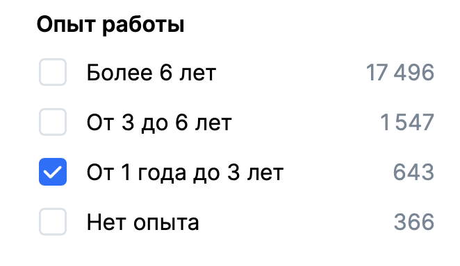
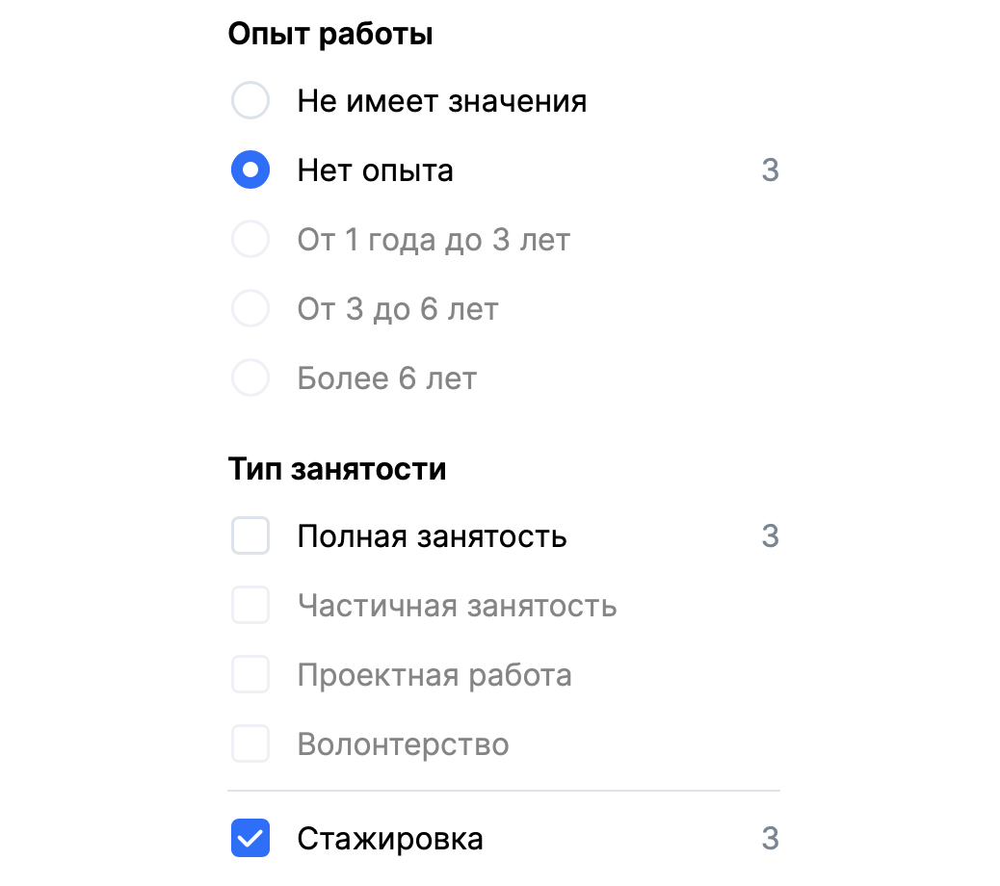
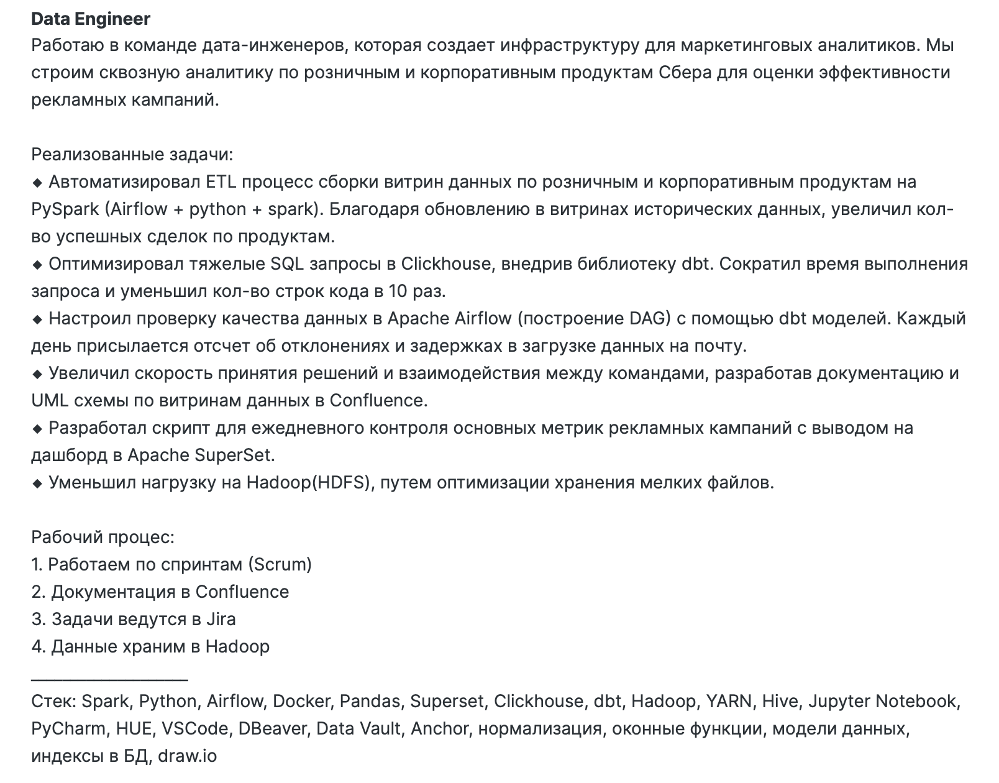
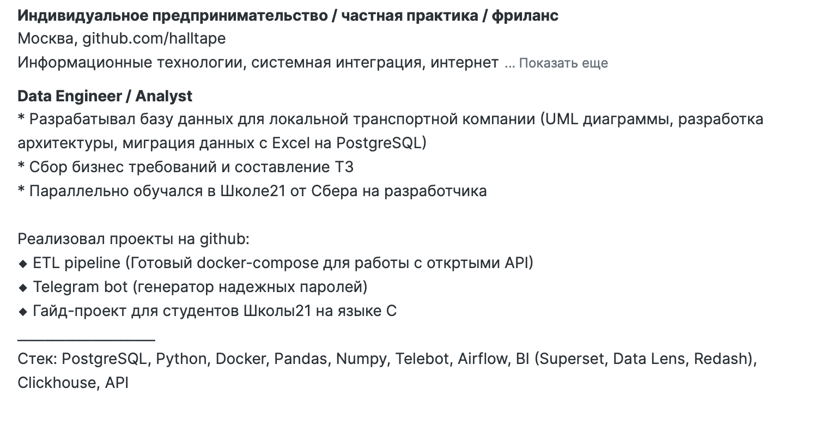
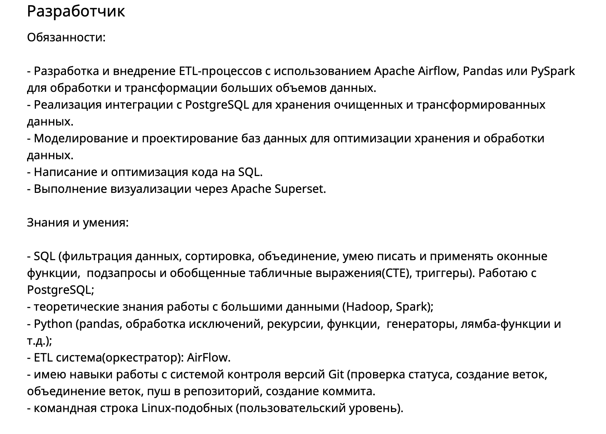
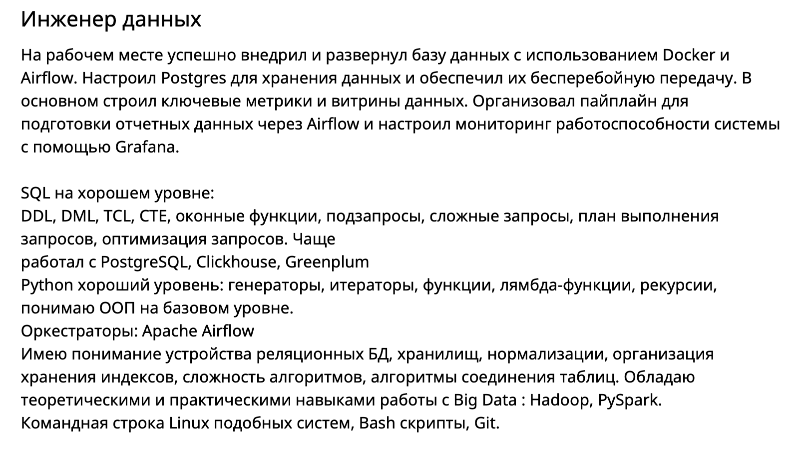
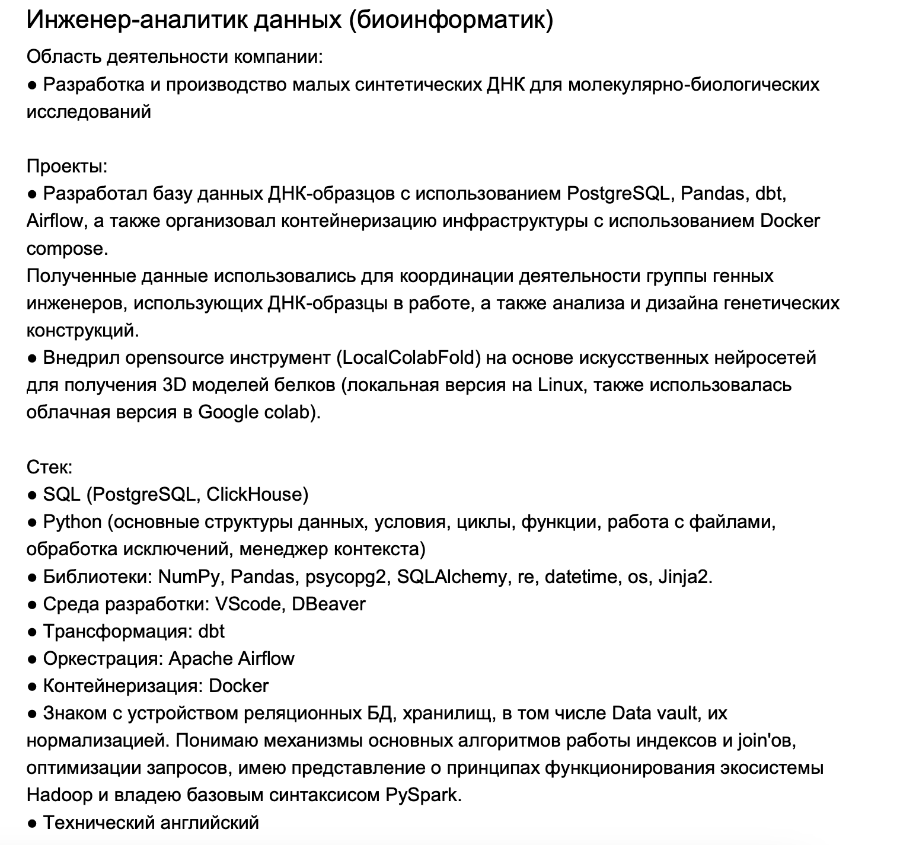

# Резюме

- [Резюме](#резюме)
    - [Стажировка](#стажировка)
    - [Как составить резюме?](#как-составить-резюме)
    - [Примеры описания опыта](#примеры-описания-опыта)
  
***

**Вопрос:** Где взять опыт работы если без него не берут?\
**Ответ:** Адаптировать

    

> Чтобы попасть на тех собес, вам нужно пройти автофильтры рекрутеров по годам опыта. Важно, чтобы в вашем резюме была проставлена именно правильная цифра. Стажировок для НЕ СТУДЕНТОВ мало. Есть конечно компании, которые вас нанимают стажером или джуном, но перепродают большим бигтехам, как сеньера. Разницу естественно забирают себе. Справедливо ли это - решать вам. Мне такой подход не нравится.

### Стажировка

    

Если вы студент, то можете во время учебы запрыгнуть на SberSeasons. В целом норм вариант пока вы учитесь. Там прям берут студентов последних курсов технических университетов.

Если вы закончили универ вчера или 100 лет назад, то для вас СТАЖИРОВОК немного. Платить там могут до 100к. Если вам надо жить в Москве, у вас семеро детй и четверо козлят - возможно зарплаты в 60к вам не хватит. Здесь я рекомендую сразу идти на junior или junior+. 

И по деньгам это будет от 120к на руки. Хотя у меня лично есть примеры, когда люди залетали сразу на мидла на 200к на руки. Нужны будут пруфы - пиши мне в телегу.

***

### Как составить резюме?

[Большая часть материала взята из этого источника](https://t.me/lavka_og/18)

> *Советы универсальные, но часть заточена под платформу Head Hunter*

**Базированная База**
- **Резюме нужно, чтобы "продать" себя нанимающей стороне и у них не осталось вопросов, почему ТЕБЯ должны взять на это место.**

**Сделай PDF**
- У тебя всегда должно быть 2 резюме, одно на платформе поиске работы, а другое - сохраненное в PDF файл, которое будешь отправлять по запросу (например в телеге).

**Шапка**
- Заполняй ФИО, свой город, контакты
- Рядом с номером телефона в комментарии укажи свой ТГ (для XX - больше вероятность, что напишут напрямую)
- Городом указывай - Москва или Питер. Только если не нужен конкретный регион или работа в местном офисе
- Возраст - если уже победил кризис среднего возраста или еще бывший школьник, то возраст не указывай. Эйджизм дело такое... 
- Поставь нормальное "живое" фото, примерно, как на паспорт. Если ты на нем улыбаешься, вообще замечательно. Никаких фото с клуба с бутылочкой 🍾 минералки в руке.
Нет нормального фото, тогда не ставь. Если ты школьник, тоже не ставь
- Должность пиши, как в большинстве вакансий для твоего стека (Python Developer). Грейд нигде тоже не указывай, если только не претендуешь на Лида и выше. Никаких Middle Питон Девелопер, вот как на ХХ написано, так и пиши
- Не указывай ЗП, могут предложить больше чем ты хотел изначально. Исключение - отсечение по нижней границе для синьоров с опытом и ЗП 400к+

**Опыт работы**

>❗️ ВАЖНО ДЛЯ ТЕХ КТО РАБОТАЕТ ПО СЗ, ГПХ, ИП или служит по контракту (военный).
В этих случаях подтвердить опыт работы документально будет проблематично. У вас есть два варианта решения проблемы: Написать Study | Pet Project или ООО "Рога и Копыта" или ООО "Связь" (для военных).

Толковых ребят с военки реально много, и к сожалению никого не волнует, что вы защищали свою Родину, а теперь у вас нет записи в выписке из Трудовой книжке.

Я не против, если вы сделаете себе резюме сразу на Middle-Senior. Походите на собесы. Задачи собеседующих проверить ваши компетенции. Можете просто даже протестировать рынок и понять, насколько много или мало надо знать на такие деньги. В случае, если вы успешно пройдете собес и получите оффер на 350к с ходу, я могу либо поздравить вас с отличными навыками, либо поругать тим лида с той стороны, который плохо вас прособеседовал. Ведь к собесу надо готовиться не только кандидату, но и собеседующей стороне!

Важный момент. Если вы с ходу получили оффер на хорошие деньги, взвесьте все ЗА и ПРОТИВ перед соглашением. Если у вас нет реального опыта, то будет очень тяжело. Оптимально идти все-таки на начальные или средние позиции в крупные компании, где медленные процессы, чтобы было время освоиться. 

**Года опыта**

- Пишите **2 года опыта** на текущем месте работы (даже если вы пожарный или медсестра). Можно написать Study | Pet Project (в целом это проходит фильтры HR и вам могут писать рекрутеры САМИ). Но эффективнее, если опыт будет адаптирован. **Забудьте** про всю свою предыдущую жизнь. На крайнем месте работы вам удалось переключиться на задачи, связанные с данными. Позиции дата инженера/аналитика у компании не было, так как это были нецелевые задачи компании. Вы автоматизировали сбор данных и наладили дашборд для руководства. Вам так это понравилось, что вы решили свичнуться в DE и начать работать с реальной Big Data. Вы сочиняете себе легенду.

- Легенда является легендой только в рамках того, что это была реальная задача в компании. Вам реально надо собрать проект по типу [HallatapeETLPipeline](https://github.com/halltape/HalltapeETL) и по возможности адаптировать идею под свой род деятельности. На собесе проверяют глубину знания инструмента и степень его владения, а не качество выполняемой работы на предыдущем месте.

<table>
    <tr>
        <th>Пример легенды</th>
    <tr>
        <td>Работал аналитиком (по факту монтажником). Написал телеграм бота, который собирал данные по расходникам с каждого объекта и складывал все в СУБД PostgreSQL. Все было развернуто в Docker на сервере и каждый вечер, неделю, месяц Airflow читал данные из базы данных и внутри pandas или pyspark строили витрины отчеты для руководства</td>
    <tr>
<table>

- Описывайте свой опыт с указанием всех ключевых слов
  
<table>
    <tr>
        <td>Настроил парсинг и загрузку данных в хранилище</td>
        <td style="text-align: center;">❌</td>
    </tr>
    <tr>
        <td>Настроил парсинг данных из API с помощью pandas и request, а также загрузку в Clickhouse при помощи Airflow + настроил DAG мониторинга данных с помощью dbt</td>
        <td style="text-align: center;">✅</td>
    </tr>
</table>

>❗️ Удаляйте весь **НЕРЕЛЕВАНТНЫЙ** опыт. Даже, если у вас за плечами **10-20 лет** спасения жизни человечества или продажи галстуков в пустыне – это никак не поможет в поиске работы Дата Инженера. Мы не спасаем мир и не продаем галстуки. Только работа с данными.\
>❗️❗️ Крутить можно и больше. Вопрос только в том, насколько вы готовы за это брать ответственность. На 2-3 года накрученного опыта вас будут спрашивать конкретные кейсы (примеры решенных задач). Я рекомендую идти либо на джуна, либо на джун+. Через год вы станете уже мидлом и сможете мощно заявлять любые шестизначные суммы.

**Образование**
- Указываем обязательно, если оно есть, хоть какое-то. Особенно высшее. Даже не оконченное и не ИТ-шное. Показывает, что человек обучаем и не совсем "улиточка" 🐌

**Языки**
- Пиши все которые знаешь. Уровень указывай, как чувствуешь, но чем выше тем лучше

**Стажировки**
- Никаких стажировок указывать не надо. Так же не пиши, что ничего не знаешь и "готов работать за еду, только возьмите меня"

**Курсы**
- Курсы не пишем, особенно те, что у всех на слуху. Исключение - курсы повышение квалификации которые котируются именно в твой области и их наличие показатель для нанимающей стороны.

**Навыки**
- На ХХ (HeadHunter) можно указать навыки в количестве 30 штук. Указывай все, что он предлагает для твоего стека и с чем ты работал. "Стрессоустойчивость" и "работу в команде" и похожее указывать не нужно.
Если делаешь шаблон сам, то можешь сделать отдельный блок Скиллы\Skills

**Программист-водитель**
- Никаких прав "Категории - В" указывать не нужно. ХХ любит добавлять их самостоятельно, проверяем и убираем

**Рекомендации**
- Убираем. Если это не знаковая фигура, которую все знают или известна в твоей области

**О себе**
- Обязательно надо оставить **контактную информацию** в самом конце (пример ниже). Вам будут больше писать, открытие контактов в **HH** платное.

Для связи:\
ТГ - @ilon_mask\
почта - IlonMask@om.nom\
телефон - 8 (800) 555-35-35\
*проще позвонить, чем у кого-то занимать*

**🏁 Финально**
- Размер резюме должен быть такой, чтобы читающий понял, что ты нужный им человек. При этом не устал читать и не закрыл его.
Для ХХ при экспорте в PDF размер не более 2 страниц А4, максимум 3.
Для своей PDF - в идеале 1 страница, для разработчиков с опытом - 2.
- Твое резюме должно быть минимум на трех сайтах:
<table>
  <tr>
    <td><a href="https://hh.ru">HH.ru</a></td>
    <td><a href="https://www.linkedin.com">Linkedin</a></td>
    <td><a href="https://career.habr.com">Хабр Карьера</a></td>
  </tr>
</table>

***
### Примеры описания опыта
*Кради, как художник*

    

    
    

    
    

    
    

    
    

    

