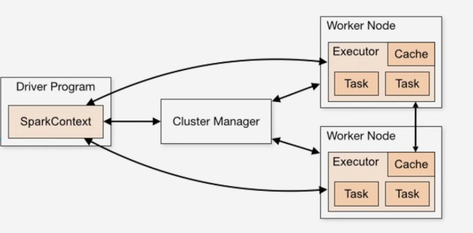
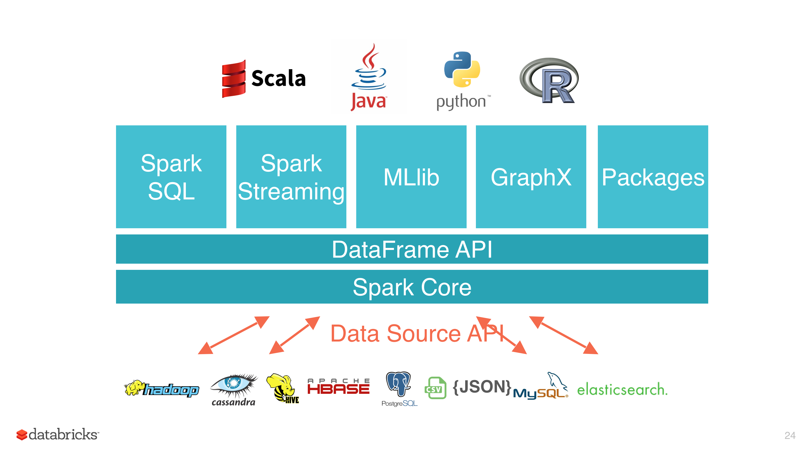
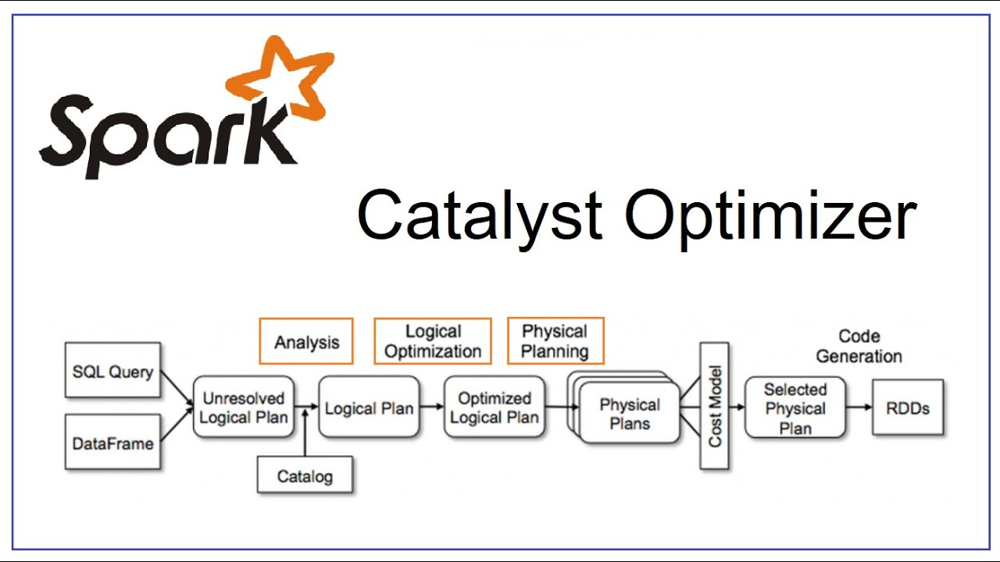

## Куратор раздела

**Подвальный Артем**, 
                                                                                                                      _Data Engineer/Data Scientist_

   [Канал Data Engineer Lab](https://t.me/dataengineerlab)

Хочешь перейти в дата-инженерию, но не знаешь с чего начать? Пиши -  составим резюме, продумаем твое развитие [https://t.me/ampodvalniy](https://t.me/ampodvalniy)
 

Хочешь улучшить текущий раздел, внести недостающее или поправить формулировку? Предлагай PR и тегай [@Artemlin6231](https://github.com/Artemlin6231)

## Немного об этой главе
Apache spark - это распределенный фреймворк обработки данных, ставший де-факто стандартом в обработке больших данных. Требуется практически повсевместо в работе дата-инженера.

Приятного изучения)

# Основы Apache Spark и RDD

## Введение

**Apache Spark** — это масштабируемая платформа для распределённой обработки данных, которая позволяет выполнять вычисления в памяти, обеспечивая высокую производительность и гибкость. Она подходит как для пакетной (batch), так и для потоковой (streaming) обработки данных.

---

##  Ключевые идеи Apache Spark

-  **Эффективная DAG-модель вычислений**  
  Spark строит направленный ациклический граф (DAG), отображающий зависимости между этапами обработки. Это обеспечивает более гибкое и оптимизированное планирование по сравнению с классическим MapReduce.

- **Ленивая модель исполнения**  
  Преобразования не выполняются сразу. Spark откладывает их выполнение до вызова операции-действия, что позволяет эффективно планировать и объединять задачи.

- **Гибкое управление памятью**  
  - Предпочтение хранения данных в памяти
  - Сброс данных на диск при нехватке ресурсов
  - Возможность комбинированного хранения
  - Поддержка различных форматов сериализации

- **Широкая поддержка языков**  
  Поддерживаются API для **Scala**, **Java**, **Python** и **R**

- **Единый API для batch и streaming обработки**

---

## RDD (Resilient Distributed Dataset)

**RDD** — основная абстракция данных в Spark, представляющая собой неизменяемую, распределённую коллекцию объектов.

### Основные свойства RDD:

- **Неизменяемость и отказоустойчивость (fault tolerance)**  
  Все операции над RDD являются детерминированными и безопасными к сбоям.

- **Два типа операций:**
  - **Transformations** — возвращают новый RDD, операции ленивые  
    Примеры: `map`, `filter`, `join`
  - **Actions** — инициируют выполнение вычислений  
    Примеры: `count`, `collect`, `save`

- **Партиционирование**  
  Данные разбиты на независимые части (partition), которые обрабатываются параллельно.

- **Кэширование данных**  
  Поддерживаются различные уровни хранения:
  - `memory`
  - `disk`
  - `memory & disk`
  - `external*` (при внешней настройке)
 
  
## Архитектура и модель вычислений Spark

    

### Компоненты архитектуры

- **Driver Program**  
  Главный управляющий процесс, с которого начинается выполнение приложения Spark. Он:
  - инициализирует `SparkContext`;
  - строит DAG вычислений;
  - управляет разбиением на задачи;
  - распределяет задачи по `executors`.

- **SparkContext**  
  Ядро взаимодействия приложения с кластером. Он:
  - подключается к `Cluster Manager`;
  - планирует вычисления;
  - отслеживает выполнение задач и собирает результаты.

- **Cluster Manager**  
  Менеджер ресурсов, который:
  - отслеживает доступные ресурсы;
  - выделяет `worker`-узлы;
  - запускает `executors`.  
  Поддерживаемые варианты: **Standalone**, **YARN**, **Kubernetes**, **Mesos**.

- **Worker Node**  
  Узел, на котором исполняются задачи Spark. Каждый узел может запускать один или несколько `executors`.

- **Executor**  
  Процесс, который:
  - исполняет задачи;
  - кэширует промежуточные данные;
  - взаимодействует с `driver` для отправки результатов.

- **Task**  
  Минимальная единица вычислений в Spark. Каждое преобразование над данными разбивается на множество `tasks`, которые распределяются между `executors`.

- **Cache**  
  Используется для хранения данных в памяти или на диске с целью ускорения повторных вычислений.

---

### Как работает модель вычислений Spark

1. Пользователь пишет Spark-программу с использованием `RDD`, `DataFrame` или `Dataset`.
2. Программа запускается, и `Driver` создаёт `SparkContext`.
3. Spark строит **DAG (направленный ациклический граф)** всех ленивых операций (`transformations`).
4. DAG разбивается на **этапы (stages)**, каждый из которых состоит из задач (`tasks`).
5. Через `Cluster Manager`, Spark запускает `executor`'ы на `worker`-узлах.
6. `Tasks` исполняются параллельно на `executors`.
7. Промежуточные данные могут кэшироваться.
8. После завершения все результаты собираются и возвращаются `Driver`-у.

# Экосистема Apache Spark

Apache Spark — представляет собой целую экосистему модулей, предоставляющую мощные средства для работы с данными в различных форматах и задачах: от SQL-запросов и машинного обучения до потоковой обработки и анализа графов.

    

---

## Архитектура уровней

Экосистема Spark построена на **многоуровневой архитектуре**, где каждый уровень отвечает за свою часть функциональности.

### 1. Spark Core

Базовый компонент Spark, реализующий:

- Распределённое планирование и выполнение задач
- Управление памятью
- Отказоустойчивость
- Модель RDD (Resilient Distributed Dataset)

Все остальные компоненты построены поверх `Spark Core`.

---

### 2. DataFrame API

Предоставляет более высокоуровневую абстракцию над RDD — **DataFrame** (табличное представление данных). Обеспечивает:

- SQL-подобный синтаксис
- Оптимизацию исполнения через **Catalyst Optimizer**
- Поддержку различных источников данных через **Data Source API**

---

### 3. Библиотеки Spark

На верхнем уровне располагаются модули для специализированных задач:

| Модуль | Назначение |
|--------|------------|
| **Spark SQL**       | Выполнение SQL-запросов, работа с таблицами, интеграция с Hive |
| **Spark Streaming** | Обработка потоковых данных в реальном времени |
| **MLlib**           | Машинное обучение: классификация, регрессия, кластеризация и др. |
| **GraphX**          | Графовые вычисления и анализ социальных сетей |
| **Packages**        | Расширения и сторонние библиотеки, добавляемые через Spark Packages |

---

### 4. Data Source API

Позволяет подключаться к множеству внешних источников данных:

- **Hadoop / HDFS**
- **Apache Hive**
- **Apache HBase**
- **PostgreSQL**, **MySQL**
- **CSV**, **JSON**, **Parquet**
- **Elasticsearch** и другие

Spark автоматически оптимизирует чтение, запись и обработку данных из этих источников.

---

## Поддерживаемые языки

Spark поддерживает API на нескольких языках:

- **Scala** (родной язык для Spark)
- **Java**
- **Python (PySpark)**
- **R (SparkR)**

# DataFrame API и Catalyst Optimizer в Apache Spark

---

## Что такое DataFrame API?

**DataFrame** — это одна из высокоуровневых абстракций в Apache Spark, представляющая собой распределённую коллекцию данных в виде таблицы (аналогично таблице в реляционной базе или датафрейму в Pandas/R).

DataFrame API предоставляет удобные и декларативные средства работы с данными:

- SQL-подобный синтаксис (`select`, `filter`, `groupBy` и т.д.)
- Поддержка различных источников: JSON, CSV, Parquet, Hive, JDBC, и т.д.
- Поддержка нескольких языков: Scala, Python (PySpark), Java, R
- Интеграция с **Catalyst Optimizer** для автоматической оптимизации запросов

---

## Как работает Catalyst Optimizer?

**Catalyst** — это движок оптимизации запросов в Spark SQL и DataFrame API. Он обеспечивает автоматическую трансформацию запросов в эффективные планы выполнения с учётом структуры данных и статистики.

    

---

### Этапы обработки запроса в Catalyst:

1. ### SQL или DataFrame запрос
   Пользователь пишет SQL-запрос или использует DataFrame API.

2. ### Unresolved Logical Plan
   Spark строит первоначальный **логический план**, который ещё не содержит информации о типах данных и таблицах.

3. ### Analysis
   С помощью **каталога** (catalog) Spark разрешает имена таблиц, столбцов и типов данных. Получается **разрешённый логический план** (`Logical Plan`).

4. ### Logical Optimization
   На этом этапе Spark применяет **правила оптимизации**, такие как:
   - удаление ненужных столбцов (projection pruning),
   - фильтрация как можно раньше (predicate pushdown),
   - переупорядочивание `joins`.

   Результат — **оптимизированный логический план** (`Optimized Logical Plan`).

5. ### Physical Planning
   Spark генерирует несколько вариантов **физического плана** — конкретных стратегий выполнения операций.

6. ### Cost Model
   Для выбора наилучшего плана Spark применяет **модель стоимости**, оценивая ресурсоёмкость каждого варианта.

7. ### Code Generation
   Выбранный физический план используется для **генерации Java/Scala кода**, который преобразуется в **RDD-процессы**.

---

## Преимущества Catalyst и DataFrame API

| Преимущество                 | Описание |
|-----------------------------|----------|
| Высокая производительность | Благодаря автоматической оптимизации |
| Упрощение разработки       | SQL-подобный синтаксис, декларативный подход |
| Поддержка многих форматов  | CSV, Parquet, JSON, Hive, JDBC и др. |
| Расширяемость              | Поддержка пользовательских функций (UDF) и типов данных |
| Совместимость              | Интеграция с MLlib, GraphX, Streaming и др. |

---

## Заключение

DataFrame API и движок Catalyst являются основой гибкости и производительности Spark. Они позволяют пользователям сосредоточиться на логике анализа данных, а оптимизация и исполнение остаются на стороне платформы.

> _Spark SQL и DataFrame API дают декларативный уровень, а Catalyst автоматически превращает его в оптимальный код._

