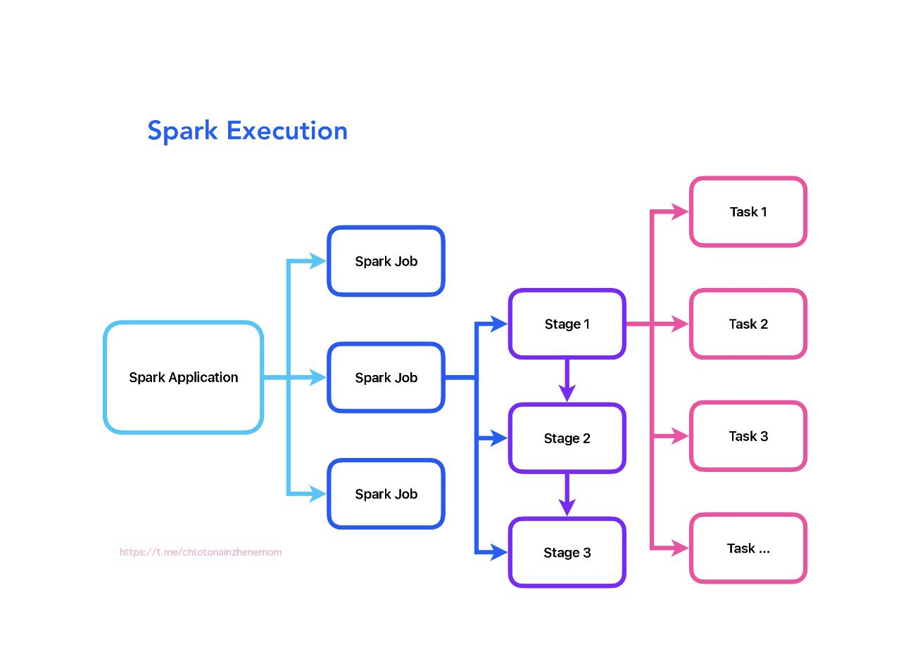

> 💡 **Автор материала:**  
> [**Анна Бобкова**](https://t.me/iamannabo)  
> 📡 [**что-то на инженерном**](https://t.me/chtotonainzhenernom) — Telegram-канал о дата инжиниринге.
***

### Что такое Job - Stage - Task
<p align="center">
    
</p>

Если вы только начинаете погружаться в spark, одно из первых, что нужно усвоить - это иерархию выполнения задач: Job, Stage, Task.

### Почему это важно?

Оптимизация, дебаггинг, настройка кластера - всё это требует знания, как Spark дробит ваши операции на этапы и задачи.  

Даже высокоуровневые API (DataFrames, SQL) скрывают RDD, но не отменяют логики выполнения через Job → Stage → Task.

### Термины:

✔️ Spark Job / Задание - это вся вычислительная задача, которую вы отправляете в Spark через действие (action), например, collect(), save(), count(). Состоит из одного или нескольких Stages.
Пример: обработка датасета от загрузки до сохранения результата.  

✔️ Spark Stage / Этап - логический этап выполнения Job, который объединяет задачи, не требующие обмена данными между узлами (shuffle). Разделение на Stages происходит при широких преобразованиях (например, join, groupBy, repartition), которые требуют shuffle.  
Пример:  filter → map → reduceByKey
Первые две операции (узкие) остаются в Stage 1, reduceByKey (широкое) запускает Stage 2.

✔️ Spark Task / Задача - минимальная единица работы в Spark. Каждая Task обрабатывает одну партицию данных. Выполняется параллельно на исполнителях (executors).  
Пример: Если ваш DataFrame имеет 200 партиций, для Stage будет создано 200 Tasks.

### Как это работает на практике?
1. Job отправляется в spark (например, вызов df.write.csv("file")).
2. DAG Scheduler разбивает Job на Stages на основе широких преобразований.  
3. Каждая Stage делится на Tasks по числу партиций.
4. Tasks распределяются между executor’ами и выполняются параллельно.
5. Результаты Tasks объединяются, и Job завершается.

### Пример:
```python
df = spark.read.csv("data.csv")  
df_filtered = df.filter(df["age"] > 20) # Узкое преобразование (Stage 1)  
df_repartitioned = df_filtered.repartition(10) # Широкое преобразование (Stage 2)  
df_grouped = df_repartitioned.groupBy("city").count() # Широкое преобразование (Stage 3)  
df_grouped.write.csv("result") # Запускает Job
```
Итог:
- 1 Job (запись в CSV),
- 3 Stages (фильтрация → репартицирование → агрегация),
- N Tasks (например, 10 задач в Stage 3 после repartition(10)).


### Почему в Spark UI иногда отображается только один Stage?
- Отсутствие операций с shuffle: если все преобразования узкие (например, filter, select), spark выполнит их в одной Stage.  
- Оптимизация Catalyst: в spark SQL/DataFrames Catalyst Optimizer может переупорядочивать операции, избегая ненужных shuffle.
Пример: df.groupBy(...).filter(...) → фильтрация выполняется до группировки.  
- Предварительное партиционирование: если данные уже разделены по ключу (например, после repartition("key")), groupBy может не требовать shuffle.  
- Маленький объем данных: если данные помещаются в память одного исполнителя, spark обработает их без разделения на задачи.

### Советы для оптимизации:
- Следите за shuffle: каждое широкое преобразование создает новый Stage. Используйте broadcast для небольших таблиц в join.
### Настройте партиции:
    ➕Слишком много партиций → много мелких Tasks (риск перегрузки планировщика).
    ➕Слишком мало → неэффективный параллелизм.
    ➕Используйте coalesce для уменьшения числа партиций без shuffle.
### Используйте Spark UI:
- Анализируйте время выполнения Stages (вкладка Stages), проверяйте наличие перекоса данных (Skew) и Spill (Memory/Disk).  

### Что в итоге?
1. Spark-приложение вызывает действие (action) → создается Job.
2. Job разбивается на Stages на основе широких преобразований.
3. Каждый Stage состоит из Tasks (по одной на партицию).  
4. Tasks выполняются на исполнителях (executors). Один исполнитель может обрабатывать несколько Tasks параллельно.
   
### Хинты в Spark 🪄

Сегодня расскажу про «секретные команды», которые помогают оптимизировать выполнение задач, когда автоматический оптимизатор не справляется. Разберемся, какие хинты бывают, как их использовать и почему они не работают.

**Важно: хинты не гарантируют результат, но в 90% случаев spark их учитывает**

## ✳️ Основные типы хинтов в Spark

### 🔗 **Хинты для JOIN'ов**
Помогают выбрать оптимальный алгоритм соединения таблиц:

- **▫️ BROADCAST**  
  Запускает *Broadcast Join* — запускает Broadcast Join (маленькая таблица копируется на все ноды).

- **▫️ MERGE**  
  Подсказывает, что данные отсортированы и можно использовать *Merge Join*.  
  ⚠️ Применяется только если данные **заранее отсортированы** по ключу соединения.

- **▫️ SHUFFLE_HASH**  
  Принудительно запускает *Shuffle Hash Join*.  
  Полезен при соединении **больших таблиц**, когда ключи легко хешируются.

### 📦 Хинты для управления партициями

Контролируют, как данные распределяются между нодами в кластере:

- **▫️ REPARTITION**  
  Перераспределяет данные через полный shuffle, чтобы увеличить/уменьшить число партиций или партицировать по столбцу.

- **▫️ COALESCE**  
  Уменьшает число партиций без shuffle (объединяет соседние).  Применяется после фильтрации, чтобы избежать мелких партиций.

- **▫️ REBALANCE**  
  Автоматически балансирует данные, минимизируя перекосы.
 
### ⚖️ Хинт для борьбы с перекосами (Data Skew)

- **▫️ SKEW**  
  Указывает spark на перекошенный ключ и число партиций. 


Кстати, если в Spark UI видите задачи, которые выполняются в 10 раз дольше других — это skew. Попробуйте применить хинт SKEW или REBALANCE

### Что по синтаксису?
В sql: хинт передается в комменты /*+ ... */ после select.
```sql
SELECT /*+ MERGE */ 
    t1.*, t2.* 
FROM table1 t1 
JOIN table2 t2 ON t1.sorted_key = t2.sorted_key;
В spark: через метод hint()
df.hint("rebalance", "user_id")
```
**Почему хинты не работают?**

— Противоречат логике оптимизатора. Например, если таблица для BROADCAST слишком большая, spark выполнит Sort-Merge Join вместо Broadcast.

— Версия вашего spark. Хинты вроде SKEW или REBALANCE требуют spark 3.0+

— Что-то в параметрах сессии. Например, включен AQE, он может переопределять хинты.


## Влияет ли тип джойна на выбор алгоритма?

Да, тип джойна может влиять на выбор алгоритма, но не всегда напрямую. Попробую объяснить чуть подробнее.

Возьмем inner join, который возвращает только совпадающие строки, ему вообще подходит любой алгоритм: но, например, Hash Join будет самым эффективным, если одна таблица помещается в память или Sort-Merge при джойне больших отсортированных таблиц.

Немного другая история с left/right джойнами: алгоритмы должны уметь обрабатывать отсутствующие ключи.  

Hash Join: в целом поддерживает left/right джойны, но требует дополнительных шагов, типа:  
- сохранение всех строк из главной таблицы (левой для left join)
- затем отметка отсутствующих совпадений -> может потребовать больше памяти.  
  
Поэтому лучше выбрать Sort-Merge Join: так как сортировка позволяет легко найти отсутствующие ключи.  

Сложнее с full outer join: он возвращает все строки из обеих таблиц и требует полной обработки обеих таблиц, поэтому для него: 
- Точно нет: Nested Loop Join - неэффективен из-за сложности O(N*M).  
- Hash Join - можно, но редко используется, так как нужно хранить хеш-таблицы для обеих таблиц (можно встретить в PostgreSQL для небольших таблиц)
- Точно да: Sort-Merge Join - оптимальный выбор, так как сортировка позволяет объединить все данные (spark использует почти всегда)

Если вдруг вы решили сделать декартово произведение (cross join 🥴), то тут только Nested Loop Join (или его лучшие версии), поскольку происходит джойн каждой строки одной таблицы с каждой строкой другой. Но в spark реализовано через Shuffle.

- Что там с semi join? 💅🏼 
- в целом аналогичен inner join, поэтому подойдет любой алгоритм.

Для anti join - эффективен Hash Join с фильтрацией отсутствующих ключей.

Это все работает в случае равенства ключей (в том числе и для составных ключей).

❕Если ключ содержит неравенства **(key_1 > key_2)**, то обычно работает алгоритм **Nested Loop Join**, для отсортированных данных - **Sort-Merge Join**.


### Что такое Data Skew, как его выявить и как с ним бороться?

Во-первых, кратко дала бы определение понятия. Data Skew - это дисбаланс в распределении данных между партициями, когда некоторые ключи содержат значительно больше записей, чем другие. Это приводит к тому, что отдельные задачи в spark выполняются дольше, возникает нагрузка на ноды, падают неприятные out of memory ошибки и падение производительности в целом. Простыми словами, одна задача обрабатывает гигантский объем данных, не справляется и падает. 

Далее, рассказала бы как выявляю проблему. По правде говоря, проблема выявляется, когда спустя некоторое время процесс падает 🥴. Но моя лучшая версия на собесе идет и анализирует Spark UI: смотрю на метрики Shuffle Read/Write и время выполнения задач. Если вижу, что одна задача обрабатывает в 10–100 раз больше данных, чем другие - это явный признак **skew**.

Затем проверяю распределение ключей через groupBy + count.

**Например:**
```python
df.groupBy("key").count().orderBy("count", ascending=False).show(10)
```
Если несколько ключей содержат >50% данных - skew присутствует. Бывает еще, что в ключе есть NULL, который собирает все в одну партицию.

**Методы решения:**

В реальной жизни у меня всегда в конфигурации сессии присутствует AQE (Adaptive Query Execution) для автоматического устранения skew:
```python
spark.conf.set("spark.sql.adaptive.enabled", "true")
```
На собеседовании рассуждаю, что проблема решается в зависимости от контекста:
### 1 - Broadcast Join
Если один из датасетов маленький — использую broadcast: 
```python
df_large.join(broadcast(df_small), "key") # чтобы избежать shuffle
```

### 2 - Солим данные (salting)
Для ключей со skew добавляю случайный префикс, чтобы равномерно распределить данные. Например, разбиваю „тяжелый“ ключ на 100 подключей, типа key_1, key_2 и т.д.
```python
df = df.withColumn("salted_key", concat(col("key"), lit("_"), (rand() * 100).cast("int")))
```

### 3 - Разделение данных
Выделяю записи с тяжелыми ключами в отдельный датасет и обрабатываю их отдельно (например, через map-side join).

### 4 - Оптимизация партиций
Увеличиваю число партиций через ```spark.sql.shuffle.partitions``` или ```repartition()```, чтобы снизить нагрузку на отдельные ноды.

Также обязательно делимся примером из практики в стиле: на прошлом проекте делала join датасета с 10 млрд записей и маленькой таблицей-справочником. Ключ user_id был сильно перекошен: 70% данных приходилось на 5% пользователей.

**Решила проблему так:**

— Выделила тяжелых user_id в отдельный датасет.

— Для них применила соль с 200 подключами.

— Остальные данные обработала через broadcast join.

— Время выполнения сократилось с 3 часов до 30 минут 🎉.


**Не забудьте упомянуть, что чаще всего обращаете внимание на тюнинг spark сессии:**

— играю с параметрами spark.sql.shuffle.partitions

— использую kryo-сериализацию

— контролирую память исполнителей (spark.executor.memory, spark.memory.fraction)

— ну и вообще, кэширую часто используемые данные (если это уместно), как хорошая девочка 😇


## Shuffle в Spark

Про shuffle в spark часто спрашивают на собеседованиях и мучают вопросами в стиле: где смотреть, куда копать. Обычно такие вопросы идут в связке с проблемой data skew.
***
### Шаг 1. Разбираемся, что такое shuffle

Shuffle - это процесс перераспределения данных между партициями и нодами кластера. Он возникает, когда данные нужно сгруппировать, отсортировать или объединить (например, при join, groupBy, orderBy).  

**Почему он происходит?**

Данные физически разбросаны по нодам и для их обработки нужно собрать их по ключу. Пример: чтобы посчитать сумму продаж по каждому региону (`groupBy("region").sum()`), spark должен собрать все записи одного региона в одну партицию.  
***
### Шаг 2. Узнаем, когда shuffle неизбежен

**Операции, которые вызывают shuffle:**

— ```groupBy```, ```reduceByKey```, ```distinct``` (агрегация)

— ```join``` (если данные не колокализованы, т.е. физически не расположены в одних и тех же партициях или на одних нодах)

— ```orderBy```, ```repartition```
***

### Шаг 3. Уверенно оптимизируем shuffle

**Как уменьшить объем shuffle?**

— ```Broadcast Join``` для маленьких таблиц. Если одна из таблиц помещается в память, её можно разослать на все ноды, избежав shuffle.

— Ранняя фильтрация и агрегация. Удаляем ненужные данные до операций с shuffle - это снизит нагрузку.

**Настройка партиций**

Вспоминаем чем отличается ```repartition``` и ```coalesce```:
```python
  df.repartition(200, "key")  # Увеличивает число партиций  
  df.coalesce(100)            # Уменьшает без Shuffle  
```
Правильное партицирование ускоряет Shuffle, распределяя данные равномерно.
В любой непонятной ситуации применяем AQE
***

### Шаг 4. Контролируем процесс

**▫️Что смотреть в Spark UI:**

- Shuffle Read/Write Size: показывает объем данных, перемещенных между нодами.  
- Disk Spills: Если высокий — увеличивайте память экзекуторов.  
- Время выполнения этапов: этапы с shuffle обычно самые долгие.  

**▫️Что проверить в параметрах:**

- ```spark.sql.shuffle.partitions```: указывает, на сколько партиций делятся данные при shuffle. 
Меньше партиций → меньше накладных расходов, но выше риск перегрузки памяти. Больше партиций → лучше параллелизм, но больше мелких файлов.  
- spark.sql.autoBroadcastJoinThreshold: задает максимальный размер таблицы (в байтах) для автоматического ```Broadcast Join```.  
Если таблица меньше порога, spark автоматически использует Broadcast Join, избегая shuffle.  

**▫️Что смотреть в плане выполнения через df.explain():**
- Ищите Exchange - это метка shuffle.  
- Определите, на каких этапах данные перемещаются между нодами.  
Совет: если в плане много Exchange, проверьте, можно ли заменить join на Broadcast или перепартицировать данные заранее.

Пример вывода:
```python
   == Physical Plan ==  
  *(3) Project [...]  
  +- *(3) SortMergeJoin [...]  
     :- *(1) Sort [...]  
     :  +- Exchange hashpartitioning(user_id, 200)  ← Shuffle!  
     :     +- Scan parquet  
     +- *(2) Sort [...]  
        +- Exchange hashpartitioning(user_id, 200)  ← Shuffle!  
           +- Scan parquet  
```
***
### Шаг 5. Знать, что спросят на собеседовании (и как отвечать)

**Что такое Shuffle?**

```«Это перераспределение данных между нодами для группировки или сортировки. Он возникает при wide transformations, таких как groupBy или join. Данные перемещаются между партициями, что требует сетевых и дисковых операций».```

**Как избежать Shuffle?**

```«Использовать broadcast join, фильтровать данные заранее, применять AQE». Также можно понтануться в стиле: «я всегда анализирую Spark UI после запуска задачи. Если вижу высокий Shuffle Read, проверяю, можно ли заменить join на broadcast или перепартицировать данные заранее».```


**Что такое skew и как с ним бороться?**

```«Skew - это неравномерное распределение данных (например, 90% данных в одной партиции). Решения: salting (добавление случайных префиксов), увеличение числа партиций, AQE».``` 

**Чем опасен Shuffle?**

```«Сетевые издержки, риск нехватки памяти (disk spills), skew».```

***

## Dynamic Allocation в Spark: шпаргалка по настройке

В рубрике вопросы с собеседований сегодня разбираем динамическую аллокацию ресурсов. Простыми словами, это автоматическое управление количеством рабочих нод (исполнителей) в зависимости от текущей нагрузки, чтобы эффективно использовать ресурсы кластера: добавлять их при пиках задач и освобождать, когда они не нужны.

**Как включить?**

```python
spark.dynamicAllocation.enabled=true
```
**Главные параметры**

— минимум и максимум исполнителей:
```python
spark.dynamicAllocation.minExecutors=2   # ниже не опустится
spark.dynamicAllocation.maxExecutors=20  # выше не поднимется
```
— таймаут простоя:
```python
spark.dynamicAllocation.executorIdleTimeout=60s  # удаляет исполнителя через 60 сек простоя
```
  
**Чего лучше избегать?**
```python
❌ executorIdleTimeout=10s → постоянное создание/удаление исполнителей.  
❌ maxExecutors=1000 → риск перегрузить кластер.  
❌ не включить Shuffle Service в YARN → ошибки при удалении (spark.shuffle.service.enabled=true)
```

**Когда Dynamic Allocation может быть неэффективен?**

- короткие задачи (< 1-2 мин) → накладные расходы на масштабирование больше, чем выгода.  
- фиксированная нагрузка → если всегда нужно 10 исполнителей, DA только мешает.
- частые микрозадачи → DA не успевает реагировать.  
- зависимости от конкретных нод → например, данные закэшированы на определенных исполнителях.  

**Как проверить работу?**

- Spark UI → вкладка "Executors"
- смотрите, как меняется число исполнителей
- если не удаляются → проверьте Shuffle Service и таймауты

Короче, dynamic allocation - это «умное» управление ресурсами.
```
Используйте: если нагрузка меняется (пики/спады).  
Отключайте: если задачи короткие, фиксированные или требуют жесткого контроля.
```

## Основные алгоритмы джойнов

<p align="center">
    
</p>

```Next level для тех, кто освоил типы джойнов, и теперь готов к оптимизации своих запросов 😎```

Ниже приведены ключевые алгоритмы джойнов, используемые в реляционных СУБД и распределенных системах (Spark, Hadoop). Каждый из них решает определенные задачи в зависимости от объема данных, их структуры и инфраструктуры.
***
**▫️Nested Loop Join** - для каждой строки левой таблицы сканируется вся правая таблица (вложенные циклы).
- подходит для очень маленьких таблиц (до 1 тыс. строк)
- используется в SQLite, PostgreSQL для простых запросов
- простая реализация
- не требует сортировки или индексов
- сложность ```O(N*M)``` → неприменим для больших данных.  
***

**▫️Hash Join** - состоит из двух фаз:

```Build Phase: создается хеш-таблица для меньшей таблицы.```

```Probe Phase: большая таблица итерируется, и ключи ищутся в хеш-таблице.```

- используется, если одна таблица помещается в память (справочники, малые датасеты), например в PostgreSQL для джойна пользователей и заказов.  
- быстрый поиск за счет хешей → O(N + M).
- не требует сортировки.  
- требует много памяти.  
- неэффективен для skewed-ключей.  
***

**▫️Sort-Merge Join** - сначала обе таблицы сортируются по ключу джойна. Далее происходит слияние отсортированных данных (как в алгоритме двух указателей).

- подходит для больших таблиц, которые нельзя броадкастить, и если данные уже отсортированы (например, партиционированы по дате).  
- стабильная работа на больших данных.
- минимизирует использование памяти.  
- дорогая сортировка → O(N log N + M log M)
- не подходит для skewed data.  
***

**▫️Broadcast Join (Map-Side Join)** - маленькая таблица рассылается на все ноды кластера. Джойн выполняется локально на каждой ноде без ```Shuffle```. 

- используется, если маленькая таблица ≤ 10% памяти ноды (справочники, конфигурации), например для джойна логов и справочника стран на spark. 
- нет Shuffle → экономия сети.  
- максимальная скорость для маленьких таблиц.  
- риск OOM, если таблица слишком большая.  
***

**▫️Shuffle Hash Join** - обе таблицы перемешиваются (Shuffle) по ключу.  На каждой ноде строится хеш-таблица для одной из таблиц.

- подходит для больших таблиц, когда одна из них после фильтрации помещается в память.
- быстрее Sort-Merge для средних данных.  
- риск spill на диск при нехватке памяти.  
***


**▫️Bucket Join** - данные предварительно разбиваются на бакеты по ключу, затем джоин выполняется между соответствующими бакетами. Подходит для частых джойнов по одному ключу (ETL-пайплайны).

***

**▫️Skew Join** - добавление случайного префикса (соли) к «тяжелым» ключам для распределения нагрузки. Далее происходит динамическое разбиение: дробление партиций с skewed-ключами. Подходит для данных с сильным перекосом (например, 80% записей по одному ключу).  

***

**▫️Grace Hash Join** - комбинация Hash Join и внешней сортировки. Если хеш-таблица не влезает в память, данные разбиваются на партиции и обрабатываются по частям. Подходит для очень больших таблиц, которые не помещаются в память. 

***

### Как выбрать алгоритм?

**1 — смотрим на размер данных:**

 ```Небольшая таблица → Broadcast Join```

 ```Большие таблицы → Sort-Merge или Shuffle Hash```

**2 — смотрим на структуру данных:**

```Отсортированы → Sort-Merge```

```Skewed-ключи → Skew Join```

**3 — инфраструктура:**

```Spark → используйте хинты (BROADCAST, MERGE)```

```Реляционная СУБД → опирайтесь на планировщик и индексы```

**❕Запомнить:**

- Nested Loop и Hash Join - база для СУБД.  
- Broadcast и Sort-Merge - основа для распределенных систем.  
- Всегда анализируйте план выполнения (explain в SQL, df.explain() в Spark) + метрики (память, сеть).
***

## Оптимизация Spark 

Рекомендую очень годные статьи про Spark: 

[Как Apache Spark читает файлы](https://habr.com/ru/articles/896492/)  

[Оптимизация запросов в Apache Spark](https://habr.com/ru/articles/901078/)  


