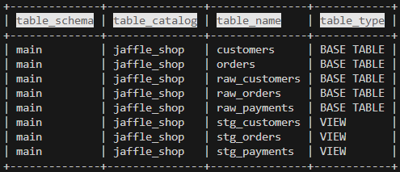
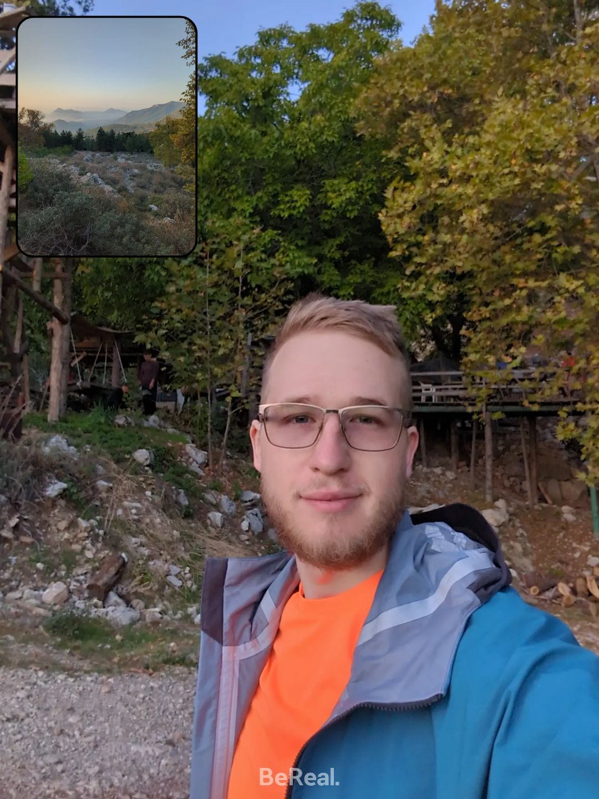

## Что такое dbt
Это инструмент для описания трансформаций средствами СУБД (системой управления баз данных) и упорядочивания объектов, которые создаются в базе. 

Буква "Т" в ELT (extract, load, transform). Внешним инструментом (например, Spark, dlt, python скриптами) нужно загрузить данные в сыром виде в staging/landing zone (обычно схема/каталог, первый слой данных), и эстафета передаётся dbt -- вплоть до построения витрин данных и даже метрик для BI.

> Дисклеймер: ниже инфа только по dbt-core версии на момент ~v1.8 (open-source, free, command line interface)

## Кому нужно, какие проблемы решает
Можно воспринимать dbt как развитие идеи хранимых процедур, но применяется обычно для OLAP распределённых баз.

В современных СУБД вроде Greenplum, Clickhouse, (и облачных AWS Redshift, GCP BigQuery, Azure Synapse) вычислительных мощностей хватает для обработки данных без необходимости в Spark и подобных ETL инструментах.

Есть встроенные удобства:
* Разработка
  * интеграция с гитом (и др. системами контроля версий и параллельной разработки)
  * декомпозиция на отдельные шаги расчёта, которые можно переиспользовать (принцип DRY - don't repeat yourself)
  * дата-тесты (запускаются на проде каждый раз) и юнит-тесты (помогают при разработке, запускаются один раз)
  * простые системы можно создавать обычными селектами -- dbt заворачивает модели в DDL самостоятельно
* Документация:
  * автоматизированная документация, которая хранится рядом с кодом
  * data lineage -- построение графа зависимостей между моделями и удобная визуализация
* Данные
  * автоматизированная настройка инкрементальной загрузки и историчности SCD2
  * дата-контракты (проверка структуры таблиц)

## Нужно знать перед началом
Пререквизиты: 
* установленный python > 3.5
* установленный гит клиент
* основы написания SQL запросов

## Запусти локально и посмотри, как это работает!
[Склонируй и запусти демо-репозиторий](https://github.com/dbt-labs/jaffle_shop_duckdb?tab=readme-ov-file#step-by-step-explanation), есть инструкции для linux, mac, windows. Если впервые работаешь с терминалом, набери в поиске по системе "powershell" или "terminal". Начни в корне репо HalltapeRoadmapDE, чтобы ссылки на файлы в этом readme работали.

Копируй и вставляй строчки кода по одной, наблюдай за тем, что получится. В течение ~10 минут скачаются все пакеты и отработает загрузка данных из .csv файлов в портативную базу duckdb. Если в `dbt docs serve` пишет, что порт уже занят, добавь ` --port 8085`

Результат должен получиться такой:


После запуска последней команды откроется веб-страница с информацией по проекту. Понажимай всё, что нажимается (изучи как минимум lineage внизу справа и хотя бы одну из моделей слева).

Неудачные здесь цвета, конечно, но их можно будет сменить)


Для выхода вернись в терминал и нажми Ctrl+C.

Данные можно посмотреть через консольную версию duckcli (или DBeaver, если уже знаешь что это):
```
duckcli jaffle_shop.duckdb -e "select table_schema, table_catalog, table_name, table_type from information_schema.tables" -t
```
```
duckcli jaffle_shop.duckdb -e "select * from customers where customer_id = 42" -t
```



## Основные команды
Общие полезные флаги, которые можно добавить почти к любой команде ниже:
```
`-s` выбрать модели
`-f` пересоздать инкрементальную модель (и всё другое, что попадает в селект)
`-d` выводит в консоль дебаг логи
`-t` указать таргет профиля (dev, test, prod)
`--profile` указать профиль, напр. для ci/cd тестов на duckdb
`--vars` указать специфичные для этого запуска значения переменных в виде json
```

`dbt <command> [-flag1 value1 --flag2-full-name value2]`, помни что `dbt --help` всегда рядом ;)
```
`ls` вывести список объектов, попадающих под `-s`
`compile` проверить, что в проекте нет ошибок*
`run` скомпилировать и запустить модели, сохранить их в базе
`test` запуск тестов
`seed` загрузить в базу .csv
`build` seed + run + test
`deps` устанавливает пакеты из `packages.yml`
`debug` проверка соединения с базой, не путать с -d
`init` создать проект
```
\* также подставляет значения в jinja шаблоны модели `target/compiled/project_name/model.sql` -- копируй и запускай; если отобрана одна модель, выводит SQL код в терминал

## А теперь разберёмся, что это было
Опущу описание клонирования репозитория и настройки venv. Детали наверняка есть в соседних разделах роадмапа про git и python.

После установки dbt и duckdb выполнили следующие команды в инициализированном проекте:
```
dbt build
dbt docs generate
dbt docs serve
```

Сконфигурированный в `dbt_project.yml` проект обратился к профилю `jaffle_shop` в `profilies.yml` и создал duckdb базу (впоследствии будет подключаться к ней же, с другими СУБД поведение может быть другим). После успешного подключения выполняется dbt build, которая состоит из трёх команд:

1. загружает в базу "справочники" -- константные значения из csv
```
dbt seed
```
2. по порядку запускает модели (`.sql` файлы) и создаёт на их основе объекты в СУБД duckdb: таблицы или представления (вью)
```
dbt run
```
3. запускает дата-тесты для проверки загруженных данных, описанные в `models/schema.yml`, и показывает в терминале результат выполнения
```
dbt test
```
Затем генерируется документация (`target/index.html`) на основе скомпилированного в `target/manifest.json` проекта с описанием моделей и связей между ними.
```
dbt docs generate
```
На основе этой генерации строится локальный веб-сайт, который удобно использовать для поиска нужных сущностей в системе и прослеживания зависимостей (в серьёзных проектах их могут быть тысячи).
``` 
dbt docs serve
```

## Терминология (базовая)
### Проект
Общая конфигурация в [`dbt_project.yml`](../jaffle_shop_duckdb/dbt_project.yml), хранится в корне директории. Относительно этого файла указываются все пути (можно переименовать папки с моделями, тестами и пр.). В нём же указывается профайл для коннекта к источникам. Ещё в него удобно выносить общие конфигурации по моделям (для всех файлов внутри папки). В общем, центральная штука.

### Profile
Конфигурация подключений к приёмнику данных, куда всё будем загружать. Может быть по-разному настроен для dev, test, prod. Если есть [в директории проекта](../jaffle_shop_duckdb/profiles.yml), берётся эта версия. Иначе -- стандартная в `~/.dbt/profiles.yml` (в домашней папке).

По умолчанию dbt работает с одной БД в разных схемах. Если нужно подключение к разным СУБД/источникам в рамках одного проекта/запроса, ищи интеграцию с Trino.

### Модель
Описание объекта, который будет создан в СУБД. Все трансформации задаются в виде sql кода и [jinja шаблонов](https://docs.getdbt.com/guides/using-jinja?step=1). [Пример файла](../jaffle_shop_duckdb/models/orders.sql)

DDL-конфигурация с параметрами, общими для dbt или специфичными для адаптера, задаётся в {{ config }}
```
{{ config(materialized = "table") }}
```
```
{{ config(materialized = "view") }}
```
```
{{
    config(
        materialized='incremental',
        unique_key='id',
        on_schema_change='append_new_columns'
    )
}}
```
Про инкрементальную модель [хорошо написано в доке](https://docs.getdbt.com/docs/build/incremental-models). Кратко: нужно определить логику инкремента через `` и задать ключ в поле unique_key. Также можно [задать стратегию заполнения инкремента](https://docs.getdbt.com/docs/build/incremental-strategy).

В .yml файлах указываются тесты и описывается структура (на её основе генерируется дока). [Пример файла](../jaffle_shop_duckdb/models/schema.yml). Называть `schema.yml` не обязательно, но расширение должно быть `.yml`, не `.yaml`.
> Название объекта создаётся из имени файла, схема и БД указываются в `profiles.yml`

> Если модель не подхватывается проектом, проверь что у неё расширение `.sql` и она находится в директории `model-paths: ["models"]`.

### Материализация
Указывает dbt правила создания модели на основе селекта.
Выше показаны базовые настройки для:
* view -- простое представление
* table -- таблица, пересоздаётся каждый раз с нуля
* incremental_table -- загружает только инкремент

Также есть материализуемые вью, эфемерные одели (подставляются как SQL CTE, хранятся в отдельном файле .sql), снэпшоты (см. ниже).

### Seed
Файлы, загружаемые в систему "как есть". Только формат csv. Обычно -- справочники. Перезаписываются в БД каждый раз при запуске `dbt seed`.

### Источники
Внешние объекты, созданные не в текущем проекте. Могут быть загруженными EL-инструментом таблицы staging layer, таблицы других dbt-проектов.
Описываются в .yml файле в models директории, например:
```
sources:
* name: jaffle_shop
    database: raw  
    schema: jaffle_shop  
    tables:
    * name: orders
    * name: customers
```
Могут указывать на таблицы (обрати внимание на database, schema), S3 bucket'ы и другие поддерживаемые адаптером системы.

### Зависимости 
Связывают модели между собой и дают возможность обращаться к моделям в разных контурах (дев, тест, прод) в зависимости от команд при запуске. 

Пример кода (не запустится, т.к. нет локально не существует проекта `jaffle_shop`):

```
select * 
from {{ ref('raw_customers') }} c
join {{ source('jaffle_shop', 'orders') }} o
    on c.customer_id = o.customer_id
```

Для запуска всех источников модели укажи + перед названием:
```
dbt run -s +orders
```
Для всех зависимых от модели:
```
dbt run -s raw_orders+
```
Подробнее [про фильтрацию запускаемых моделей](https://docs.getdbt.com/reference/node-selection/methods), [про +, @ и другие операторы](https://docs.getdbt.com/reference/node-selection/graph-operators), [и объединение нескольких условий AND OR](https://docs.getdbt.com/reference/node-selection/set-operators).

## Терминология (продвинутая)
### Lineage
Граф зависимостей, который строится при запуске на основе `ref` и `source`.

Можно посмотреть визуально в UI через `dbt docs serve`.

### Макросы
Функции, написанные на jinja-коде, которые добавляют возможности скриптовой логики для генерации участков SQL кода (циклы, условия, переменные).

В этом проекте не заданы, но обычно живут в папке `macros`. Также, как и модели, описываются в sql логике. Если ещё не, посмотри мини-гайд в первом упоминании jinja кода на этой странице.

Переменные внутри фигурных скобок указываются без доп. скобок, напр: 

`` 

вместо 

``

> `{{ }}` после компиляции подставляет результат выполнения макроса **текстом**, `` выполняет операцию без вывода результата.

> Для отладки используй {{ log("my_text: " ~ my_variable, info=true) }}, аналог print. Строки соединяются через ~

### Тесты 
Базовые проверки, определяются в папке `tests/` или [.yml файлах среди моделей](../jaffle_shop_duckdb/models/schema.yml):
* unique
* not_null
* foreign key
* accepted_values
* freshness (данные добрались до таргета в течение Х минут)

Можно создавать свои кастомные тесты, можно [расширить список пакетами](https://hub.getdbt.com/calogica/dbt_expectations/latest/).

Можно указывать строгость (уведомление или ошибка при нарушении теста).

Как и писал выше, запускаются каждый раз после загрузки данных.

Также есть unit-тесты, которые проверяют одну модель изолированно и нужны для отладки и поддержки сложной бизнес-логики. На момент 1.8 ещё очень сырые. [Я использую альтернативу](https://hub.getdbt.com/EqualExperts/dbt_unit_testing/latest/).

### Vars (переменные)
Переменные, которые можно задавать при запуске, например, из Airflow (или командной строки). Используются в коде в виде `{{ var('my_var') }}`.

### Теги
Удобный способ группировки моделей, тестов и пр. Можно задать в `{{ config }}` или `dbt_project.yml`.

### Адаптер
Механизм dbt, позволяющий подключиться к разным приёмникам (postgres, mysql, duckdb, ...). Переопределяет базовое поведение макроса (весь dbt под капотом работает на макросах). [Простой пример](https://docs.getdbt.com/reference/dbt-jinja-functions/dispatch#a-simple-example).

### Также полезно упомянуть: 
* Снепшоты: dbt-native реализация SCD2 для историчных таблиц
* MetricFlow: dbt-native реализация BI метрик (и ограниченно в dbt-core семантический слой)
* Analysis: папка с полезными SQL-запросами, которые хочется хранить в гите, но которые не материализуют модели
* Пакеты: библиотеки с кодом для расширения функционала, можно сделать свои

## А как это может запускаться в продакшене
Обобщённое выступление с деталями: [Доклад Евгения Ермакова на SmartData](https://youtu.be/u8LkCBVKKus)

* [Очень подробно про версионирование dbt-core](https://docs.getdbt.com/docs/dbt-versions/core)
* [Конфигурирование разных environment'ов](https://docs.getdbt.com/docs/core/dbt-core-environments)
* [Куча разных коннекторов](https://docs.getdbt.com/docs/core/connect-data-platform/about-core-connections)
* [Про использование нескольких схем в проекте (по умолчанию одна)](https://docs.getdbt.com/docs/build/custom-schemas)
* [Оркестрация с Airflow через cosmos](https://www.astronomer.io/cosmos/)
* [Best practices](https://docs.getdbt.com/best-practices)

## Как настроить окружение для дальнейшей удобной работы
* Для VS Code есть расширение [dbt power user](https://marketplace.visualstudio.com/items?itemName=innoverio.vscode-dbt-power-user)
* TODO: добавить инструкцию по настройке вместе с SqlFluff
* TODO: добавить настройку других популярных IDE

## Что ещё полезного почитать по dbt
* [Поэтапное развитие проекта dbt на практическом примере (прям с кодом)](https://docs.getdbt.com/blog/how-to-build-a-mature-dbt-project-from-scratch)
* [Советы на русском с дополнениями из моего опыта](https://t.me/rzv_de/117)
* [Про миграцию с хранимых процедур на dbt](https://docs.getdbt.com/blog/migrating-from-stored-procs)
* [Построение Кимбалл модели](https://docs.getdbt.com/blog/kimball-dimensional-model)
* [Отладка макросов](https://docs.getdbt.com/blog/guide-to-jinja-debug)
* [Семантический слой для BI](https://docs.getdbt.com/blog/semantic-layer-in-pieces)
* [Официальные tips&tricks](https://docs.getdbt.com/docs/build/dbt-tips)

## Advanced topics (in progress)
* Управление пробелами и пустым пространством после компиляции через ``
* pre-hooks, напр. для создания темповых таблиц в рамках сессии
* Порядок поиска макросов и других объектов (проект, пакеты, стандартные)
* Переопределение стандартных макросов
* Кастомные материализации
* Кастомные адаптеры (adapter-dispatch), как один и тот же код можно по-разному выполнять на разных СУБД
* Создание своих пакетов и использование https://hub.getdbt.com/
* CI/CD

## Куратор раздела
Разводов Алексей, дата-инженер с 6+ годами опыта и автор: 
* [Тг-канал](https://t.me/rzv_de)
* [Youtube канал с мок-собесами](https://youtube.com/@rzv_de)
* [Бусти-сообщество начинающих и продолжающих путь в DE](https://boosty.to/rzv_de)
* [CV (resume)](https://docs.google.com/document/d/1tYi0s7yNsGl_Xts5CrHDegLvAtlHtz7jPSp074MfCyI/edit?usp=sharing)

Если хочешь сменить текущую профессию на Дата Инженера или нужна помощь с ростом и развитием из джуна/мидла до сеньора -- пиши, обсудим https://t.me/razvodov_de_mentor

Хочешь улучшить текущий раздел, внести недостающее или поправить формулировку? Предлагай PR и тегай [@LexxaRRioo](https://github.com/LexxaRRioo).

